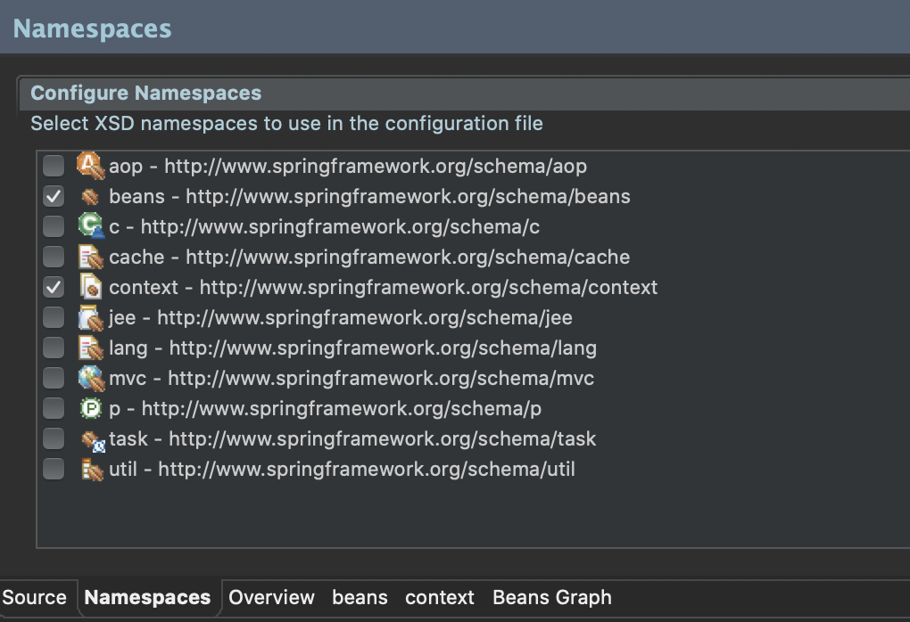
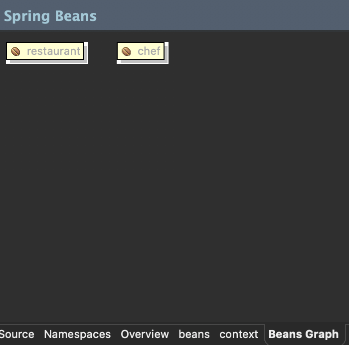

## ch02. 스프링의 특징과 의존성 주입
- 스프링의 주요 특징
    - POJO(Plain Old Java Object) 기반의 구성
        - 별도의 API를 사용하지 않는 POJO의 구성만으로 객체 간의 관계를 구성할 수 있음
        - 즉, 특정 라이브러리나 컨테이너의 기술에 종속적이지 않다는 것을 의미
        - 개발자는 가장 일반적인 형태로 코드를 작성하고 실행할 수 있기 때문에 생산성 유리
        - 코드에 대한 테스트 작업이 좀 더 유연
    - 의존성 주입(DI)을 통한 객체 간의 관계 구성
        - 의존성이라는 것은 하나의 객체가 다른 객체 없이 제대로 된 역할을 할 수 없다는 것을 의미<br>
        (흔히 A 객체가 B 객체 없이 동작이 불가능한 상황을 <strong>'A가 B에 의존적이다'</strong> 라고 표현함)
        - 주입은 말 그대로 외부에서 밀어 넣는 것을 의미
        - 의존성 주입 : 어떤 객체가 필요한 객체를 외부에서 밀어 넣는다<br>
        (A가 B를 필요로 요청하면, 외부에서 B객체를 주입)
        - ApplicationContext : 필요한 객체들을 생성하고, 필요한 객체들을 주입하는 역할을 해주는 구조(관리하는 객체가 Bean)
        - Bean과 Bean 사이의 의존관계를 처리하는 방식
            - XML설정
            - 어노테이션 설정
            - Java 설정
    - AOP(Aspect-Oriented-Programming) 지원
        - 반복적인 코드의 제거. 핵심 비즈니스 로직에선 집중할 수 있는 방법 제공
        - 횡단 괌심사(Cross-concern) : 대부분의 시스템이 공통으로 가지고 있는 보안이나 로그, 트랜젝션과 같은 비즈니스 로직은 아니지만, 반드시 처리가 필요한 부분
        - AOP는 횡단관심사를 모듈로 분리
    - 편리한 MVC 구조
        - 트랜잭션 자원(어노테이션이나 XML로 설정)
    - WAS의 종속적이지 않은 개발 환경
-----------
- 의존성 주입 pom.xml 설정
    ```xml
        <!-- 의존성 주입 테스트를 위한 라이브러리 추가 -->
		<dependency>
			<groupId>org.springframework</groupId>
			<artifactId>spring-test</artifactId>
			<version>${org.springframework-version}</version>
		</dependency>
		<dependency>
			<groupId>org.projectlombok</groupId>
			<artifactId>lombok</artifactId>
			<version>1.18.0</version>
			<scope>provided</scope>
		</dependency>
		<dependency>
			<groupId>log4j</groupId>
			<artifactId>log4j</artifactId>
			<version>1.2.17</version>   <!-- lombok 활용을 위해 버젼 1.2.17 사용 -->
		</dependency>
		
		<!-- Test -->
		<dependency>
			<groupId>junit</groupId>
			<artifactId>junit</artifactId>
			<version>4.12</version>
			<scope>test</scope>
		</dependency>        
    ```
-----------------
- Chef.java
    ```java
    package org.zerock.sample;

    import org.springframework.stereotype.Component;
    import lombok.Data;

    @Component
    @Data
    public class Chef {
        
    }
    ```
- Chef.java
    ```java
    package org.zerock.sample;

    import org.springframework.beans.factory.annotation.Autowired;
    import org.springframework.stereotype.Component;

    import lombok.Data;
    import lombok.Setter;

    /*
    * 작성된 코드가 의미하는 것은 Restaurant 객체가 Chef 타입의 객체를 필요로 한다는 상황
    */

    @Component	// 스프링에게 해당 클래스가 스프링에서 관리해야 하는 대상임을 표시하는 어노테이
    @Data
    public class Restaurant {
        
        @Setter(onMethod_ = @Autowired)	// @Setter는 컴파일 시 자동으로 setChef를 생성
        private Chef chef;

    }
    ```
    ---------------------------
- root-context.xml

    

    ```xml
        <?xml version="1.0" encoding="UTF-8"?>
        <beans xmlns="http://www.springframework.org/schema/beans"
            xmlns:xsi="http://www.w3.org/2001/XMLSchema-instance"
            xmlns:context="http://www.springframework.org/schema/context"
            xsi:schemaLocation="http://www.springframework.org/schema/beans https://www.springframework.org/schema/beans/spring-beans.xsd
                http://www.springframework.org/schema/context http://www.springframework.org/schema/context/spring-context-4.3.xsd">
            
            <!-- Root Context: defines shared resources visible to all other web components -->
            
            <context:component-scan base-package="org.zerock.sample"></context:component-scan>
                
        </beans>
   
    ```
- Beans Graph에 추가된 것을 확인

    
------------------------
- JAVA 설정을 이용하여 의존성 주입
- RootConfig.java
    ```java
    package org.zerock.config;

    import org.springframework.context.annotation.Configuration;
    import org.springframework.context.annotation.ComponentScan;

    @Configuration
    @ComponentScan(basePackages= {"org.zerock.sample"})
    public class RootConfig {

    }
    ```
---------------------------
- 스프링 동작 시
    - 메모리 영역을 만듦(Context), 스프링에서는 ApplicationContext라는 이름으로 만들어짐
    - root-context.xml 파일 확인(객체를 생성하고 관리해야 하는 객체들에 대한 설정)
        - \<context:component-scan>태그의 내용을 통해 org.zerock.sample 패키지 스캔
        - 해당 패키지 중 @Component 어노테이션이 존재하는 클래스의 인스턴스를 생성<br>
        (ex) Restaurant 객체는 Chef 객체가 필요하다는 어노테이션(@Autowired) 설정이 있으므로, 스프링은 Chef 객체의 레퍼런스를 Restaurant 객체에 주입함

- 참고 요약
    - @Component
        - 해당 클래스가 스프링에서 객체로 만들어서 관리하는 대상임을 명시하는 어노테이션
        - @ComponenetScan을 통해 @Component가 있는 클래스들을 조사하면서 @Component가 존재하는 크래스들을 객체로 생성해서 빈으로 관리하게 됨
    - @Autowired
        - 스프링 내부에서 자신이 특정한 객체에 의존적이므로 자신에게 해당 타입의 빈을 주입해주라는 표시
        - @Autowired 어노테이션을 보고 스프링 내부에 관리되는 객체(들) 중에 적당한 것이 있는지를 확인하고, 자동으로 주입해 줌. 필요한 객체가 존재하지 않는다면 에러 발생