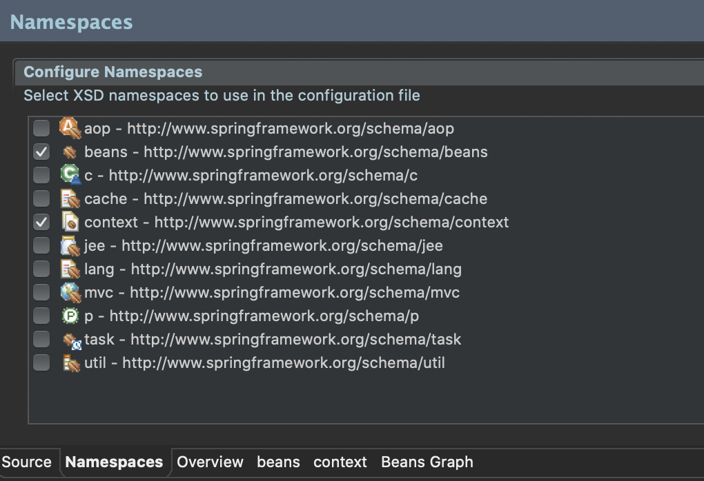
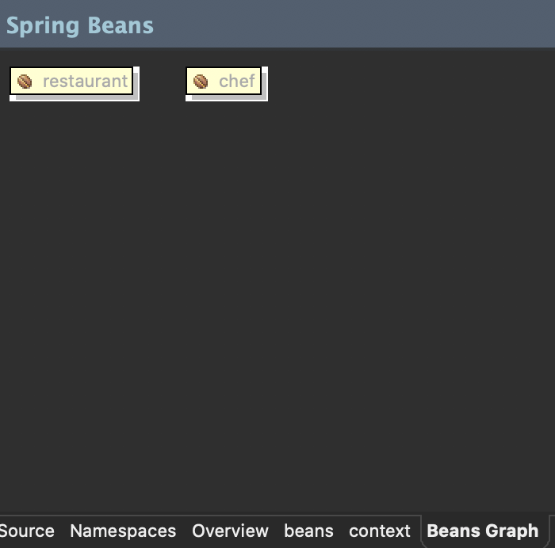
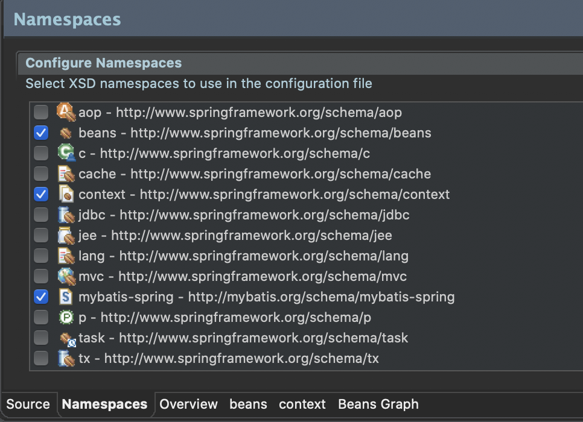
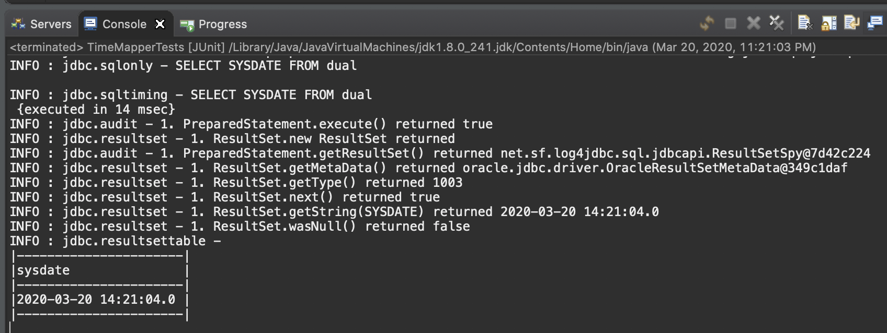

# 1장. 스프링 개발 환경 구축
>## ch01. 개발을 위한 준비
- pom.xml 설정
    - pom.xml 에서 스프링 프레임워크 버전은 3.1.1로 생성되므로, 5.0.7 버젼으로 변경
    - java 1.8 버젼으로 변경
    - maven-compiler-plugin 3.5.1 버젼으로 변경
    ```xml
    <properties>
		<java-version>1.8</java-version>
		<org.springframework-version>5.0.7.RELEASE</org.springframework-version>
		<org.aspectj-version>1.6.10</org.aspectj-version>
		<org.slf4j-version>1.6.6</org.slf4j-version>
	</properties>
    ```
     ```xml
     <plugin>
        <groupId>org.apache.maven.plugins</groupId>
        <artifactId>maven-compiler-plugin</artifactId>
        <version>3.5.1</version>
        <configuration>
            <source>1.8</source>
            <target>1.8</target>
            <compilerArgument>-Xlint:all</compilerArgument>
            <showWarnings>true</showWarnings>
            <showDeprecation>true</showDeprecation>
        </configuration>
    </plugin>
    ```
-----------------
- lombok 설치
    - getter/setter, toString(), 생성자 등 자동 생성
------------
>## ch02. 스프링의 특징과 의존성 주입
- 스프링의 주요 특징
    - POJO(Plain Old Java Object) 기반의 구성
        - 별도의 API를 사용하지 않는 POJO의 구성만으로 객체 간의 관계를 구성할 수 있음
        - 즉, 특정 라이브러리나 컨테이너의 기술에 종속적이지 않다는 것을 의미
        - 개발자는 가장 일반적인 형태로 코드를 작성하고 실행할 수 있기 때문에 생산성 유리
        - 코드에 대한 테스트 작업이 좀 더 유연
    - 의존성 주입(DI)을 통한 객체 간의 관계 구성
        - 의존성이라는 것은 하나의 객체가 다른 객체 없이 제대로 된 역할을 할 수 없다는 것을 의미<br>
        (흔히 A 객체가 B 객체 없이 동작이 불가능한 상황을 <strong>'A가 B에 의존적이다'</strong> 라고 표현함)
        - 주입은 말 그대로 외부에서 밀어 넣는 것을 의미
        - 의존성 주입 : 어떤 객체가 필요한 객체를 외부에서 밀어 넣는다<br>
        (A가 B를 필요로 요청하면, 외부에서 B객체를 주입)
        - ApplicationContext : 필요한 객체들을 생성하고, 필요한 객체들을 주입하는 역할을 해주는 구조(관리하는 객체가 Bean)
        - Bean과 Bean 사이의 의존관계를 처리하는 방식
            - XML설정
            - 어노테이션 설정
            - Java 설정
    - AOP(Aspect-Oriented-Programming) 지원
        - 반복적인 코드의 제거. 핵심 비즈니스 로직에선 집중할 수 있는 방법 제공
        - 횡단 괌심사(Cross-concern) : 대부분의 시스템이 공통으로 가지고 있는 보안이나 로그, 트랜젝션과 같은 비즈니스 로직은 아니지만, 반드시 처리가 필요한 부분
        - AOP는 횡단관심사를 모듈로 분리
    - 편리한 MVC 구조
        - 트랜잭션 자원(어노테이션이나 XML로 설정)
    - WAS의 종속적이지 않은 개발 환경
-----------
- 의존성 주입 pom.xml 설정
    ```xml
        <!-- 의존성 주입 테스트를 위한 라이브러리 추가 -->
		<dependency>
			<groupId>org.springframework</groupId>
			<artifactId>spring-test</artifactId>
			<version>${org.springframework-version}</version>
		</dependency>
		<dependency>
			<groupId>org.projectlombok</groupId>
			<artifactId>lombok</artifactId>
			<version>1.18.0</version>
			<scope>provided</scope>
		</dependency>
		<dependency>
			<groupId>log4j</groupId>
			<artifactId>log4j</artifactId>
			<version>1.2.17</version>   <!-- lombok 활용을 위해 버젼 1.2.17 사용 -->
		</dependency>
		
		<!-- Test -->
		<dependency>
			<groupId>junit</groupId>
			<artifactId>junit</artifactId>
			<version>4.12</version>
			<scope>test</scope>
		</dependency>        
    ```
-----------------
- Chef.java
    ```java
    package org.zerock.sample;

    import org.springframework.stereotype.Component;
    import lombok.Data;

    @Component
    @Data
    public class Chef {
        
    }
    ```
- Restaurant.java
    ```java
    package org.zerock.sample;

    import org.springframework.beans.factory.annotation.Autowired;
    import org.springframework.stereotype.Component;

    import lombok.Data;
    import lombok.Setter;

    /*
    * 작성된 코드가 의미하는 것은 Restaurant 객체가 Chef 타입의 객체를 필요로 한다는 상황
    */

    @Component	// 스프링에게 해당 클래스가 스프링에서 관리해야 하는 대상임을 표시하는 어노테이
    @Data
    public class Restaurant {
        
        @Setter(onMethod_ = @Autowired)	// @Setter는 컴파일 시 자동으로 setChef를 생성
        private Chef chef;

    }
    ```
    ---------------------------
- root-context.xml

    

    ```xml
        <?xml version="1.0" encoding="UTF-8"?>
        <beans xmlns="http://www.springframework.org/schema/beans"
            xmlns:xsi="http://www.w3.org/2001/XMLSchema-instance"
            xmlns:context="http://www.springframework.org/schema/context"
            xsi:schemaLocation="http://www.springframework.org/schema/beans https://www.springframework.org/schema/beans/spring-beans.xsd
                http://www.springframework.org/schema/context http://www.springframework.org/schema/context/spring-context-4.3.xsd">
            
            <!-- Root Context: defines shared resources visible to all other web components -->
            
            <context:component-scan base-package="org.zerock.sample"></context:component-scan>
                
        </beans>
   
    ```
- Beans Graph에 추가된 것을 확인

    
------------------------
- JAVA 설정을 이용하여 의존성 주입
- RootConfig.java
    ```java
    package org.zerock.config;

    import org.springframework.context.annotation.Configuration;
    import org.springframework.context.annotation.ComponentScan;

    @Configuration
    @ComponentScan(basePackages= {"org.zerock.sample"})
    public class RootConfig {

    }
    ```
---------------------------
- 스프링 동작 시
    - 메모리 영역을 만듦(Context), 스프링에서는 ApplicationContext라는 이름으로 만들어짐
    - root-context.xml 파일 확인(객체를 생성하고 관리해야 하는 객체들에 대한 설정)
        - \<context:component-scan>태그의 내용을 통해 org.zerock.sample 패키지 스캔
        - 해당 패키지 중 @Component 어노테이션이 존재하는 클래스의 인스턴스를 생성<br>
        (ex) Restaurant 객체는 Chef 객체가 필요하다는 어노테이션(@Autowired) 설정이 있으므로, 스프링은 Chef 객체의 레퍼런스를 Restaurant 객체에 주입함

- 참고 요약
    - @Component
        - 해당 클래스가 스프링에서 객체로 만들어서 관리하는 대상임을 명시하는 어노테이션
        - @ComponenetScan을 통해 @Component가 있는 클래스들을 조사하면서 @Component가 존재하는 크래스들을 객체로 생성해서 빈으로 관리하게 됨
    - @Autowired
        - 스프링 내부에서 자신이 특정한 객체에 의존적이므로 자신에게 해당 타입의 빈을 주입해주라는 표시
        - @Autowired 어노테이션을 보고 스프링 내부에 관리되는 객체(들) 중에 적당한 것이 있는지를 확인하고, 자동으로 주입해 줌. 필요한 객체가 존재하지 않는다면 에러 발생
-------------
>## ch03. 스프링과 Oracle Database 연동
- ojdbc8.jar 빌드패스 추가 (java 1.8 버젼은 ojdbc8 사용)
- JDBC 테스트 코드
    - JDBCTests.java
    ```java
    package org.zerock.persistence;

    import static org.junit.Assert.fail;

    import java.sql.Connection;
    import java.sql.DriverManager;

    import org.junit.Test;

    import lombok.extern.log4j.Log4j;

    @Log4j
    public class JDBCTests {
        static {
            try {
                Class.forName("oracle.jdbc.driver.OracleDriver");
            } catch(Exception e) {
                e.printStackTrace();
            }
        }

        @Test
        public void testConnection() {
            try(Connection con = DriverManager.getConnection("jdbc:oracle:thin:@tongracle.cnsqtfo00xiq.ap-northeast-2.rds.amazonaws.com:1521:orcl","book_ex","book_ex")) {
                log.info(con);
            }catch(Exception e) {
                fail(e.getMessage());
            }
        }
    }
    ```
- 커넥션 풀 설정
    - 일반적으로 여러 명의 사용자가 동시에 처리해야 하는 웹 어플리케이션의 경우 데이터베이스 연결을 이용할 때는 <strong>커넥션 풀(Connection Pool)</strong>을 이용하므로, 스프링에 등록 권장
    - Java에서는 DataSource 인터페이스를 통해 커넥션 풀을 사용함
    - DataSource : 매번 데이터베이스와 연결하는 방식이 아닌, 미리 연결을 맺어주고 반환하는 구조(성능 향상)
    - 현재 예제는 HikariCP 라이브러리 사용 (다른 라이브러리로는 spring-jdbc등이 있음)
- pom.xml
    ```xml
    <dependency>
        <groupId>com.zaxxer</groupId>
        <artifactId>HikariCP</artifactId>	<!-- DataSource 라이브러리 -->
        <version>2.7.4</version>
    </dependency>
    ```

- root-context.xml
    ```xml
    <?xml version="1.0" encoding="UTF-8"?>
    <beans xmlns="http://www.springframework.org/schema/beans"
        xmlns:xsi="http://www.w3.org/2001/XMLSchema-instance"
        xmlns:context="http://www.springframework.org/schema/context"
        xsi:schemaLocation="http://www.springframework.org/schema/beans https://www.springframework.org/schema/beans/spring-beans.xsd
            http://www.springframework.org/schema/context http://www.springframework.org/schema/context/spring-context-4.3.xsd">
        
        <!-- Root Context: defines shared resources visible to all other web components -->
        <!-- <bean id="hikariConfig" class="com.zaxxer.hikari.HikariConfig">
            <property name="driverClassName" value="oracle.jdbc.driver.OracleDriver"></property>
            <property name="jdbcUrl" value="jdbc:oracle:thin:@tongracle.cnsqtfo00xiq.ap-northeast-2.rds.amazonaws.com:1521:orcl"></property>
            <property name="username" value="book_ex"></property>
            <property name="password" value="book_ex"></property>
        </bean> -->
        
        <!-- HikariCP configuration -->
        <!-- <bean id="dataSource" class="com.zaxxer.hikari.HikariDataSource" destroy-method="close">
            <constructor-arg ref="hikariConfig" />
        </bean> -->
        
        <!-- HikariCP configuration 
             책 예제를 따라하니 에러발생해서 변경함-->
        <bean id="dataSource" class="com.zaxxer.hikari.HikariDataSource" destroy-method="close">
            <property name="driverClassName" value="oracle.jdbc.driver.OracleDriver"></property>
            <property name="jdbcUrl" value="jdbc:oracle:thin:@tongracle.cnsqtfo00xiq.ap-northeast-2.rds.amazonaws.com:1521:orcl"></property>
            <property name="username" value="book_ex"></property>
            <property name="password" value="book_ex"></property>
        </bean>
        
        <context:component-scan base-package="org.zerock.sample"></context:component-scan>
            
    </beans>
    ```

- RootConfig.java   (자바설정 버젼)
    ```java
    package org.zerock.config;

    import org.springframework.context.annotation.Configuration;
    import org.springframework.context.annotation.ComponentScan;

    import javax.sql.DataSource;

    import org.springframework.context.annotation.Bean;
    import org.springframework.context.annotation.ComponentScan;
    import org.springframework.context.annotation.Configuration;

    import com.zaxxer.hikari.HikariConfig;
    import com.zaxxer.hikari.HikariDataSource;

    @Configuration
    @ComponentScan(basePackages= {"org.zerock.sample"})
    public class RootConfig {
        @Bean
        public DataSource dataSource() {
            HikariConfig hikariConfig = new HikariConfig();
    //	    hikariConfig.setDriverClassName("oracle.jdbc.driver.OracleDriver");
    //	    hikariConfig.setJdbcUrl("jdbc:oracle:thin:@localhost:1521:XE");

            hikariConfig.setDriverClassName("oracle.jdbc.driver.OracleDriver");
            hikariConfig.setJdbcUrl("jdbc:oracle:thin:@tongracle.cnsqtfo00xiq.ap-northeast-2.rds.amazonaws.com:1521:orcl");

            hikariConfig.setUsername("book_ex");
            hikariConfig.setPassword("book_ex");

            HikariDataSource dataSource = new HikariDataSource(hikariConfig);

            return dataSource;
        }
    }
    ```

- DataSourceTests.java
    ```java
    package org.zerock.persistence;

    import static org.junit.Assert.fail;

    import java.sql.Connection;

    import javax.sql.DataSource;

    import org.junit.Test;
    import org.junit.runner.RunWith;
    import org.springframework.beans.factory.annotation.Autowired;
    import org.springframework.test.context.ContextConfiguration;
    import org.springframework.test.context.junit4.SpringJUnit4ClassRunner;

    import lombok.Setter;
    import lombok.extern.log4j.Log4j;

    @RunWith(SpringJUnit4ClassRunner.class)
    @ContextConfiguration("file:src/main/webapp/WEB-INF/spring/root-context.xml")
    /*
    * JAVA 설정을 사용하는 경우
    * @ContextConfiguration(classes = {RootConfig.class})
    */
    @Log4j
    public class DataSourceTests {
        @Setter(onMethod_= {@Autowired})
        private DataSource dataSource;
        
        @Test
        public void testConnection() {
            try(Connection con = dataSource.getConnection()){
                log.info(con);
            }catch(Exception e) {
                fail(e.getMessage());
            }
        }
    }
    ```
---------
>## ch04. MyBatis의 스프링 연동
- MyBatis의 장점
    - 자동으로 Connection close() 가능
    - MyBatis 내부적으로 PreparedStatement 처리
    - #{prop}와 같이 속성을 지정하면 내부적으로 자동 처리
    - 리턴 타입을 지정하는 경우 자동으로 객체 생성 및 ResultSet 처리
    - 기존의 SQL을 그대로 활용 가능
    - 진입장벽이 낮음
-----------------
- MyBatis 라이브러리 추가
    - pom.xml
    ```xml
    <!-- mybatis 라이브러리 추가 -->
    <!-- https://mvnrepository.com/artifact/org.mybatis/mybatis -->
    <dependency>
        <groupId>org.mybatis</groupId>
        <artifactId>mybatis</artifactId>
        <version>3.4.6</version>
    </dependency>
    <!-- https://mvnrepository.com/artifact/org.mybatis/mybatis-spring -->
    <dependency>
        <groupId>org.mybatis</groupId>
        <artifactId>mybatis-spring</artifactId>
        <version>1.3.2</version>
    </dependency>
    <dependency>
        <groupId>org.springframework</groupId>
        <artifactId>spring-tx</artifactId>
        <version>${org.springframework-version}</version>
    </dependency>
    <dependency>
        <groupId>org.springframework</groupId>
        <artifactId>spring-jdbc</artifactId>
        <version>${org.springframework-version}</version>
    </dependency>
    ```
- SQLSessionFactory
    - SQLSession을 통해 Connection을 생성하거나 원하는 SQL을 전달하고, 결과를 리턴 받는 구조로 작성하게 됨
    - root-context.xml
    ```xml
    <bean id="sqlSessionFactory" class="org.mybatis.spring.SqlSessionFactoryBean">
		<property name="dataSource" ref="dataSource"></property>
	</bean>
    ```
- Mapper
    - SQLSessionFactory를 이용해서 코드를 작성해도 직접 Connection을 얻어서 JDBC 코딩이 가능하지만 좀 더 편하게 사용하기 위해 Mapper 사용
    - SQL을 어떻게 처리할 것인지 별도의 설정을 분리해 주고, 자동으로 처리되는 방식 이용
    - 즉, SQL과 그에 대한 처리를 지정하는 역할을 함
    - Spring을 이용하는 경우에는 Mapper를 XML과 인터페이스 + 어노테이션의 형태로 작성 가능
-------------
- Mapper 인터페이스
    - TimeMapper.java
    ```java
    package org.zerock.mapper;

    import org.apache.ibatis.annotations.Select;

    public interface TimeMapper {

        @Select("SELECT sysdate FROM dual")
        public String getTime();

    }
    ```
    - MyBatis가 동작할 때 Mapper를 인식할 수 있도록 설정
    - root-context.xml
    
        
    
    ```xml
	<mybatis-spring:scan base-package="org.zerock.mapper"/>
    ```
    - TimeMapperTests.java
    ```java
    package org.zerock.persistence;

    import org.junit.Test;
    import org.junit.runner.RunWith;
    import org.springframework.beans.factory.annotation.Autowired;
    import org.springframework.test.context.ContextConfiguration;
    import org.springframework.test.context.junit4.SpringJUnit4ClassRunner;
    import org.zerock.mapper.TimeMapper;

    import lombok.Setter;
    import lombok.extern.log4j.Log4j;

    @RunWith(SpringJUnit4ClassRunner.class)
    @ContextConfiguration("file:src/main/webapp/WEB-INF/spring/root-context.xml")
    /*
    * JAVA 설정의 경우
    * @ContextConfiguration(classes = {org.zerock.config.RootConfig.class})
    */
    @Log4j
    public class TimeMapperTests {
        @Setter(onMethod_ = @Autowired)
        private TimeMapper timeMapper;
        
        @Test
        public void testGetTime() {
            log.info(timeMapper.getClass().getName());
            log.info(timeMapper.getTime());
        }
    }
    ```
------------
- XML 매퍼와 같이 쓰기
    - MyBatis를 이용해서 SQL을 처리할 때 어노테이션을 이용하는 방식이 압도적으로 편리함
    - 하지만, SQL이 복잡하거나 길어지는 경우 XML을 이용하는 방식을 권장
    - Mapper 인터페이스와 XML 파일의 이름을 동일하게 하는 것이 가독성에 좋음
- id 속성과 메서드의 이름과 동일하게, resultType은 인터페이스에 선언된 메서드의 리턴 타입과 동일하게 작성
- TimeMapper.xml
    ```xml
    <?xml version="1.0" encoding="UTF-8"?>
    <!DOCTYPE mapper PUBLIC "-//mybatis.org//DTD Mapper 3.0//EN" "http://mybatis.org/dtd/mybatis-3-mapper.dtd">
    <mapper namespace="org.zerock.mapper.TimeMapper">

        <select id="getTime2" resultType="string">
            SELECT SYSDATE FROM dual
        </select>
        
    </mapper>
    ```
- TimeMapperTests.java
    ```java
    package org.zerock.persistence;

    import org.junit.Test;
    import org.junit.runner.RunWith;
    import org.springframework.beans.factory.annotation.Autowired;
    import org.springframework.test.context.ContextConfiguration;
    import org.springframework.test.context.junit4.SpringJUnit4ClassRunner;
    import org.zerock.mapper.TimeMapper;

    import lombok.Setter;
    import lombok.extern.log4j.Log4j;

    @RunWith(SpringJUnit4ClassRunner.class)
    @ContextConfiguration("file:src/main/webapp/WEB-INF/spring/root-context.xml")
    /*
    * JAVA 설정의 경우
    * @ContextConfiguration(classes = {org.zerock.config.RootConfig.class})
    */
    @Log4j
    public class TimeMapperTests {
        @Setter(onMethod_ = @Autowired)
        private TimeMapper timeMapper;
        
        @Test
        public void testGetTime() {
            log.info("getTime2!!");
            log.info(timeMapper.getTime2());
        }
    }
    ```
-------------
- log4jdbc-log4j2 설정
    - pom.xml
    ```xml
    <!-- log4jdbc 설정 -->
    <!-- https://mvnrepository.com/artifact/org.bgee.log4jdbc-log4j2/log4jdbc-log4j2-jdbc4 -->
    <dependency>
        <groupId>org.bgee.log4jdbc-log4j2</groupId>
        <artifactId>log4jdbc-log4j2-jdbc4</artifactId>
        <version>1.16</version>
    </dependency>
    ```
    - log4jdbc.log4j2.properties
    ```properties
    log4jdbc.spylogdelegator.name=net.sf.log4jdbc.log.slf4j.Slf4jSpyLogDelegator
    ```
    - root-context.xml
    ```xml
    <bean id="dataSource" class="com.zaxxer.hikari.HikariDataSource" destroy-method="close">
	    <!-- <property name="driverClassName" value="oracle.jdbc.driver.OracleDriver"></property>
	    <property name="jdbcUrl" value="jdbc:oracle:thin:@tongracle.cnsqtfo00xiq.ap-northeast-2.rds.amazonaws.com:1521:orcl"></property> -->
	    <property name="driverClassName" value="net.sf.log4jdbc.sql.jdbcapi.DriverSpy"></property>
	    <property name="jdbcUrl" value="jdbc:log4jdbc:oracle:thin:@tongracle.cnsqtfo00xiq.ap-northeast-2.rds.amazonaws.com:1521:orcl"></property>
	    <property name="username" value="book_ex"></property>
		<property name="password" value="book_ex"></property>
	</bean>
    ```
    - 변경된 결과 확인

        

---------------
- 로그 레벨 설정
    - log4j.xml 에서 level value 설정