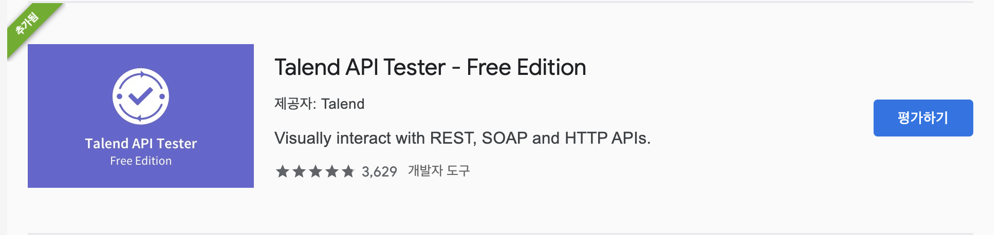
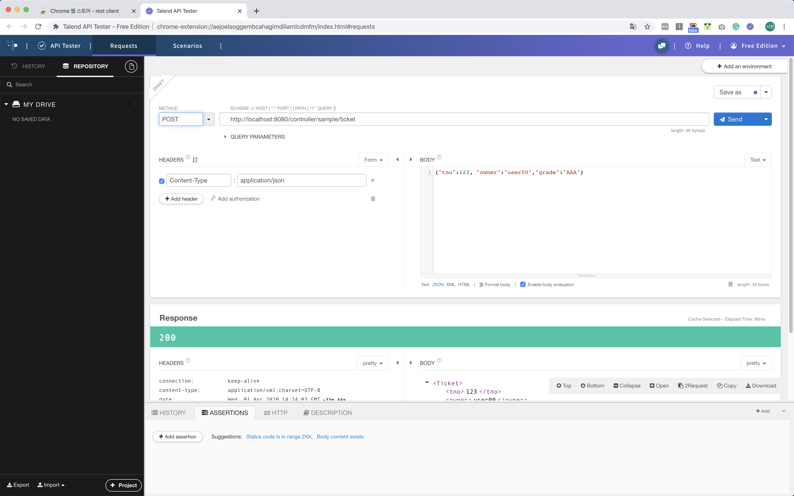

# 4장. REST 방식과 Ajax를 이용하는 댓글 처리
> ## ch16. REST 방식으로 전환
- REST 데이터 처리를 위한 어노테이션
    |어노테이션|기능|
    |----|---|
    |@RestController|Controller가 REST 방식을 처리하기 위한 것임을 명시 함|
    |@ResponseBody|일반적인 JSP와 같은 뷰로 전달되는 게 아니라 데이터 자체를 전달하기 위한 용도|
    |@PathVariable|URL 경로에 있는 값을 파라미터로 추출하려고 할때 사용|
    |@CrossOrigin|Ajax의 크로스 도메인 문제를 해결해주는 어노테이션|
    |@RequestBody|JSON 데이터를 원하는 타입으로 바인딩 처리|
-------
- @RestController
    - JSP와 달리 순수한 데이터를 반환하는 형태이므로 다양한 포맷의 데이터 전송 가능
    - 주로 많이 사용 형태 : 일반문자열, JSON, XML 등
    - produces는 MIME TYPE을 의미
    >일반 문자열 반환
    - @Controller에서는 문자열 return값이 jsp 파일의 이름으로 처리되지만, @RestController에서는 순수한 문자열로 처리 됨
    - SampleController.java
    ```java
    package org.zerock.controller;

    import org.springframework.http.MediaType;
    import org.springframework.web.bind.annotation.GetMapping;
    import org.springframework.web.bind.annotation.RequestMapping;
    import org.springframework.web.bind.annotation.RestController;

    import lombok.extern.log4j.Log4j;

    @RestController
    @RequestMapping("/sample")
    @Log4j
    public class SampleController {
        
        @GetMapping(value = "/getText", produces = "text/plain; charset=UTF-8")
        public String getText() {
            log.info("MIME TYPE : " + MediaType.TEXT_PLAIN_VALUE);
            
            return "안녕하세요";
        }
        
    }
    ```
    >객체 반환
    - SampleVO.java
    ```java
    package org.zerock.domain;

    import lombok.AllArgsConstructor;
    import lombok.Data;
    import lombok.NoArgsConstructor;

    @Data
    @AllArgsConstructor
    @NoArgsConstructor
    public class SampleVO {
        private Integer mno;
        private String firstName;
        private String lastName;
    }
    ```
    - SampleController.java
        - /sample/getSample 로 호출하는 경우 json 타입의 데이터가 전달되는 것을 확인 할수 있음
        - /sample/getSample.json 으로 호출하는 경우 json 타입의 데이터가 전달되는 것을 확인 할수 있음
    ```java
    @GetMapping(value="/getSample", produces={MediaType.APPLICATION_JSON_UTF8_VALUE, MediaType.APPLICATION_XML_VALUE})
	public SampleVO getSample() {
		return new SampleVO(112, "스타", "로드");
	}
    ```
    - SampleController.java
        - produces 생략가능 (결과는 위와 같음)
    ```java
    @GetMapping(value="/getSample2")
	public SampleVO getSample2() {
		return new SampleVO(112, "스타2", "로드2");
	}
    ```
    >컬렉션 타입의 객체 반환
    - SampleContoller.java
    ```java
    @GetMapping(value="/getList")
	public List<SampleVO> getList(){
		return IntStream.range(1,10).mapToObj(i -> new SampleVO(i, i+"First", i+ " Last")).collect(Collectors.toList());
	}
	
	@GetMapping(value="/getMap")
	public Map<String, SampleVO> getMap(){
		Map<String,SampleVO> map = new HashMap<>();
		map.put("First", new SampleVO(111,"그루트", "주니어"));
		
		return map;
	}
    ```
    > ResponseEntity 타입
    - SampleController.java
        - REST 호출 방식의 경우 데이터 자체를 전송하는 방식으로 처리되기 때문에 데이터를 요청한 쪽에서 정상적인 데이터인지 비정산적인 데이터인지 구분할 수 있는 방법이 필요
        - 예제의 경우 height값이 150 미만인 값을 파라미터로 받게되면 502 에러를 같이 보냄(개발자도구 - 네트워크에서 확인 가능)
    ```java
    @GetMapping(value="/check", params= {"height", "weight"})
	public ResponseEntity<SampleVO> check(Double height, Double weight){
		SampleVO vo = new SampleVO(0, "" + height, "" + weight);
		
		ResponseEntity<SampleVO> result = null;
		
		if(height < 150) {
			result = ResponseEntity.status(HttpStatus.BAD_GATEWAY).body(vo);
		}else {
			result = ResponseEntity.status(HttpStatus.OK).body(vo);
		}
		
		return result;
	}
    ```
------------
- @RestController에서 사용하는 어노테이션
    - @RestController는 기존 @Controller에서 사용하던 일반적인 타입 또는 사용자가 정의한 타입(클래스)을 사용
    - 추가로 사용하는 어노테이션이 존재함
        - @PathVariable
            - 일반 컨트롤러에서도 사용이 가능하지만 REST 방식에서 자주 사용됨
            - URL 경로의 일부를 파라미터로 사용할 때 이용
        - @RequestBody
            - JSON 데이터를 원하는 타입의 객체로 변환해야 하는 경우에 주로 사용
    - @PathVariable
        - '?' 뒤에 파라미터를 추가하는 형식의 '쿼리 스트링' 방식 대신 사용
        - URL 상에 경로의 일부를 파라미터로 사용
        ```java
        // http://localhost:8080/controller/sample/product/bags/234
        // http://localhost:8080/controller/sample/product/bags/234.json
        @GetMapping(value="/product/{cat}/{pid}")
        public String[] getPath(@PathVariable("cat") String cat, @PathVariable("pid") int pid) {
            return new String[] {"category: " + cat, "productid: " + pid};
        }
        ```
    - @RequestBody
        - 전달된 요청(request)의 내용(body)을 이용해서 해당 파라미터의 타입으로 변환을 요구함
        - 내부적으로는 HttpMessageConverter 타입의 객체들을 이용해서 다양한 포맷의 입력 데이터를 변환할 수 있음
        - 대부분의 경우에는 JSON 데이터를 서버에 보내서 원하는 타입의 객체로 변환하는 용도로 사용되지만, 경우에 따라서는 원하는 포맷의 데이터를 보내고, 이를 해석해서 원하는 타입으로 사용하기도 함
        - Ticket.java
        ```java
        package org.zerock.domain;

        import lombok.Data;

        @Data
        public class Ticket {
            private int tno;
            private String owner;
            private String grade;
        }
        ```
        - SampleController.java
        ```java
        @PostMapping("/ticket")
        public Ticket convert(@RequestBody Ticket ticket) {
            log.info("convert....ticket" + ticket);
            
            return ticket;
        }
        ```
---------
- REST 방식의 테스트
    - GET 방식이 아니고, POST 등의 방식으로 지정되어있으며, JSON 형태의 데이터를 처리하는 것을 브라우저에서 개발하려면 많은 시간과 노력이 들어감
    - 때문에 Junit과 spring-test를 활용하는 것을 권장
    ```java

    package org.zerock.controller;

    import static org.springframework.test.web.servlet.request.MockMvcRequestBuilders.post;
    import static org.springframework.test.web.servlet.result.MockMvcResultMatchers.status;

    import org.junit.Before;
    import org.junit.Test;
    import org.junit.runner.RunWith;
    import org.springframework.beans.factory.annotation.Autowired;
    import org.springframework.http.MediaType;
    import org.springframework.test.context.ContextConfiguration;
    import org.springframework.test.context.junit4.SpringJUnit4ClassRunner;
    import org.springframework.test.context.web.WebAppConfiguration;
    import org.springframework.test.web.servlet.MockMvc;
    import org.springframework.test.web.servlet.setup.MockMvcBuilders;
    import org.springframework.web.context.WebApplicationContext;
    import org.zerock.domain.Ticket;

    import com.google.gson.Gson;

    import lombok.Setter;
    import lombok.extern.log4j.Log4j;

    @RunWith(SpringJUnit4ClassRunner.class)
    //Test for Controller
    @WebAppConfiguration
    @ContextConfiguration({"file:src/main/webapp/WEB-INF/spring/appServlet/servlet-context.xml",
        "file:src/main/webapp/WEB-INF/spring/root-context.xml"}) // XML Version
    //@ContextConfiguration(classes = {RootConfig.class, ServletConfig.class}) // Java Version
    @Log4j
    public class SampleControllerTests {
        @Setter(onMethod_ = @Autowired)
        private WebApplicationContext ctx;
        
        private MockMvc mockMvc;
        
        @Before
        public void setup() {
            this.mockMvc = MockMvcBuilders.webAppContextSetup(ctx).build();
        }
        
        @Test
        public void testConvert() throws Exception{
            // TestConvert()는 SampleContropller에 작성해 둔 convert() 메서드를 테스트하기 위해서 작성
            // SmpleConteroller의 convert()는 JSON으로 전달되는 데이터를 받아서 Ticket 타입으로 변환함
            // 이를 위해 해당 데이터가 JSON이라는 것을 명시 해야함
            Ticket ticket = new Ticket();
            ticket.setTno(123);
            ticket.setOwner("Admin");
            ticket.setGrade("AAA");
            
            String jsonStr = new Gson().toJson(ticket);
            
            log.info(jsonStr);
            
            // mockMvc는 contentType()을 이용해서 전달하는 데이터가 무엇인지를 알려줄 수 있음
            // 코드 내의 Gson 라이브러리는 Java의 객체를 JSON 문자열로 변환하기 위해서 사용
            mockMvc.perform(post("/sample/ticket")
                    .contentType(MediaType.APPLICATION_JSON)
                    .content(jsonStr))
                    .andExpect(status().is(200));
        }
    }
    ```
-------
- REST 다양한 전송방식
    - REST 방식의 데이터 교환에서 가장 특이한 점은 기존의 GET/POST 외에 다양한 방식으로 데이터를 전달한다는 점
    > HTTP의 전송방식

    |작업|전송방식|URI 예제|
    |---|---|---|
    |등록(Create)|POST|/members/new|
    |조회(Read)|GET|/members/{id}|
    |수정(Update)|PUT|/members/{id}+body(json데이터 등)|
    |삭제(Delete)|DELETE|/members/{id}|
--------------
- 기타 도구
    - Junit 이외에도 Tomcat을 구동한다면 다른 여러가지 도구들이 존재함
- curl
    - https://curl.haxx.se
- chrome 브라우저 앱스토어
    - 크롬 앱스토어(chrome://apps/)에서 REST client 검색
    - 가장 사용자가 많은 확장프로그램으로 테스트 했음<br>
    <br><br>
    - 간단하게 테스트가 가능함
    
------------
> ## ch17. Ajax 댓글 처리
- ReplyVO.java
```java
package org.zerock.domain;

import java.util.Date;

import lombok.Data;

@Data
public class ReplyVO {
	private Long rno;
	private Long bno;
	
	private String reply;
	private String replyer;
	private Date replyDate;
	private Date updateDate;
}
```
- ReplyMapper.java
```java
package org.zerock.mapper;

import java.util.List;

import org.apache.ibatis.annotations.Param;
import org.zerock.domain.Criteria;
import org.zerock.domain.ReplyVO;

public interface ReplyMapper {
	public int insert(ReplyVO vo);
	
	public ReplyVO read(Long bno);
	
	public int delete(Long rno);
	
	public int update(ReplyVO reply);
	
	public List<ReplyVO> getListWithPaging(@Param("cri") Criteria cri, @Param("bno") Long bno);
	
}
```
- ReplyMapper.xml
```xml
<?xml version="1.0" encoding="UTF-8"?>
<!DOCTYPE mapper PUBLIC "-//mybatis.org//DTD Mapper 3.0//EN" "http://mybatis.org/dtd/mybatis-3-mapper.dtd">
<mapper namespace="org.zerock.mapper.ReplyMapper">
	<insert id="insert">
		insert into TBL_REPLY(rno, bno, reply, replyer)
		values(seq_reply.nextval, #{bno}, #{reply}, #{replyer})
	</insert>
	
	<select id="read" resultType="org.zerock.domain.ReplyVO">
		select * from tbl_reply where rno = #{rno}
	</select>
	
	<delete id="delete">
		delete from tbl_reply where rno = #{rno}
	</delete>
	
	<update id="update">
		update tbl_reply set reply = #{reply}, updatedate = sysdate where rno = #{rno}
	</update>
	
	<select id="getListWithPaging" resultType="org.zerock.domain.ReplyVO">
		select rno, bno, reply, replyer, replyDate, updatedate
		from tbl_reply
		where bno = #{bno}
		order by rno asc
	</select>
</mapper>
```
- ReplyMapperTests.java
```java
package org.zerock.controller;


import java.util.List;
import java.util.stream.IntStream;

import org.junit.Test;
import org.junit.runner.RunWith;
import org.springframework.beans.factory.annotation.Autowired;
import org.springframework.http.MediaType;
import org.springframework.test.context.ContextConfiguration;
import org.springframework.test.context.junit4.SpringJUnit4ClassRunner;
import org.springframework.test.context.web.WebAppConfiguration;
import org.springframework.test.web.servlet.MockMvc;
import org.springframework.test.web.servlet.setup.MockMvcBuilders;
import org.springframework.web.context.WebApplicationContext;
import org.zerock.domain.Criteria;
import org.zerock.domain.ReplyVO;
import org.zerock.mapper.ReplyMapper;

import lombok.Setter;
import lombok.extern.log4j.Log4j;

@RunWith(SpringJUnit4ClassRunner.class)
//Test for Controller
@WebAppConfiguration
@ContextConfiguration({"file:src/main/webapp/WEB-INF/spring/appServlet/servlet-context.xml",
	"file:src/main/webapp/WEB-INF/spring/root-context.xml"}) // XML Version
//@ContextConfiguration(classes = {RootConfig.class, ServletConfig.class}) // Java Version
@Log4j
public class ReplyMapperTests {
	
	private Long[] bnoArr = {3145728L, 3145727L, 3145726L, 3145725L, 3145724L};
	
	@Setter(onMethod_ = @Autowired)
	private ReplyMapper mapper;
	
	@Test
	public void testMapper() {
		log.info(mapper);
	}
	
	@Test
	public void testCreate() {
		IntStream.rangeClosed(1,10).forEach(i -> {
			ReplyVO vo = new ReplyVO();
			
			vo.setBno(bnoArr[i % 5]);
			vo.setReply("댓글 테스트 " + i);
			vo.setReplyer("replyer " + i);
			
			mapper.insert(vo);
		});
	}
	
	@Test
	public void testRead() {
		Long targetRno = 5L;
		
		ReplyVO vo = mapper.read(targetRno);
		
		log.info(vo);
	}
	
	@Test
	public void testDelete() {
		Long targetRno = 2L;
		
		mapper.delete(targetRno);
	}
	
	@Test
	public void testUpdate() {
		Long targetRno = 10L;
		
		ReplyVO vo = mapper.read(targetRno);
		
		vo.setReply("Update Reply ");
		
		int count = mapper.update(vo);
		
		log.info("UPDATE COUNT : " + count);
	}
	
	@Test
	public void testList() {
		Criteria cri = new Criteria();
		
		List<ReplyVO> replies = mapper.getListWithPaging(cri, bnoArr[0]);
		
		replies.forEach(reply -> log.info(reply));
	}
}
```
---------
- RESTController 설계
    - REST 방식으로 동작하는 URL을 설계할 때는 PK를 기준으로 작성 권장
    - PK만으로 조회, 수정, 삭제가 가능하기 때문
    - 목록의 경우 PK를 사용할 수 없기 때문에 게시물의 번호(bno)와 페이지 번호(page) 정보들을 URL에서 표현하는 방식을 사용
    
    |작업|URL|HTTP 전송방식|
    |---|---|---|
    |등록|/replies/new|POST|
    |조회|/replies/:rno|GET|
    |삭제|/replies/:rno|DELETE|
    |수정|/replies/rno|PUT or PATCH|
    |페이지|/replies/pages/:bno/:page|GET|
- REST 방식으로 처리할 때 주의점
    - 브라우저나 외부에서 서버를 호출할 때 데이터의 포맷과 서버에서 보내주는 데이터의 타입을 명확히 설계해야 함
    - ex) 댓글 등록의 경우 브라우저에서는 JSON 타입으로 된 댓글 데이터를 전송하고, 서버에서는 댓글의 처리 결과가 정상적으로 되었는지 문자열로 결과를 알려줘야 함
- ReplyController.java
    - @RequestBody : JSON 데이터를 VO에 담을 수 있게 변경해 줌
```java
package org.zerock.controller;

import java.util.List;

import org.springframework.http.HttpStatus;
import org.springframework.http.MediaType;
import org.springframework.http.ResponseEntity;
import org.springframework.web.bind.annotation.GetMapping;
import org.springframework.web.bind.annotation.PathVariable;
import org.springframework.web.bind.annotation.PostMapping;
import org.springframework.web.bind.annotation.RequestBody;
import org.springframework.web.bind.annotation.RequestMapping;
import org.springframework.web.bind.annotation.RequestMethod;
import org.springframework.web.bind.annotation.RestController;
import org.zerock.domain.Criteria;
import org.zerock.domain.ReplyVO;
import org.zerock.service.ReplyService;

import lombok.AllArgsConstructor;
import lombok.extern.log4j.Log4j;

@RequestMapping("/replies/")
@RestController
@Log4j
@AllArgsConstructor
public class ReplyController {
	
	private ReplyService service;
	
	//댓글 등록
	@PostMapping(value="/new", consumes="application/json", produces= {MediaType.TEXT_PLAIN_VALUE})
	public ResponseEntity<String> create(@RequestBody ReplyVO vo){
		log.info("ReplyVO: " + vo);
		
		int insertCount = service.register(vo);
		
		log.info("Reply INSERT COUNT: " + insertCount);
		
		return insertCount == 1
				? new ResponseEntity<>("success", HttpStatus.OK)
				: new ResponseEntity<>(HttpStatus.INTERNAL_SERVER_ERROR);
				//삼항 연산자 처리
	}
	
	// 댓글 목록
	@GetMapping(value="/pages/{bno}/{page}", produces= {MediaType.APPLICATION_ATOM_XML_VALUE, MediaType.APPLICATION_JSON_UTF8_VALUE})
	public ResponseEntity<List<ReplyVO>> getList(@PathVariable("page") int page, @PathVariable("bno") Long bno){
		log.info("getList........");
		Criteria cri = new Criteria(page, 10);
		
		log.info(cri);
		
		return new ResponseEntity<>(service.getList(cri, bno), HttpStatus.OK);
	}
	
	// 댓글 조회
	@GetMapping(value="/{rno}", produces= {MediaType.APPLICATION_ATOM_XML_VALUE, MediaType.APPLICATION_JSON_UTF8_VALUE})
	public ResponseEntity<ReplyVO> get(@PathVariable("rno") Long rno){
		log.info("get : " + rno);
		
		return new ResponseEntity<>(service.get(rno), HttpStatus.OK);
	}
	
	// 댓글 삭제
	@DeleteMapping(value="/{rno}", produces= {MediaType.TEXT_PLAIN_VALUE})
	public ResponseEntity<String> remove(@PathVariable("rno") Long rno){
		log.info("remove : " + rno);
		
		return service.remove(rno) == 1
				? new ResponseEntity<>("success", HttpStatus.OK)
				: new ResponseEntity<>(HttpStatus.INTERNAL_SERVER_ERROR);
	}
	
	// 댓글 수정
	@RequestMapping(method= {RequestMethod.PUT, RequestMethod.PATCH}, value="/{rno}", consumes="application/json", produces= {MediaType.TEXT_PLAIN_VALUE})
	public ResponseEntity<String> modify(@RequestBody ReplyVO vo, @PathVariable("rno") Long rno){
		vo.setRno(rno);
		
		log.info("rno : " + rno);
		log.info("modify : " + vo);
		
		return service.modify(vo) == 1
				? new ResponseEntity<>("success", HttpStatus.OK)
				: new ResponseEntity<>(HttpStatus.INTERNAL_SERVER_ERROR);
	}
}
```
-----------
- JavaScript 모듈화
    - reply.js
    ```js
    console.log("Reply Module.....");

    var replyService = (function(){
        // 댓글 등록
        function add(reply, callback, error){
            console.log("reply.......");
            
            $.ajax({
                type : 'post',
                url : '/replies/new',
                data : JSON.stringify(reply),
                contentType : "application/json; charset=utf-8",
                success : function(result, status, xhr){
                    if(callback){
                        callback(result);
                    }
                },
                error : function(xhr, status, er){
                    if(error){
                        error(er);
                    }
                }
            })
        }
        
        // 댓글 목록
        function getList(param, callback, error){
            var bno = param.bno;
            
            var page = param.page || 1;
            
            $.getJSON("/replies/pages/" + bno + "/" + page + ".json", 
            function(data){
                if(callback){
                    callback(data);
                }
            }).fail(function(xhr, status, err){
                if(error){
                    error();
                }
            });
        }
        
        // 댓글 삭제
        function remove(rno, callback, error){
            $.ajax({
                type : 'delete',
                url : '/replies/' + rno,
                success : function(deleteResult, status, xhr){
                    if(callback){
                        callback(deleteResult);
                    }
                },
                error : function(xhr, status, er){
                    if(error){
                        error(er);
                    }
                }
            })
        }
        
        // 댓글 수정
        function update(reply, callback, error){
            console.log("RNO : " + reply.rno);
            
            $.ajax({
                type : 'put',
                url : '/replies/' + reply.rno,
                data : JSON.stringify(reply),
                contentType : "application/json; charset=utf-8",
                success : function(result, status, xhr){
                    if(callback){
                        callback(result);
                    }
                },
                error : function(xhr, status, er){
                    if(error){
                        error(er);
                    }
                }
            })
        }
        
        // 댓글 조회
        function get(rno, callback, error) {
            $.get("/replies/" + rno + ".json", function(result) {
                if (callback) {
                    callback(result);
                }
            }).fail(function(xhr, status, err) {
                if (error) {
                    error();
                }
            });
        }
        
        return {
            add : add,
            getList : getList,
            remove : remove,
            update : update,
            get : get
        };
    })();
    ```
    - get.jsp
    ```js
    <script type="text/javascript" src="/resources/js/reply.js"></script>

    <script>
        console.log("===============");
        console.log("JS TEST");
        
        var bnoValue = '<c:out value="${board.bno}"/>';
        
        //for replyService add test
        replyService.add({
            reply : "JS TEST",
            replyer : "tester",
            bno : bnoValue
        }, function(result) {
            alert("RESULT: " + result);
        });

        //for replyService getList test
        replyService.getList({
            bno : bnoValue,
            page : 1
        }, function(list) {
            for (var i = 0, len = list.length || 0; i < len; i++) {
                console.log(list[i]);
            }
        });

        //for replyService remove test
        replyService.remove(23, function(count) {
            console.log(count);

            if (count === "success") {
                alert("REMOVED");
            }
        }, function(err) {
            alert("ERROR......");
        });

        //for replyService update test
        replyService.update({
            rno : 22,
            bno : bnoValue,
            reply : "Modified Reply...."
        }, function(result) {
            alert("수정 완료...");
        });
        
        //for replyService remove test
        replyService.get(10, function(data){
            console.log(data);
        });
        
    </script>
    ```
--------------
- 이벤트 처리와 HTML 처리
    - reply.js
        - 날짜 시간 보기 좋게 변경
    ```js
    // 날짜 시간 표기
	function displayTime(timeValue){
		var today = new Date();
		
		var gap = today.getTime() - timeValue;
		
		var dateObj = new Date(timeValue);
		var str = "";
		
		if(gap < (1000 * 60 * 60 * 24)){
			var hh = dateObj.getHours();
			var mi = dateObj.getMinutes();
			var ss = dateObj.getSeconds();
			
			return [(hh > 9 ? '' : '0') + hh, ':', (mi > 9 ? '' : '0') + mi, ':', (ss > 9 ? '' : '0') + ss].join('');
		}else{
			var yy = dateObj.getFullYear();
			var mm = dateObj.getMonth() + 1; // getMonth() is zero-based
			var dd = dateObj.getDate();
			
			return [yy, '/', (mm > 9 ? '' : '0') + mm, '/', (dd > 9 ? '' : '0') + dd].join('');
		}
	}
	
	return {
		add : add,
		getList : getList,
		remove : remove,
		update : update,
		get : get,
		displayTime : displayTime
	};
    ```
    - get.jsp
    ```jsp
    <%@ page language="java" contentType="text/html; charset=UTF-8"
	pageEncoding="UTF-8"%>
    <%@ taglib uri="http://java.sun.com/jsp/jstl/core" prefix="c" %>
    <%@ taglib uri="http://java.sun.com/jsp/jstl/fmt" prefix="fmt" %>
        
    <%@include file="../includes/header.jsp"%>
    <!-- <script>
        console.log("===============");
        console.log("JS TEST");
        
        var bnoValue = '<c:out value="${board.bno}"/>';
        
        //for replyService add test
        replyService.add({
            reply : "JS TEST",
            replyer : "tester",
            bno : bnoValue
        }, function(result) {
            alert("RESULT: " + result);
        });

        //for replyService getList test
        replyService.getList({
            bno : bnoValue,
            page : 1
        }, function(list) {
            for (var i = 0, len = list.length || 0; i < len; i++) {
                console.log(list[i]);
            }
        });

        //for replyService remove test
        replyService.remove(23, function(count) {
            console.log(count);

            if (count === "success") {
                alert("REMOVED");
            }
        }, function(err) {
            alert("ERROR......");
        });

        //for replyService update test
        replyService.update({
            rno : 22,
            bno : bnoValue,
            reply : "Modified Reply...."
        }, function(result) {
            alert("수정 완료...");
        });
        
        //for replyService remove test
        replyService.get(10, function(data){
            console.log(data);
        });
        
    </script> -->
    <!-- Modal -->
    <div class="modal fade" id="myModal" tabindex="-1" role="dialog" aria-labelledby="myModalLabel" aria-hidden="true">
        <div class="modal-dialog">
            <div class="modal-content">
                <div class="modal-header">
                    <button type="button" class="close" data-dismiss="modal" aria-hidden="true">&times;</button>
                    <h4 class="modal-title" id="myModalLabel">REPLY MODAL</h4>
                </div>
                <div class="modal-body">
                    <div class="form-group">
                        <label>Reply</label>
                        <input class="form-control" name="reply" value="New Reply!!!">
                    </div>
                    <div class="form-group">
                        <label>Replyer</label>
                        <input class="form-control" name="replyer" value="replyer">
                    </div>
                    <div class="form-group">
                        <label>Reply Date</label>
                        <input class="form-control" name="replyDate" value="">
                    </div>
                </div>
                <div class="modal-footer">
                    <button id="modalModBtn" type="button" class="btn btn-warning">Modify</button>
                    <button id="modalRemoveBtn" type="button" class="btn btn-danger">Remove</button>
                    <button id="modalRegisterBtn" type="button" class="btn btn-primary">Register</button>
                    <button id="modalCloseBtn" type="button" class="btn btn-default">Close</button>
                </div>
            </div>
        </div>
    </div>
    <script type="text/javascript" src="/resources/js/reply.js"></script>
    <script type="text/javascript">
    $(document).ready(function (){

        var bnoValue = '<c:out value="${board.bno}"/>';
        var replyUL = $(".chat");
        
        showList(1);
        
        function showList(page){
            replyService.getList({bno:bnoValue, page:page||1}, function(list){
                var str="";
                if(list == null || list.length == 0){
                    replyUL.html("");
                    
                    return;
                }
                for(var i=0, len=list.length || 0; i<len; i++){
                    str +="<li class='left clearfix' data-rno='" + list[i].rno+"'>";
                    str +="<div><div class='header'><strong class='primary-font'>" + list[i].replyer+"</strong>";
                    str +="<small class='pull-right text-muted'>" + replyService.displayTime(list[i].replyDate) +"</small></div>";
                    str +="<p>" + list[i].reply+"</p></div></li>";
                }
                replyUL.html(str);
            });//end function
        }//end showList
        
        var modal = $(".modal");
        var modalInputReply = modal.find("input[name='reply']");
        var modalInputReplyer = modal.find("input[name='replyer']");
        var modalInputReplyDate = modal.find("input[name='replyDate']");
        
        var modalModBtn = $("#modalModBtn");
        var modalRemoveBtn = $("#modalRemoveBtn");
        var modalRegisterBtn = $("#modalRegisterBtn");
        var modalCloseBtn = $("#modalCloseBtn");
        
        $("#addReplyBtn").on("click", function(e){
            modal.find("input").val("");
            modalInputReplyDate.closest("div").hide();
            modal.find("button[id != 'modalCloseBtn']").hide();
            
            modalRegisterBtn.show();
            
            $(".modal").modal("show");
        });
        
        modalRegisterBtn.on("click", function(e){
            var reply = {
                reply: modalInputReply.val(),
                replyer: modalInputReplyer.val(),
                bno: bnoValue
            };
            
            replyService.add(reply, function(result){
                alert(result);
                
                modal.find("input").val("");
                modal.modal("hide");
                
                showList(1);
            });
        });

        $(".chat").on("click", "li", function(e){
            var rno = $(this).data("rno");
            
            replyService.get(rno, function(reply){
                modalInputReply.val(reply.reply);
                modalInputReplyer.val(reply.replyer);
                modalInputReplyDate.val(replyService.displayTime(reply.replyDate)).attr("readonly", "readonly");
                modal.data("rno", reply.rno);
                
                modal.find("button[id != 'modalCloseBtn']").hide();
                modalModBtn.show();
                modalRemoveBtn.show();
                
                $(".modal").modal("show");
                
            });
            
            console.log(rno);
        })
        
        modalModBtn.on("click", function(e){
            var reply = {rno:modal.data("rno"), reply: modalInputReply.val()};
            
            replyService.update(reply, function(result){
                alert(result);
                modal.modal("hide");
                showList(1);
            });
        });
        
        modalRemoveBtn.on("click", function(e){
            var rno = modal.data("rno");
            
            replyService.remove(rno, function(result){
                alert(result);
                modal.modal("hide");
                showList(1);
            });
        });
        
        modalCloseBtn.on("click", function(e){
            modal.modal("hide");
        });
        
        
        var operForm = $("#operForm");
        
        $("button[data-oper='modify']").on("click", function(e){
            operForm.attr("action","/board/modify").submit();
        });
        
        $("button[data-oper='list']").on("click", function(e){
            operForm.find("#bno").remove();
            operForm.attr("action","/board/list")
            operForm.submit();
        });
    });
    </script>

    <div class="row">
        <div class="col-lg-12">
            <h1 class="panel-heading">Board Register</h1>
        </div>
    </div>
    <!-- /.row -->
    <div class="row">
        <div class="col-lg-12">
            <div class="panel panel-default">
                <div class="panel-heading">Board Register</div>
                <!-- /.panel-heading -->
                <div class="panel-body">
                    <div class="form-group">
                        <label>Bno</label><input class="form-control" name="bno" value='<c:out value="${board.bno}"/>' readonly="readonly">
                    </div>
                    <div class="form-group">
                        <label>Title</label><input class="form-control" name="title" value='<c:out value="${board.title}" />' readonly="readonly">
                    </div>
                    <div class="form-group">
                        <label>Text area</label><textarea class="form-control" rows="3" name="content" readonly="readonly"><c:out value="${board.content}" /></textarea>
                    </div>
                    <div class="form-group">
                        <label>Writer</label><input class="form-control" name="writer" value='<c:out value="${board.writer}" />' readonly="readonly">
                    </div>
                    <button data-oper="modify" data-oper="modify" class="btn btn-default">Modify</button>
                    <button data-oper="list" data-oper="list" class="btn btn-default">List</button>
                    <form id='operForm' action="/board/modify" method="get">
                        <input type="hidden" id="bno" name="bno" value='<c:out value="${board.bno}"/>'>
                        <input type="hidden" name="pageNum" value="${cri.pageNum}">
                        <input type="hidden" name="amount" value="${cri.amount}">
                        <input type='hidden' name='type' value='<c:out value="${cri.type}"/>' />
                        <input type='hidden' name='keyword' value='<c:out value="${cri.keyword}"/>' />
                    </form>
                </div>
            </div>
        </div>
    </div>
    <div class="row">
        <div class="col-lg-12">
            <div class="panel panel-default">
                <!-- <div class="panel-heading">
                    <i class="fa fa-comments fa-fw"></i> Reply
                </div> -->
                <!-- /.panel-heading -->
                <div class="panel-heading">
                    <i class="fa fa-comments fa-fw"></i> Reply
                    <button id='addReplyBtn' class='btn btn-primary btn-xs pull-right'>New Reply</button>
                </div>
                <div class="panel-body">
                    <ul class="chat">
                        <li class="left clearfix" data-rno='12'>
                            <div>
                                <div class="header">
                                    <strong class="primary-font">user00</strong>
                                    <small class="pull-right text-muted">2018-01-01 13:13</small>
                                </div>
                                <p>Good job!</p>
                            </div>
                        </li>
                    </ul>
                </div>
            </div>
        </div>
    </div>
    <%@include file="../includes/footer.jsp"%>
    ```
---------
- 데이터베이스 인덱스 설계
    - 댓글에 대해서 우선적으로 고려해야 하는 일은 댓글을 조회할때 댓글의 번호가 아닌 해당 게시물의 번호가 중심이 된다는 점
    - 인덱스를 사용하게 되면 정렬을 피할 수 있기 때문에 order by를 생략할 수 있음
    ```sql
    create index idx_reply on tbl_reply (bno desc, rno asc);

    select /*+ INDEX(tbl_reply idx_reply) */
    rownum rn, bno, rno, reply, replyer, replyDate, updatedate
    from tbl_reply
    where bno = 5
    and rno > 0;
    ```
    - ReplyMapper.xml
    ```xml
    <select id="getListWithPaging" resultType="org.zerock.domain.ReplyVO">
		<![CDATA[
		select bno, rno, reply, replyer, replyDate, updatedate
		from(
				select /*+ INDEX(tbl_reply idx_reply) */
				rownum rn, bno, rno, reply, replyer, replyDate, updatedate
				from tbl_reply
				where bno = #{bno}
				and rno > 0
				and rownum <= #{cri.pageNum} * #{cri.amount}
			)
		where rn > (#{cri.pageNum} - 1) * #{cri.amount}
		]]>
	</select>
    ```
-------
- 댓글 수 파악
    - ReplyMapper.java
    ```java
    public int getCountByBno(Long bno);
    ```
    - ReplyMapper.xml
    ```xml
    <select id="getCountByBno" resultType="int">
		<![CDATA[
		select count(rno) from tbl_reply where bno = #{bno}
		]]>
	</select>
    ```
    - ReplyPageDTO.java
    ```java
    package org.zerock.domain;

    import java.util.List;

    import lombok.AllArgsConstructor;
    import lombok.Data;
    import lombok.Getter;

    @Data
    @AllArgsConstructor
    @Getter
    public class ReplyPageDTO {
        private int replyCnt;
        private List<ReplyVO> list;
    }
    ```
    - ReplyService.java
    ```java
    public ReplyPageDTO getListPage(Criteria cri, Long bno);
    ```
    - ReplyServiceImpl.java
    ```java
    public ReplyPageDTO getListPage(Criteria cri, Long bno) {
		return new ReplyPageDTO(mapper.getCountByBno(bno), mapper.getListWithPaging(cri, bno));
	}
    ```
    - ReplyController.java
        - getList 수정
    ```java
    // 댓글 목록
	@GetMapping(value="/pages/{bno}/{page}", produces= {MediaType.APPLICATION_ATOM_XML_VALUE, MediaType.APPLICATION_JSON_UTF8_VALUE})
	public ResponseEntity<ReplyPageDTO> getList(@PathVariable("page") int page, @PathVariable("bno") Long bno){
		Criteria cri = new Criteria(page, 10);
		
		log.info("get Reply List bno: " + bno);
		
		log.info("cri : " + cri);
		
		return new ResponseEntity<>(service.getListPage(cri, bno), HttpStatus.OK);
	}
    ```
    - reply.js
        - 일부 수정
    ```js
    // 댓글 목록
	function getList(param, callback, error){
		var bno = param.bno;
		
		var page = param.page || 1;
		
		$.getJSON("/replies/pages/" + bno + "/" + page + ".json", 
		function(data){
			if(callback){
				//callback(data); 댓글 목록만 가져오는 경우
				callback(data.replyCnt, data.list);	// 댓글 숫자와 목록을 가져오는 경
			}
		}).fail(function(xhr, status, err){
			if(error){
				error();
			}
		});
	}
    ```
    ```js
    function showList(page){
		console.log("show list : " + page);
		
		replyService.getList({bno:bnoValue, page:page||1}, function(list){
			
			console.log("replyCnt : " + replyCnt);
			console.log("list : " + list);
			console.log(list);
			
			if(page == -1){
				pageNum = Math.ceil(replyCnt/10.0);
				showList(pageNum);
				return;
			}
			
			var str="";
			if(list == null || list.length == 0){
				replyUL.html("");
				
				return;
			}
			for(var i=0, len=list.length || 0; i<len; i++){
				str +="<li class='left clearfix' data-rno='" + list[i].rno+"'>";
				str +="<div><div class='header'><strong class='primary-font'>" + list[i].replyer+"</strong>";
				str +="<small class='pull-right text-muted'>" + replyService.displayTime(list[i].replyDate) +"</small></div>";
				str +="<p>" + list[i].reply+"</p></div></li>";
			}
			replyUL.html(str);
		});//end function
	}//end showList
    ```
    ```js
    modalRegisterBtn.on("click", function(e){
		var reply = {
			reply: modalInputReply.val(),
			replyer: modalInputReplyer.val(),
			bno: bnoValue
		};
		
		replyService.add(reply, function(result){
			alert(result);
			
			modal.find("input").val("");
			modal.modal("hide");
			
			//showList(1);
			showList(-1);
		});
	});
    ```
------
 - 댓글 페이징 추가
    - get.jsp
        - \<div class="panel-footer">\</div> 추가
    ```js
    <div class="row">
        <div class="col-lg-12">
            <div class="panel panel-default">
                <!-- <div class="panel-heading">
                    <i class="fa fa-comments fa-fw"></i> Reply
                </div> -->
                <!-- /.panel-heading -->
                <div class="panel-heading">
                    <i class="fa fa-comments fa-fw"></i> Reply
                    <button id='addReplyBtn' class='btn btn-primary btn-xs pull-right'>New Reply</button>
                </div>
                <div class="panel-body">
                    <ul class="chat">
                        <!-- <li class="left clearfix" data-rno='12'>
                            <div>
                                <div class="header">
                                    <strong class="primary-font">user00</strong>
                                    <small class="pull-right text-muted">2018-01-01 13:13</small>
                                </div>
                                <p>Good job!</p>
                            </div>
                        </li> -->
                    </ul>
                </div>
                <div class="panel-footer"></div>
            </div>
        </div>
    </div>
    ```
    - get.jsp
        - 스크립트 추가
    ```jsp
    <!-- 댓글 페이징 -->
	var pageNum = 1;
	var replyPageFooter = $(".panel-footer");
	
	function showReplyPage(replyCnt){
		var endNum = Math.ceil(pageNum / 10.0) * 10;
		var startNum = endNum - 9;
		
		var prev = startNum != 1;
		var next = false;
		
		if(endNum * 10 >= replyCnt){
			endNum = Math.ceil(replyCnt/10.0);
		}
		
		if(endNum * 10 < replyCnt){
			next = true;
		}
		
		var str = "<ul class='pagination pull-right'>";
		
		if(prev){
			str+= "<li class='page-item'><a class='page-link' href='" + (startNum -1)+"'>Previous</a></li>";
		}
		
		for(var i=startNum; i<=endNum; i++){
			var active = pageNum == i? "active":"";
			
			str+= "<li class='page-item " + active + " '><a class='page-link' href='"+ i + "'>" + i + "</a></li>";
		}
		
		if(next){
			str+= "<li class='page-item'><a class='page-link' href='" + (endNum +1)+"'>Next</a></li>";
		}
		
		str += "</ul></div>";
		
		console.log(str);
		
		replyPageFooter.html(str);
	}
    ```
    - get.jsp
        - showList 함수에 댓글 페이징 함부 호출 추가
    ```jsp
    function showList(page){
		console.log("show list : " + page);
		
		replyService.getList({bno:bnoValue, page:page||1}, function(replyCnt, list){
			
			console.log("replyCnt : " + replyCnt);
			console.log("list : " + list);
			console.log(list);
			
			if(page == -1){
				pageNum = Math.ceil(replyCnt/10.0);
				showList(pageNum);
				return;
			}
			
			var str="";
			if(list == null || list.length == 0){
				replyUL.html("");
				
				return;
			}
			for(var i=0, len=list.length || 0; i<len; i++){
				str +="<li class='left clearfix' data-rno='" + list[i].rno+"'>";
				str +="<div><div class='header'><strong class='primary-font'>" + list[i].replyer+"</strong>";
				str +="<small class='pull-right text-muted'>" + replyService.displayTime(list[i].replyDate) +"</small></div>";
				str +="<p>" + list[i].reply+"</p></div></li>";
			}
			replyUL.html(str);
			
            // 댓글 페이징
			showReplyPage(replyCnt);
		});//end function
	}//end showList
    ```
    - get.jsp
        - 페이지 클릭 시 이동
    ```jsp
    replyPageFooter.on("click", "li a", function(e){
		e.preventDefault();
		console.log("page click");
		
		var targetPageNum = $(this).attr("href");
		
		pageNum = targetPageNum;
		
		showList(pageNum);
	});
    ```
    - get.jsp
        - 수정 삭제 시 pageNum 활용
    ```jsp
    modalModBtn.on("click", function(e){
		var reply = {rno:modal.data("rno"), reply: modalInputReply.val()};
		
		replyService.update(reply, function(result){
			alert(result);
			modal.modal("hide");
			showList(pageNum);
		});
	});
	
	modalRemoveBtn.on("click", function(e){
		var rno = modal.data("rno");
		
		replyService.remove(rno, function(result){
			alert(result);
			modal.modal("hide");
			showList(pageNum);
		});
	});
    ```