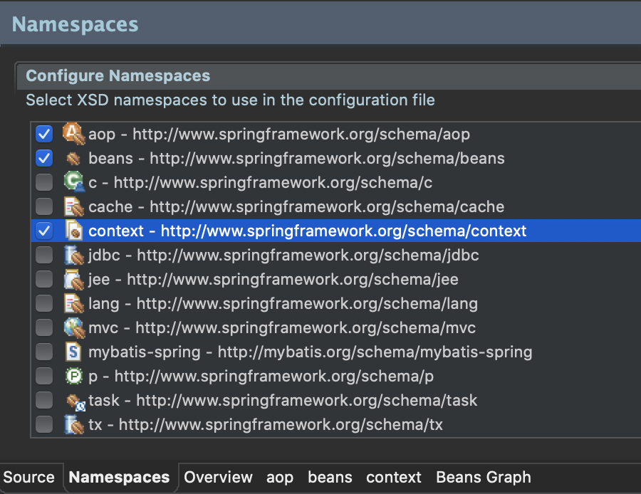

# 5장. AOP와 트랜잭션
> ## ch18. AOP라는 패러다임
- AOP란?
    - 관점 지향 프로그래밍
    - 관점이라는 용어는 개발자들에게 관심사(concern)라는 말로 통용됨
    - 즉, 코드를 작성하면서 염두(관심)에 두는 일들
        - 파라미터가 올바르게 들어왔을까?
        - 이 작업을 하는 사용자가 적절한 권한을 가진 사용자인가?
        - 이 작업에서 발생할 수 있는 모든 예외는 어떻게 처리해야 하는가?
        - 등등...
    - 핵심 로직은 아니지만, 코드를 온전하게 만들기 위해서 필요한 고민들.<br>
    <font color="red">AOP는 이러한 핵심 비즈니스 로직이 아닌 관심사들을 별도의 코드로 작성하여<br>
    컴파일 혹은 실행시점에만 결합시킬 수 있도록 괌심사를 분리 하는 것.<br>
    이로 인해 개발자는 핵심 로직에 조금 더 집중할 수 있음</font>
    - 기존의 코드를 수정하지 않고, 원하는 기능들과 결합할 수 있는 패러다임
- AOP 용어들
    - Target
        - 순수한 비즈니스 로직을 의미
        - 어떠한 관심사들과도 관계를 맺지않는 순수한 코어(core)
    - Proxy
        - Target을 전체적으로 감싸고 있는 존재
        - Proxy는 내부적으로 Target을 호출하지만, 필요한 관심사들을 거쳐서 Target을 호출하도록 자동 혹은 수동으로 작성됨
        - Proxy는 대부분 Spring AOP 기능을 이용해서 자동으로 생성되는 auto-proxy 방식을 사용
    - JoinPoint
        - Target이 가진 여러 메서드 (엄밀하게 스프링 AOP에서는 메서드만이 JoinPoint)
    - Pointcut
        - Target에는 여러 메서드(JointPoint)가 존재하기 때문에 어떤 메서드에 관심사를 결합할 것인지를 결정하는 역할
    - Aspect
        - 관심사(concern)는 Aspect와 Advice로 표현할 수 있으며, Aspect는 관심사 자체를 의미하는 추상명사
    - Advice
        - Advice는 Aspect를 구현한 코드
        - 걱정거리를 분리해 놓은 코드를 의미
            |구분|설명|
            |---|---|
            |Before Advice|Target의 JoinPoint를 호출하기 전에 실행되는 코드.<br>코드의 실행 자체에는 관여할 수 없음|
            |After Returning Advice|모든 실행이 정상적으로 이루어진 후에 동작하는 코드|
            |After Throwing Advice|예외가 발생한 뒤에 동작하는 코드|
            |After Advice|정상적으로 실행되거나 예외가 발생했을 때 구분 없이 동작하는 코드|
            |Around Advice|메서드의 실행 자체를 제어할 수 있는 가장 강력한 코드.<br>직접 대상 메서드를 호출하고 결과나 예외를 처리할 수 있음|
----------
- Advice 어노테이션
    - 과거의 스프링에서는 별도의 인터페이스로 구현되고 이를 클래스로 구현하는 방식으로 제작했으나, 스프링 3버전 이후에는 어노테이션만으로도 모든 설정이 가능
    - Target에 어떤 Advice를 적용할 것인지 XML 설정이 가능하지만, 어노테이션을 통해서도 사용이 가능함
    - AOP에서 Target은 Pointcut에 의해서 자신에게는 없는 기능들을 가지게 됨.
        |구분|설명|
        |---|---|
        |execution(@execution)|메서드를 기준으로 Pointcut을 설정|
        |within(@within)|특정한 타입(클래스)을 기준으로 Pointcut을 설정|
        |this|주어진 인터페이스를 구현한 객체를 대상으로 Pointcut으로 설정|
        |args(@args)|특정한 파라미터를 가지는 대상들만을 Pointcut으로 설정|
        |@annotation|특정한 어노테이션이 적용된 대상들만을 Pointcut으로 설정|
-----------
- AOP를 활용한 LogAdvice 설계
    - SampleService.java
    ```java
    package org.zerock.service;

    public interface SampleService {
        public Integer doAdd(String str1, String str2) throws Exception;
    }
    ```
    - SampleServiceImpl.java
    ```java
    package org.zerock.service;

    import org.springframework.stereotype.Service;

    @Service
    public class SampleServiceImpl implements SampleService{

        @Override
        public Integer doAdd(String str1, String str2) throws Exception {
            return Integer.parseInt(str1) + Integer.parseInt(str2);
        }
        
    }
    ```
    - LogAdvice.java
        - Log를 기록해주는 AOP 설계
    ```java
    package org.zerock.aop;

    import org.aspectj.lang.annotation.Aspect;
    import org.aspectj.lang.annotation.Before;
    import org.springframework.stereotype.Component;

    import lombok.extern.log4j.Log4j;

    @Aspect // Aspect를 구현한 것임을 나타내기 위함
    @Log4j
    @Component  // bean으로 인식하기 위해 사용
    public class LogAdvice {
        @Before("execution(* org.zero.service.SampleService*.*(..))")
        public void logBefore() {
            log.info("========================");
        }
    }
    ```
    - root-context.xml
    
        
    ```xml
    <?xml version="1.0" encoding="UTF-8"?>
    <beans xmlns="http://www.springframework.org/schema/beans"
        xmlns:xsi="http://www.w3.org/2001/XMLSchema-instance"
        xmlns:aop="http://www.springframework.org/schema/aop"
        xmlns:context="http://www.springframework.org/schema/context"
        xsi:schemaLocation="http://www.springframework.org/schema/beans https://www.springframework.org/schema/beans/spring-beans.xsd
            http://www.springframework.org/schema/context http://www.springframework.org/schema/context/spring-context-4.3.xsd
            http://www.springframework.org/schema/aop http://www.springframework.org/schema/aop/spring-aop-4.3.xsd">
        
        <!-- Root Context: defines shared resources visible to all other web components -->
        <context:annotation-config></context:annotation-config>
        
        <context:component-scan base-package="org.zerock.service"></context:component-scan>
        <context:component-scan base-package="org.zerock.aop"></context:component-scan>
        
        <aop:aspectj-autoproxy></aop:aspectj-autoproxy>
            
    </beans>
    ```
    - SampleServiceTests.java
    ```java
    package org.zerock.Service;

    import org.junit.Test;
    import org.junit.runner.RunWith;
    import org.springframework.beans.factory.annotation.Autowired;
    import org.springframework.test.context.ContextConfiguration;
    import org.springframework.test.context.junit4.SpringJUnit4ClassRunner;
    import org.zerock.service.SampleService;

    import lombok.Setter;
    import lombok.extern.log4j.Log4j;

    @RunWith(SpringJUnit4ClassRunner.class)
    @Log4j
    @ContextConfiguration({"file:src/main/webapp/WEB-INF/spring/root-context.xml"})
    public class SampleServiceTests {
        @Setter(onMethod_=@Autowired)
        private SampleService service;
        
        @Test
        public void testClass() {
            log.info(service);
            log.info(service.getClass().getName());
        }
        /*
            INFO : org.zerock.Service.SampleServiceTests - org.zerock.service.SampleServiceImpl@f80945f
            INFO : org.zerock.Service.SampleServiceTests - com.sun.proxy.$Proxy22
            // <aop:aspectj-autoproxy></aop:aspectj-autoproxy>가 정상작동 되었다면 Proxy 클래스의 인터페이스가 되는 것을 확인할 수 있음
        */
        
        @Test
        public void testAdd() throws Exception{
            log.info(service.doAdd("123", "456"));
        }
        /*
            INFO : org.zerock.aop.LogAdvice - ========================
            INFO : org.zerock.Service.SampleServiceTests - 579
            
            // LogAdvice에서 설정해둔 로그가 같이 출력 
        */
        
    }
    ```
    - LogAdvice.java
    ```java
    @Before("execution(* org.zerock.service.SampleService*.doAdd(String, String)) && args(str1, str2)")
	public void logBeforeWithParam(String str1, String str2) {
		log.info("str1 : " + str1);
		log.info("str2 : " + str2);
	}
    ```
    - SampleServiceTests.java
    ```java
    @Test
    public void testAdd() throws Exception{
        log.info(service.doAdd("123", "456"));
    }
    /*
		INFO : org.zerock.aop.LogAdvice - ========================
		INFO : org.zerock.aop.LogAdvice - str1 : 123
		INFO : org.zerock.aop.LogAdvice - str2 : 456
		INFO : org.zerock.Service.SampleServiceTests - 579
		
		// LogAdvice에서 설정해둔 로그가 같이 출력 
	 */
    ```
    - LogAdvice.java
    ```java
    @AfterThrowing(pointcut = "execution(* org.zerock.service.SampleService*.*(..))", throwing="exception")
	public void logException(Exception exception) {
		log.info("Exception....!!!!");
		log.info("exception : " + exception);
	}
    ```
    - SampleServiceTests.java
    ```java
    @Test
	public void testAddError() throws Exception{
		log.info(service.doAdd("123", "ABC"));
	}
	/*
	 	INFO : org.zerock.aop.LogAdvice - ========================
		INFO : org.zerock.aop.LogAdvice - str1 : 123
		INFO : org.zerock.aop.LogAdvice - str2 : ABC
		INFO : org.zerock.aop.LogAdvice - Exception....!!!!
		INFO : org.zerock.aop.LogAdvice - exception : java.lang.NumberFormatException: For input string: "ABC"
	 */
     ```
     - LogAdvice.java
     ```java
     @Around("execution(* org.zerock.service.SampleService*.*(..))")
	public Object logTime(ProceedingJoinPoint pjp) {
		long start = System.currentTimeMillis();
		
		log.info("Target : " + pjp.getTarget());
		log.info("Param : " + Arrays.deepToString(pjp.getArgs()));
		
		//invoke method
		Object result = null;
		
		try {
			result = pjp.proceed();
		}catch(Throwable e) {
			e.printStackTrace();
		}
		
		long end = System.currentTimeMillis();
		
		log.info("TIME : " + (end - start));
		
		return result;
	}
    ```
    - SampleServiceTests.java
    ```java
    @Test
	public void testAdd() throws Exception{
		log.info(service.doAdd("123", "456"));
	}
	/*
		INFO : org.zerock.aop.LogAdvice - Param : [123, 456]
		INFO : org.zerock.aop.LogAdvice - ========================
		INFO : org.zerock.aop.LogAdvice - str1 : 123
		INFO : org.zerock.aop.LogAdvice - str2 : 456
		INFO : org.zerock.aop.LogAdvice - TIME : 2
		
		// LogAdvice에서 설정해둔 로그가 같이 출력 
	 */
     ```
-------------