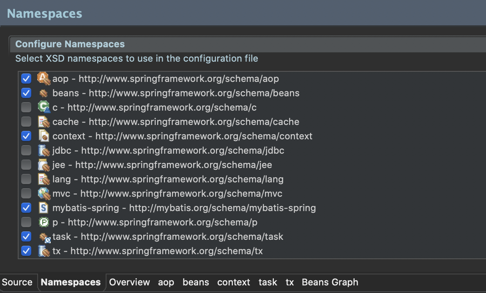

# 6장. 파일 업로드 처리
> ## ch21. 파일 업로드 방식
- 파일 업로드 방식
    - \<form> 태그를 이용하는 방식
        - 브라우저의 제한이 없어야 하는 경우에 사용
        - 일반적으로 페이지 이동과 동시에 첨부파일을 업로드하는 방식
        - \<iframe>을 이용해서 화면의 이동 없이 첨부파일을 처리하는 방식
    - Ajax를 이용한 방식
        - 첨부파일을 별도로 처리하는 방식
        - \<input type="file">을 이용하고 Ajax로 처리하는 방식
        - HTML5의 Drag And Drop 기능이나 jQuery 라이브러리를 이용해서 처리하는 방식
-------
- \<form> 방식의 파일 업로드
    > uploadForm.jsp
    ```jsp
    <%@ page language="java" contentType="text/html; charset=UTF-8"
    pageEncoding="UTF-8"%>
    <!DOCTYPE html>
    <html>
    <head>
    <meta charset="UTF-8">
    <title>Insert title here</title>
    </head>
    <body>
        <from action="uploadFormAction" method="post" enctype="mulipart/form-data">
        <input type="file" name="uploadFile" multiple>
        <button>Submit</button>
        </from>
    </body>
    </html>
    ```
    > UploadController.java
    ```java
    package org.zerock.controller;

    import java.io.File;

    import org.springframework.stereotype.Controller;
    import org.springframework.ui.Model;
    import org.springframework.web.bind.annotation.GetMapping;
    import org.springframework.web.bind.annotation.PostMapping;
    import org.springframework.web.multipart.MultipartFile;

    import lombok.extern.log4j.Log4j;

    @Controller
    @Log4j
    public class UploadController {
        @GetMapping("/uploadForm")
        public void uploadForm() {
            
            log.info("upload form");
        }
        
        @PostMapping("/uploadFormAction")
        public void uploadFormPost(MultipartFile[] uploadFile, Model model) {
            
            String uploadFolder = "/Users/tongbook/Desktop/study/upload";
            
            for(MultipartFile multipartFile : uploadFile) {
                log.info("----------------------");
                log.info("Upload File Name: " + multipartFile.getOriginalFilename());
                log.info("Upload File Size: " + multipartFile.getSize());
                
                File saveFile = new File(uploadFolder, multipartFile.getOriginalFilename());
                
                try {
                    multipartFile.transferTo(saveFile);
                }catch(Exception e) {
                    log.error(e.getMessage());
                }
            }
        }
    }
    ```
-------
- Ajax를 이용하는 파일 업로드
    - Ajax는 FormData 타입의 객체에 파일을 담음 (가상의 form태그 와 같다고 생각하면 쉬움)
    > uploadAjax.jsp
    ```jsp
    <%@ page language="java" contentType="text/html; charset=UTF-8"
    pageEncoding="UTF-8"%>
    <!DOCTYPE html>
    <html>
    <head>
    <meta charset="UTF-8">
    <title>Insert title here</title>
    </head>
    <body>
        <h1>Upload with Ajax</h1>
        
        <div class="uploadDiv">
            <input type="file" name="uploadFile" multiple>
        </div>
        
        <button id="uploadBtn">Upload</button>
        
        <script src="https://code.jquery.com/jquery-3.5.0.js"
        integrity="sha256-r/AaFHrszJtwpe+tHyNi/XCfMxYpbsRg2Uqn0x3s2zc="
        crossorigin="anonymous"></script>
        
        <script>
            $(document).ready(function(){
                $("#uploadBtn").on("click", function(e){
                    var formData = new FormData();
                    
                    var inputFile = $("input[name='uploadFile']");
                    
                    var files = inputFile[0].files;
                    
                    console.log(files);
                    
                    //add filedata to formData
                    for(var i=0; i<files.length; i++){
                        formData.append("uploadFile", files[i]);
                    }
                    
                    $.ajax({
                        url : "/uploadAjaxAction",
                        processData : false,	// ajax로 파일 전송 시 반드시 false
                        contentType : false,	// ajax로 파일 전송 시 반드시 false
                        data : formData,
                        type : "POST",
                        success : function(result){
                            alert("uploaded");
                        }
                    });
                });
            });
        </script>
    </body>
    </html>
    ```
    > uploadController.java
    ```java
    @GetMapping("/uploadAjax")
	public void uploadAjax() {
		log.info("upload ajax");
	}
	
	@PostMapping("/uploadAjaxAction")
	public void uploadAjaxPost(MultipartFile[] uploadFile) {
		log.info("update ajax post");
		
		String uploadFolder = "/Users/tongbook/Desktop/study/upload";
		
		for(MultipartFile multipartFile : uploadFile) {
			log.info("----------------");
			log.info("Upload File Name : " + multipartFile.getOriginalFilename());
			log.info("Upload File Size : " + multipartFile.getSize());
			
			String uploadFileName = multipartFile.getOriginalFilename();
			
			// IE has file path
			uploadFileName = uploadFileName.substring(uploadFileName.lastIndexOf("\\") + 1);
			log.info("only file name : " + uploadFileName);
			
			File saveFile = new File(uploadFolder, uploadFileName);
			
			try {
				multipartFile.transferTo(saveFile);
			}catch(Exception e) {
				log.error(e.getMessage());
			}
		}
	}
    ```
---------
> ## ch22. 파일 업로드 상세 처리
- 고려해야 하는점
    - 동일한 이름으로 파일이 업로드 되었을 때 기존 파일이 사라지는 문제
    - 이미지 파일의 경우에는 원본 파일의 용량이 큰 경우 섬네일 이미지를 생성해야 하는 문제
    - 이미지 파일과 일반 파일을 구분해서 다운로드 혹은 페이지에서 조회하도록 처리하는 문제
    - 첨부파일 공격에 대비하기 위한 업로드 파일의 확장자 제한
    -----
- 파일의 확장자나 크기의 사전 처리
    > uploadAjax.jsp
    ```jsp
    <script>
		var regex = new RegExp("(.*?)\.(exe|sh|zip|alz)$");
		var maxSize = 5242880;	// 5MB
		
		function checkExtension(fileName, fileSize){
			if(fileSize >= maxSize){
				alert("파일 사이즈 초과");
				return false;
			}
			
			if(regex.test(fileName)){
				alert("당 종류의 파일은 업로드할 수 없습니다.");
				return false;
			}
			return true;
		}
		
		$(document).ready(function(){
			$("#uploadBtn").on("click", function(e){
				var formData = new FormData();
				
				var inputFile = $("input[name='uploadFile']");
				
				var files = inputFile[0].files;
				
				console.log(files);
				
				//add filedata to formData
				for(var i=0; i<files.length; i++){
					
					if(!checkExtension(files[i].name, files[i].size)){
						return false;
					}
					
					formData.append("uploadFile", files[i]);
				}
				
				$.ajax({
					url : "/uploadAjaxAction",
					processData : false,	// ajax로 파일 전송 시 반드시 false
					contentType : false,	// ajax로 파일 전송 시 반드시 false
					data : formData,
					type : "POST",
					success : function(result){
						alert("uploaded");
					}
				});
			});
		});
	</script>
    ```
    ------
- 중복 방지를 위한 UUID 적용
    - UploadController
    ```java
    @PostMapping("/uploadAjaxAction")
	public void uploadAjaxPost(MultipartFile[] uploadFile) {
		log.info("update ajax post");
		
		String uploadFolder = "/Users/tongbook/Desktop/study/upload";
		
		// 폴더 생성
		File uploadPath = new File(uploadFolder, getFolder());
		log.info("upload path : " + uploadPath);
		
		if(uploadPath.exists() == false) {
			uploadPath.mkdir();	// yyyy/mm/dd
		}
		// 생성 종료
		
		for(MultipartFile multipartFile : uploadFile) {
			log.info("----------------");
			log.info("Upload File Name : " + multipartFile.getOriginalFilename());
			log.info("Upload File Size : " + multipartFile.getSize());
			
			String uploadFileName = multipartFile.getOriginalFilename();
			
			// IE has file path
			uploadFileName = uploadFileName.substring(uploadFileName.lastIndexOf("\\") + 1);
			log.info("only file name : " + uploadFileName);
			
			UUID uuid = UUID.randomUUID();
			
			uploadFileName = uuid.toString() + "_" + uploadFileName;
			
			File saveFile = new File(uploadPath, uploadFileName);
			
			try {
				multipartFile.transferTo(saveFile);
			}catch(Exception e) {
				log.error(e.getMessage());
			}
		}
	}
    ```
    ------
- 섬네일 이미지 생성
    - pom.xml
    ```xml
    <!-- https://mvnrepository.com/artifact/net.coobird/thumbnailator -->
    <dependency>
        <groupId>net.coobird</groupId>
        <artifactId>thumbnailator</artifactId>
        <version>0.4.11</version>
    </dependency>
    ```
    - UploadController.java
    ```java
    private boolean checkImageType(File file) {
		try {
			// Mac OS 에서 확장자를 못찾아서 null 값이 들어
			//String contentType = Files.probeContentType(file.toPath());
			//log.info("contentType : " + contentType);
			//return contentType.startsWith("image");
			
            // MacOS에서도 동작하지만 파일의 크기가 커지면 속도가 느려지는 문제점이 있음
			MimetypesFileTypeMap mimetypesFileTypeMap = new MimetypesFileTypeMap();
			
			String contentType = mimetypesFileTypeMap.getContentType(file);
			
			if(contentType.contains("image")) {
				return true;
			}
		}catch(Exception e) {
			e.getMessage();
		}
		
		return false;
	}
    ```
    ```java
    @PostMapping("/uploadAjaxAction")
	public void uploadAjaxPost(MultipartFile[] uploadFile) {
		log.info("update ajax post");
		
		String uploadFolder = "/Users/tongbook/Desktop/study/upload";
		
		// 폴더 생성
		File uploadPath = new File(uploadFolder, getFolder());
		log.info("upload path : " + uploadPath);
		
		if(uploadPath.exists() == false) {
			uploadPath.mkdir();	// yyyy/mm/dd
		}
		// 생성 종료
		
		for(MultipartFile multipartFile : uploadFile) {
			log.info("----------------");
			log.info("Upload File Name : " + multipartFile.getOriginalFilename());
			log.info("Upload File Size : " + multipartFile.getSize());
			
			String uploadFileName = multipartFile.getOriginalFilename();
			
			// IE has file path
			uploadFileName = uploadFileName.substring(uploadFileName.lastIndexOf("\\") + 1);
			log.info("only file name : " + uploadFileName);
			
			UUID uuid = UUID.randomUUID();
			
			uploadFileName = uuid.toString() + "_" + uploadFileName;
			
			try {
				File saveFile = new File(uploadPath, uploadFileName);
				multipartFile.transferTo(saveFile);
				
				if(checkImageType(saveFile)) {
					FileOutputStream thumbnail = new FileOutputStream(new File(uploadPath, "s_" + uploadFileName));
					
					Thumbnailator.createThumbnail(multipartFile.getInputStream(), thumbnail, 100, 100);
					
					thumbnail.close();
				}
			}catch(Exception e) {
				log.error(e.getMessage());
			}
		}
	}
    ```
    -----
- 업로드된 파일의 데이터 반환
    - 브라우저로 전송할 데이터 정보
        - 업로드된 파일의 이름과 원본 파일의 이름
        - 파일이 저장된 경로
        - 업로드된 파일이 이미지인지 아닌지에 대한 정보
    - pom.xml
    ```xml
    <!-- https://mvnrepository.com/artifact/com.fasterxml.jackson.core/jackson-databind -->
    <dependency>
        <groupId>com.fasterxml.jackson.core</groupId>
        <artifactId>jackson-databind</artifactId>
        <version>2.9.5</version>
    </dependency>
    
    <dependency>
        <groupId>com.fasterxml.jackson.dataformat</groupId>
        <artifactId>jackson-dataformat-xml</artifactId>
        <version>2.9.5</version>
    </dependency>
    ```
    - AttachFileDTO.java
    ```java
    package org.zerock.domain;

    import lombok.Data;

    @Data
    public class AttachFileDTO {
        private String fileName;
        private String uploadPath;
        private String uuid;
        private boolean image;
    }
    ```
    - UploadController.java
    ```java
    @PostMapping(value = "/uploadAjaxAction", produces=MediaType.APPLICATION_JSON_UTF8_VALUE)
	@ResponseBody
	public ResponseEntity<List<AttachFileDTO>> uploadAjaxPost(MultipartFile[] uploadFile) {
		log.info("update ajax post");
		
		List<AttachFileDTO> list = new ArrayList();
		
		String uploadFolder = "/Users/tongbook/Desktop/study/upload";
		
		String uploadFolderPath = getFolder();
		
		// 폴더 생성
		File uploadPath = new File(uploadFolder, uploadFolderPath);
		log.info("upload path : " + uploadPath);
		
		if(uploadPath.exists() == false) {
			uploadPath.mkdir();	// yyyy/mm/dd
		}
		// 생성 종료
		
		for(MultipartFile multipartFile : uploadFile) {
			log.info("----------------");
			log.info("Upload File Name : " + multipartFile.getOriginalFilename());
			log.info("Upload File Size : " + multipartFile.getSize());
			
			AttachFileDTO attachDTO = new AttachFileDTO();
			
			String uploadFileName = multipartFile.getOriginalFilename();
			
			// IE has file path
			uploadFileName = uploadFileName.substring(uploadFileName.lastIndexOf("\\") + 1);
			log.info("only file name : " + uploadFileName);
			attachDTO.setFileName(uploadFileName);
			
			UUID uuid = UUID.randomUUID();
			
			uploadFileName = uuid.toString() + "_" + uploadFileName;
			
			try {
				File saveFile = new File(uploadPath, uploadFileName);
				multipartFile.transferTo(saveFile);
				
				attachDTO.setUuid(uuid.toString());
				attachDTO.setUploadPath(uploadFolderPath);
				
				if(checkImageType(saveFile)) {
					
					attachDTO.setImage(true);
					
					FileOutputStream thumbnail = new FileOutputStream(new File(uploadPath, "s_" + uploadFileName));
					
					Thumbnailator.createThumbnail(multipartFile.getInputStream(), thumbnail, 100, 100);
					
					thumbnail.close();
				}
				
				list.add(attachDTO);
			}catch(Exception e) {
				log.error(e.getMessage());
			}
		}
		
		return new ResponseEntity<>(list, HttpStatus.OK);
	}
    ```
    - uploadAjax.jsp
    ```jsp
    $.ajax({
        url : "/uploadAjaxAction",
        processData : false,	// ajax로 파일 전송 시 반드시 false
        contentType : false,	// ajax로 파일 전송 시 반드시 false
        data : formData,
        type : "POST",
        dataType : "json",
        success : function(result){
            console.log(result);
        }
    });
    ```
    --------
- 파일 업로드 후 초기화
    - uploadAjax.jsp
    ```jsp
    $(document).ready(function(){
        
        var cloneObj = $(".uploadDiv").clone();
        
        $("#uploadBtn").on("click", function(e){
            var formData = new FormData();
            
            var inputFile = $("input[name='uploadFile']");
            
            var files = inputFile[0].files;
            
            console.log(files);
            
            //add filedata to formData
            for(var i=0; i<files.length; i++){
                
                if(!checkExtension(files[i].name, files[i].size)){
                    return false;
                }
                
                formData.append("uploadFile", files[i]);
            }
            
            $.ajax({
                url : "/uploadAjaxAction",
                processData : false,	// ajax로 파일 전송 시 반드시 false
                contentType : false,	// ajax로 파일 전송 시 반드시 false
                data : formData,
                type : "POST",
                dataType : "json",
                success : function(result){
                    console.log(result);
                    
                    $(".uploadDiv").html(cloneObj.html());
                }
            });
        });
    });
    ```
    -----
- 썸네일 이미지 보여주기 (최종 소스)
    - UploadController.java
    ```java
    package org.zerock.controller;

    import org.zerock.domain.AttachFileDTO;

    import java.io.File;
    import java.io.FileOutputStream;
    import java.io.IOException;
    import java.nio.file.Files;
    import java.text.SimpleDateFormat;
    import java.util.ArrayList;
    import java.util.Date;
    import java.util.List;
    import java.util.UUID;

    import javax.activation.MimetypesFileTypeMap;

    import org.springframework.http.HttpHeaders;
    import org.springframework.http.HttpStatus;
    import org.springframework.http.MediaType;
    import org.springframework.http.ResponseEntity;
    import org.springframework.stereotype.Controller;
    import org.springframework.ui.Model;
    import org.springframework.util.FileCopyUtils;
    import org.springframework.web.bind.annotation.GetMapping;
    import org.springframework.web.bind.annotation.PostMapping;
    import org.springframework.web.bind.annotation.ResponseBody;
    import org.springframework.web.multipart.MultipartFile;

    import lombok.extern.log4j.Log4j;
    import net.coobird.thumbnailator.Thumbnailator;

    @Controller
    @Log4j
    public class UploadController {
        @GetMapping("/uploadForm")
        public void uploadForm() {
            
            log.info("upload form");
        }
        
        @PostMapping("/uploadFormAction")
        public void uploadFormPost(MultipartFile[] uploadFile, Model model) {
            
            String uploadFolder = "/Users/tongbook/Desktop/study/upload";
            
            for(MultipartFile multipartFile : uploadFile) {
                log.info("----------------------");
                log.info("Upload File Name: " + multipartFile.getOriginalFilename());
                log.info("Upload File Size: " + multipartFile.getSize());
                
                File saveFile = new File(uploadFolder, multipartFile.getOriginalFilename());
                
                try {
                    multipartFile.transferTo(saveFile);
                }catch(Exception e) {
                    log.error(e.getMessage());
                }
            }
        }
        
        @GetMapping("/uploadAjax")
        public void uploadAjax() {
            log.info("upload ajax");
        }
        
        @PostMapping(value = "/uploadAjaxAction", produces=MediaType.APPLICATION_JSON_UTF8_VALUE)
        @ResponseBody
        public ResponseEntity<List<AttachFileDTO>> uploadAjaxPost(MultipartFile[] uploadFile) {
            log.info("update ajax post");
            
            List<AttachFileDTO> list = new ArrayList();
            
            String uploadFolder = "/Users/tongbook/Desktop/study/upload";
            
            String uploadFolderPath = getFolder();
            
            // 폴더 생성
            File uploadPath = new File(uploadFolder, uploadFolderPath);
            log.info("upload path : " + uploadPath);
            
            if(uploadPath.exists() == false) {
                uploadPath.mkdir();	// yyyy/mm/dd
            }
            // 생성 종료
            
            for(MultipartFile multipartFile : uploadFile) {
                log.info("----------------");
                log.info("Upload File Name : " + multipartFile.getOriginalFilename());
                log.info("Upload File Size : " + multipartFile.getSize());
                
                AttachFileDTO attachDTO = new AttachFileDTO();
                
                String uploadFileName = multipartFile.getOriginalFilename();
                
                // IE has file path
                uploadFileName = uploadFileName.substring(uploadFileName.lastIndexOf("\\") + 1);
                log.info("only file name : " + uploadFileName);
                attachDTO.setFileName(uploadFileName);
                
                UUID uuid = UUID.randomUUID();
                
                uploadFileName = uuid.toString() + "_" + uploadFileName;
                
                try {
                    File saveFile = new File(uploadPath, uploadFileName);
                    multipartFile.transferTo(saveFile);
                    
                    attachDTO.setUuid(uuid.toString());
                    attachDTO.setUploadPath(uploadFolderPath);
                    
                    if(checkImageType(saveFile)) {
                        
                        attachDTO.setImage(true);
                        
                        FileOutputStream thumbnail = new FileOutputStream(new File(uploadPath, "s_" + uploadFileName));
                        
                        Thumbnailator.createThumbnail(multipartFile.getInputStream(), thumbnail, 100, 100);
                        
                        thumbnail.close();
                    }
                    
                    list.add(attachDTO);
                }catch(Exception e) {
                    log.error(e.getMessage());
                }
            }
            
            return new ResponseEntity<>(list, HttpStatus.OK);
        }
        
        private String getFolder() {
            SimpleDateFormat sdf = new SimpleDateFormat("yyyy-MM-dd");
            
            Date date = new Date();
            
            String str = sdf.format(date);
            
            return str.replace("-", File.pathSeparator);
        }
        
        private boolean checkImageType(File file) {
            try {
                // Mac OS 에서 확장자를 못찾아서 null 값이 들어
                //String contentType = Files.probeContentType(file.toPath());
                //log.info("contentType : " + contentType);
                //return contentType.startsWith("image");
                
                MimetypesFileTypeMap mimetypesFileTypeMap = new MimetypesFileTypeMap();
                
                String contentType = mimetypesFileTypeMap.getContentType(file);
                
                if(contentType.contains("image")) {
                    return true;
                }
            }catch(Exception e) {
                e.getMessage();
            }
            
            return false;
        }
        
        @GetMapping("/display")
        @ResponseBody
        public ResponseEntity<byte[]> getFile(String fileName){
            log.info("fileName : " + fileName);
            
            File file = new File("/Users/tongbook/Desktop/study/upload/" + fileName);
            
            log.info("file: " + file);
            
            ResponseEntity<byte[]> result = null;
            
            try {
                HttpHeaders header = new HttpHeaders();
                
                header.add("Content-Type", Files.probeContentType(file.toPath()));
                result = new ResponseEntity<>(FileCopyUtils.copyToByteArray(file), header, HttpStatus.OK);
            }catch(IOException e) {
                e.printStackTrace();
            }
            
            return result;
        }
    }
    ```
    - uploadAjax.jsp
    ```jsp
    <%@ page language="java" contentType="text/html; charset=UTF-8"
    pageEncoding="UTF-8"%>
    <!DOCTYPE html>
    <html>
    <head>
    <meta charset="UTF-8">
    <title>Insert title here</title>
    </head>
    <body>
        <h1>Upload with Ajax</h1>
        
        <div class="uploadDiv">
            <input type="file" name="uploadFile" multiple>
        </div>
        
        <style type="text/css">
            .uploadResult{
                width:100%;
                background-color: gray;
            }
            
            .uploadResult ul{
                display:flex;
                flex-flow: row;
                justify-content: center;
                align-items: center;
            }
            
            .uploadResult ul li {
                list-style: none;
                padding: 10px;
            }
            
            .uploadResult ul li img{
                width: 100px;
            }
        </style>
        <div class="uploadResult">
            <ul>
            </ul>
        </div>
        
        <button id="uploadBtn">Upload</button>
        
        <script src="https://code.jquery.com/jquery-3.5.0.js"
        integrity="sha256-r/AaFHrszJtwpe+tHyNi/XCfMxYpbsRg2Uqn0x3s2zc="
        crossorigin="anonymous"></script>
        
        <script>
            var regex = new RegExp("(.*?)\.(exe|sh|zip|alz)$");
            var maxSize = 5242880;	// 5MB
            
            function checkExtension(fileName, fileSize){
                if(fileSize >= maxSize){
                    alert("파일 사이즈 초과");
                    return false;
                }
                
                if(regex.test(fileName)){
                    alert("당 종류의 파일은 업로드할 수 없습니다.");
                    return false;
                }
                return true;
            }
            
            var uploadResult = $(".uploadResult ul");
            
            function showUploadedFile(uploadResultArr){
                var str = "";
                
                $(uploadResultArr).each(function(i,obj){
                    if(!obj.image){
                        str += "<li>" + obj.fileName + "</li>";
                    }else{
                        //str += "<li>" + obj.fileName + "</li>";
                        
                        var fileCallPath = encodeURIComponent(obj.uploadPath+"/s_" + obj.uuid + "_" + obj.fileName);
                        
                        str += "<li></li>";
                    }
                });
                
                uploadResult.append(str);
            }
            
            $(document).ready(function(){
                
                var cloneObj = $(".uploadDiv").clone();
                
                $("#uploadBtn").on("click", function(e){
                    var formData = new FormData();
                    
                    var inputFile = $("input[name='uploadFile']");
                    
                    var files = inputFile[0].files;
                    
                    console.log(files);
                    
                    //add filedata to formData
                    for(var i=0; i<files.length; i++){
                        
                        if(!checkExtension(files[i].name, files[i].size)){
                            return false;
                        }
                        
                        formData.append("uploadFile", files[i]);
                    }
                    
                    $.ajax({
                        url : "/uploadAjaxAction",
                        processData : false,	// ajax로 파일 전송 시 반드시 false
                        contentType : false,	// ajax로 파일 전송 시 반드시 false
                        data : formData,
                        type : "POST",
                        dataType : "json",
                        success : function(result){
                            console.log(result);
                            
                            showUploadedFile(result);
                            
                            $(".uploadDiv").html(cloneObj.html());
                        }
                    });
                });
            });
        </script>
    </body>
    </html>
    ```
-----------
> ## ch24. 첨부파일의 다운로드
- 간단한 첨부파일의 다운로드 처리
    - MIME 타입을 다운로드 타입으로 지정
---
- 첨부파일 다운로드
    - UplaodController.java
    ```java
    @GetMapping(value="/download", produces=MediaType.APPLICATION_OCTET_STREAM_VALUE)
	@ResponseBody
	public ResponseEntity<Resource> downloadFile(@RequestHeader("User-Agent") String userAgent, String fileName){
		log.info("download file : " + fileName);
		
		Resource resource = new FileSystemResource("/Users/tongbook/Desktop/study/upload/" + fileName);

		if(resource.exists() == false) {
			return new ResponseEntity<>(HttpStatus.NOT_FOUND);
		}
		
		log.info("resource : " + resource);
		
		String resourceName = resource.getFilename();
		
		String resourceOriginalName = resourceName.substring(resourceName.indexOf("_") + 1);
		
		HttpHeaders headers = new HttpHeaders();
		
		try {
			String downloadName = null;
			
			if(userAgent.contains("Trident")) {
				log.info("IE browser");
				
				downloadName = URLEncoder.encode(resourceOriginalName, "UTF-8").replaceAll("\\+", " ");
			}else if(userAgent.contains("Edge")) {
				log.info("Edge browser");
				
				downloadName = URLEncoder.encode(resourceOriginalName, "UTF-8");
			}else {
				log.info("Chrome browser");
				
				downloadName = new String(resourceOriginalName.getBytes("UTF-8"), "ISO-8859-1");
			}
			
			log.info("downloadName : " + downloadName);
			headers.add("Content-Disposition", "attachment; filename=" + downloadName);
		}catch(UnsupportedEncodingException e) {
			e.printStackTrace();
		}
		
		return new ResponseEntity<Resource>(resource, headers, HttpStatus.OK);
	}    
    ```
    - uploadAjax.jsp
    ```jsp
    function showUploadedFile(uploadResultArr){
        var str = "";
        
        $(uploadResultArr).each(function(i,obj){
            if(!obj.image){
                var fileCallPath = encodeURIComponent(obj.uploadPath + "/" + obj.uuid + "_" + obj.fileName);
                
                str += "<li><a href='/download?fileName=" + fileCallPath + "'>" + obj.fileName + "</a></li>";
            }else{
                //str += "<li>" + obj.fileName + "</li>";
                
                var fileCallPath = encodeURIComponent(obj.uploadPath+"/s_" + obj.uuid + "_" + obj.fileName);
                
                str += "<li></li>";
            }
        });
        
        uploadResult.append(str);
    }
    ```
-------
- 첨부파일 삭제
    - uploadAjax.jsp
    ```jsp
    function showUploadedFile(uploadResultArr){
        var str = "";
        
        $(uploadResultArr).each(function(i,obj){
            if(!obj.image){
                var fileCallPath = encodeURIComponent(obj.uploadPath + "/" + obj.uuid + "_" + obj.fileName);
                
                str += "<li><a href='/download?fileName=" + fileCallPath + "'>" + obj.fileName + "</a>" +
                "<span data-file=\'" + fileCallPath + "\' data-type='file'> x </span></li>";
            }else{
                //str += "<li>" + obj.fileName + "</li>";
                
                var fileCallPath = encodeURIComponent(obj.uploadPath+"/s_" + obj.uuid + "_" + obj.fileName);
                
                str += "<li><span data-file=\'" + fileCallPath + "\' data-type='file'> x </span></li>";
            }
        });
        
        uploadResult.append(str);
    }
    ```
    ```jsp
    $(".uploadResult").on("click", "span", function(e){
        var targetFile = $(this).data("file");
        var type = $(this).data("type");
        console.log(targetFile);
        
        $.ajax({
            url : "/deleteFile",
            data : {fileName : targetFile, type : type},
            dataType : "text",
            type : "POST",
            success : function(result){
                alert(result);
            }
        });
    });
    ```
    - UploadController.java
    ```java
    @PostMapping("/deleteFile")
	@ResponseBody
	public ResponseEntity<String> deleteFile(String fileName, String type){
		log.info("deleteFile : " + fileName);
		log.info("type : " + type);
		
		File file;
		
		try {
			file = new File("/Users/tongbook/Desktop/study/upload/" + URLDecoder.decode(fileName, "UTF-8"));
			
			file.delete();
			
			if(type.equals("image")) {
				String largeFileName = file.getAbsolutePath().replace("s_", "");
				
				log.info("largeFileName : " + largeFileName);
				
				file = new File(largeFileName);
				
				file.delete();
			}
		}catch(UnsupportedEncodingException e) {
			e.printStackTrace();
			
			return new ResponseEntity<>(HttpStatus.NOT_FOUND);
		}
		
		return new ResponseEntity<String>("deleted", HttpStatus.OK);
	}
    ```
----------
> ## 프로젝트 실제 반영 소스
- AttachFileDTO.java
```java
package org.zerock.mapper;

import java.util.List;

import org.zerock.domain.BoardAttachVO;

public interface BoardAttachMapper {
	public void insert(BoardAttachVO vo);
	
	public void delete(String uuid);
	
	public List<BoardAttachVO> findByBno(Long bno);
	
	public void deleteAll(Long bno);
}
```
- BoardVO.java
```java
package org.zerock.domain;

import java.util.Date;
import java.util.List;

import lombok.Data;

@Data
public class BoardVO {
	private Long bno;
	private String title;
	private String content;
	private String writer;
	private Date regdate;
	private Date updateDate;
	
	private int replyCnt;
	
	private List<BoardAttachVO> attachList;
}
```
- BoardAttachMapper.java
```java
package org.zerock.mapper;

import java.util.List;

import org.zerock.domain.BoardAttachVO;

public interface BoardAttachMapper {
	public void insert(BoardAttachVO vo);
	
	public void delete(String uuid);
	
	public List<BoardAttachVO> findByBno(Long bno);
	
	public void deleteAll(Long bno);
}
```
- BoardAttachMapper.xml
```xml
<?xml version="1.0" encoding="UTF-8"?>
<!DOCTYPE mapper PUBLIC "-//mybatis.org/DTD Mapper 3.0//EN" "http://mybatis.org/dtd/mybatis-3-mapper.dtd">

<mapper namespace="org.zerock.mapper.BoardAttachMapper">
	<insert id="insert">
		insert into tbl_attach (uuid, uploadpath, filename,
		filetype, bno)
		values (#{uuid}, #{uploadPath}, #{fileName},
		#{fileType}, #{bno} )
	</insert>

	<delete id="delete">
		delete from tbl_attach where uuid = #{uuid}
	</delete>

	<select id="findByBno" resultType="org.zerock.domain.BoardAttachVO">
		select * from tbl_attach where bno = #{bno}
	</select>

	<delete id="deleteAll">
		delete tbl_attach where bno = #{bno}
	</delete>

	<select id="getOldFiles" resultType="org.zerock.domain.BoardAttachVO">
		select * from tbl_attach where uploadpath = to_char(sysdate -1 ,'yyyy\mm\dd')
	</select>
</mapper>
```
- register.jsp
```jsp
<%@ page language="java" contentType="text/html; charset=UTF-8"
	pageEncoding="UTF-8"%>
<%@ taglib uri="http://java.sun.com/jsp/jstl/core" prefix="c" %>
<%@ taglib uri="http://java.sun.com/jsp/jstl/fmt" prefix="fmt" %>
	
<%@include file="../includes/header.jsp"%>

<style type="text/css">
	.uploadResult{
		width:100%;
		background-color: gray;
	}
	
	.uploadResult ul{
		display:flex;
		flex-flow: row;
		justify-content: center;
		align-items: center;
	}
	
	.uploadResult ul li {
		list-style: none;
		padding: 10px;
	}
	
	.uploadResult ul li img{
		width: 100px;
	}
</style>

<!-- /.row -->
<div class="row">
	<div class="col-lg-12">
		<h1 class="panel-heading">Board Register</h1>
	</div>
</div>
<!-- /.row -->
<div class="row">
	<div class="col-lg-12">
		<div class="panel panel-default">
			<div class="panel-heading">Board Register</div>
			<!-- /.panel-heading -->
			<div class="panel-body">
				<form role="form" action="/board/register" method="post">
					<div class="form-group">
						<label>Title</label><input class="form-control" name="title">
					</div>
					<div class="form-group">
						<label>Text area</label><textarea class="form-control" rows="3" name="content"></textarea>
					</div>
					<div class="form-group">
						<label>Writer</label><input class="form-control" name="writer">
					</div>
					<button type="submit" class="btn btn-default">Submit Button</button>
					<button type="reset" class="btn btn-default">Reset Button</button>
				</form>
			</div>
		</div>
	</div>
</div>

<div class="row">
	<div class="col-lg-12">
		<div class="panel panel-default">

			<div class="panel-heading">File Attach</div>
			<!-- /.panel-heading -->
			<div class="panel-body">
				<div class="form-group uploadDiv">
					<input type="file" name='uploadFile' multiple>
				</div>

				<div class='uploadResult'>
					<ul>

					</ul>
				</div>
			</div>
		</div>
	</div>
</div>

<script>
	
	$(document).ready(function(e) {
	
		var formObj = $("form[role='form']");
	
		$("button[type='submit']").on("click", function(e) {
	
			e.preventDefault();
	
			console.log("submit clicked");
			
			var str = "";
		    
		    $(".uploadResult ul li").each(function(i, obj){
		      
		      	var jobj = $(obj);
				
				console.dir(jobj);
				console.log("-------------------------");
				console.log(jobj.data("filename"));
				
				
				str += "<input type='hidden' name='attachList["+i+"].fileName' value='"+jobj.data("filename")+"'>";
				str += "<input type='hidden' name='attachList["+i+"].uuid' value='"+jobj.data("uuid")+"'>";
				str += "<input type='hidden' name='attachList["+i+"].uploadPath' value='"+jobj.data("path")+"'>";
				str += "<input type='hidden' name='attachList["+i+"].fileType' value='"+ jobj.data("type")+"'>";
		      
		    });
		    
		    console.log(str);
		    
		    formObj.append(str).submit();
	
		});
		
		$(".uploadResult").on("click", "button", function(e){
			console.log("delete file");
			
			var targetFile = $(this).data("file");
			var type = $(this).data("type");
			
			var targetLi = $(this).closest("li");
			
			$.ajax({
			  url: '/deleteFile',
			  data: {fileName: targetFile, type:type},
			  dataType:'text',
			  type: 'POST',
			    success: function(result){
			       alert(result);
			       
			       targetLi.remove();
			     }
			}); //$.ajax
		});
	});
	
	var regex = new RegExp("(.*?)\.(exe|sh|zip|alz)$");
	var maxSize = 5242880; //5MB
	
	function checkExtension(fileName, fileSize) {
	
		if (fileSize >= maxSize) {
			alert("파일 사이즈 초과");
			return false;
		}
	
		if (regex.test(fileName)) {
			alert("해당 종류의 파일은 업로드할 수 없습니다.");
			return false;
		}
		return true;
	}
	
	$("input[type='file']").change(function(e) {
	
		var formData = new FormData();
	
		var inputFile = $("input[name='uploadFile']");
	
		var files = inputFile[0].files;
	
		for (var i = 0; i < files.length; i++) {
	
			if (!checkExtension(files[i].name, files[i].size)) {
				return false;
			}
			formData.append("uploadFile", files[i]);
	
		}
	
		$.ajax({
			url : '/uploadAjaxAction',
			processData : false,
			contentType : false,
			data : formData,
			type : 'POST',
			dataType : 'json',
			success : function(result) {
				console.log(result);
				showUploadResult(result); //업로드 결과 처리 함수 
	
			}
		}); //$.ajax
	
	});
	
	function showUploadResult(uploadResultArr) {
		if (!uploadResultArr || uploadResultArr.length == 0) {
			return;
		}

		var uploadUL = $(".uploadResult ul");

		var str = "";

		$(uploadResultArr).each(function(i, obj) {
			if (obj.image) {
				var fileCallPath = encodeURIComponent(obj.uploadPath + "/s_" + obj.uuid + "_" + obj.fileName);
				str += "<li data-path='"+obj.uploadPath+"'";
				str +=" data-uuid='"+obj.uuid+"' data-filename='"+obj.fileName+"' data-type='"+obj.image+"'"
				str +" ><div>";
				str += "<span> " + obj.fileName + "</span>";
				str += "<button type='button' data-file=\'"+fileCallPath+"\' "
				str += "data-type='image' class='btn btn-warning btn-circle'><i class='fa fa-times'></i></button><br>";
				str += "";
				str += "</div>";
				str + "</li>";
			} else {
				var fileCallPath = encodeURIComponent(obj.uploadPath + "/" + obj.uuid + "_" + obj.fileName);
				var fileLink = fileCallPath.replace(new RegExp(/\\/g), "/");
					str += "<li "
				str += "data-path='"+obj.uploadPath+"' data-uuid='"+obj.uuid+"' data-filename='"+obj.fileName+"' data-type='"+obj.image+"' ><div>";
				str += "<span> " + obj.fileName + "</span>";
				str += "<button type='button' data-file=\'"+fileCallPath+"\' data-type='file' " 
				str += "class='btn btn-warning btn-circle'><i class='fa fa-times'></i></button><br>";
				str += "</a>";
				str += "</div>";
				str + "</li>";
			}
		});

		uploadUL.append(str);
	}
</script>

<%@include file="../includes/footer.jsp"%>
```
- get.jsp
```jsp
<%@ page language="java" contentType="text/html; charset=UTF-8"
  pageEncoding="UTF-8"%>
<%@ taglib uri="http://java.sun.com/jsp/jstl/core" prefix="c"%>
<%@ taglib uri="http://java.sun.com/jsp/jstl/fmt" prefix="fmt"%>
<%@include file="../includes/header.jsp"%>


<div class="row">
  <div class="col-lg-12">
    <h1 class="page-header">Board Read</h1>
  </div>
  <!-- /.col-lg-12 -->
</div>
<!-- /.row -->

<div class="row">
  <div class="col-lg-12">
    <div class="panel panel-default">

      <div class="panel-heading">Board Read Page</div>
      <!-- /.panel-heading -->
      <div class="panel-body">

          <div class="form-group">
          <label>Bno</label> <input class="form-control" name='bno'
            value='<c:out value="${board.bno }"/>' readonly="readonly">
        </div>

        <div class="form-group">
          <label>Title</label> <input class="form-control" name='title'
            value='<c:out value="${board.title }"/>' readonly="readonly">
        </div>

        <div class="form-group">
          <label>Text area</label>
          <textarea class="form-control" rows="3" name='content'
            readonly="readonly"><c:out value="${board.content}" /></textarea>
        </div>

        <div class="form-group">
          <label>Writer</label> <input class="form-control" name='writer'
            value='<c:out value="${board.writer }"/>' readonly="readonly">
        </div>

<%-- 		<button data-oper='modify' class="btn btn-default">
        <a href="/board/modify?bno=<c:out value="${board.bno}"/>">Modify</a></button>
        <button data-oper='list' class="btn btn-info">
        <a href="/board/list">List</a></button> --%>


<button data-oper='modify' class="btn btn-default">Modify</button>
<button data-oper='list' class="btn btn-info">List</button>

<%-- <form id='operForm' action="/boad/modify" method="get">
  <input type='hidden' id='bno' name='bno' value='<c:out value="${board.bno}"/>'>
</form> --%>


<form id='operForm' action="/boad/modify" method="get">
  <input type='hidden' id='bno' name='bno' value='<c:out value="${board.bno}"/>'>
  <input type='hidden' name='pageNum' value='<c:out value="${cri.pageNum}"/>'>
  <input type='hidden' name='amount' value='<c:out value="${cri.amount}"/>'>
  <input type='hidden' name='keyword' value='<c:out value="${cri.keyword}"/>'>
  <input type='hidden' name='type' value='<c:out value="${cri.type}"/>'>  
 
</form>


      </div>
      <!--  end panel-body -->

    </div>
    <!--  end panel-body -->
  </div>
  <!-- end panel -->
</div>
<!-- /.row -->


<div class='bigPictureWrapper'>
  <div class='bigPicture'>
  </div>
</div>


<style>
.uploadResult {
  width:100%;
  background-color: gray;
}
.uploadResult ul{
  display:flex;
  flex-flow: row;
  justify-content: center;
  align-items: center;
}
.uploadResult ul li {
  list-style: none;
  padding: 10px;
  align-content: center;
  text-align: center;
}
.uploadResult ul li img{
  width: 100px;
}
.uploadResult ul li span {
  color:white;
}
.bigPictureWrapper {
  position: absolute;
  display: none;
  justify-content: center;
  align-items: center;
  top:0%;
  width:100%;
  height:100%;
  background-color: gray; 
  z-index: 100;
  background:rgba(255,255,255,0.5);
}
.bigPicture {
  position: relative;
  display:flex;
  justify-content: center;
  align-items: center;
}

.bigPicture img {
  width:600px;
}

</style>


<div class="row">
  <div class="col-lg-12">
    <div class="panel panel-default">

      <div class="panel-heading">Files</div>
      <!-- /.panel-heading -->
      <div class="panel-body">
        
        <div class='uploadResult'> 
          <ul>
          </ul>
        </div>
      </div>
      <!--  end panel-body -->
    </div>
    <!--  end panel-body -->
  </div>
  <!-- end panel -->
</div>
<!-- /.row -->


<div class='row'>

  <div class="col-lg-12">

    <!-- /.panel -->
    <div class="panel panel-default">
<!--       <div class="panel-heading">
        <i class="fa fa-comments fa-fw"></i> Reply
      </div> -->
      
      <div class="panel-heading">
        <i class="fa fa-comments fa-fw"></i> Reply
        <button id='addReplyBtn' class='btn btn-primary btn-xs pull-right'>New Reply</button>
      </div>      
      
      
      <!-- /.panel-heading -->
      <div class="panel-body">        
      
        <ul class="chat">

        </ul>
        <!-- ./ end ul -->
      </div>
      <!-- /.panel .chat-panel -->

	<div class="panel-footer"></div>


		</div>
  </div>
  <!-- ./ end row -->
</div>


<!-- Modal -->
      <div class="modal fade" id="myModal" tabindex="-1" role="dialog"
        aria-labelledby="myModalLabel" aria-hidden="true">
        <div class="modal-dialog">
          <div class="modal-content">
            <div class="modal-header">
              <button type="button" class="close" data-dismiss="modal"
                aria-hidden="true">&times;</button>
              <h4 class="modal-title" id="myModalLabel">REPLY MODAL</h4>
            </div>
            <div class="modal-body">
              <div class="form-group">
                <label>Reply</label> 
                <input class="form-control" name='reply' value='New Reply!!!!'>
              </div>      
              <div class="form-group">
                <label>Replyer</label> 
                <input class="form-control" name='replyer' value='replyer'>
              </div>
              <div class="form-group">
                <label>Reply Date</label> 
                <input class="form-control" name='replyDate' value='2018-01-01 13:13'>
              </div>
      
            </div>
<div class="modal-footer">
        <button id='modalModBtn' type="button" class="btn btn-warning">Modify</button>
        <button id='modalRemoveBtn' type="button" class="btn btn-danger">Remove</button>
        <button id='modalRegisterBtn' type="button" class="btn btn-primary">Register</button>
        <button id='modalCloseBtn' type="button" class="btn btn-default">Close</button>
      </div>          </div>
          <!-- /.modal-content -->
        </div>
        <!-- /.modal-dialog -->
      </div>
      <!-- /.modal -->


<script type="text/javascript" src="/resources/js/reply.js"></script>

<script>

$(document).ready(function () {
  
  var bnoValue = '<c:out value="${board.bno}"/>';
  var replyUL = $(".chat");
  
    showList(1);
    
    function showList(page){
    	
    	console.log("show list " + page);
        
        replyService.getList({bno:bnoValue,page: page|| 1 }, function(replyCnt, list) {
          
        console.log("replyCnt: "+ replyCnt );
        console.log("list: " + list);
        console.log(list);
        
        if(page == -1){
          pageNum = Math.ceil(replyCnt/10.0);
          showList(pageNum);
          return;
        }
          
         var str="";
         
         if(list == null || list.length == 0){
           return;
         }
         
         for (var i = 0, len = list.length || 0; i < len; i++) {
           str +="<li class='left clearfix' data-rno='"+list[i].rno+"'>";
           str +="  <div><div class='header'><strong class='primary-font'>["
        	   +list[i].rno+"] "+list[i].replyer+"</strong>"; 
           str +="    <small class='pull-right text-muted'>"
               +replyService.displayTime(list[i].replyDate)+"</small></div>";
           str +="    <p>"+list[i].reply+"</p></div></li>";
         }
         
         replyUL.html(str);
         
         showReplyPage(replyCnt);

     
       });//end function
         
     }//end showList
    
    var pageNum = 1;
    var replyPageFooter = $(".panel-footer");
    
    function showReplyPage(replyCnt){
      
      var endNum = Math.ceil(pageNum / 10.0) * 10;  
      var startNum = endNum - 9; 
      
      var prev = startNum != 1;
      var next = false;
      
      if(endNum * 10 >= replyCnt){
        endNum = Math.ceil(replyCnt/10.0);
      }
      
      if(endNum * 10 < replyCnt){
        next = true;
      }
      
      var str = "<ul class='pagination pull-right'>";
      
      if(prev){
        str+= "<li class='page-item'><a class='page-link' href='"+(startNum -1)+"'>Previous</a></li>";
      }
      
       
      
      for(var i = startNum ; i <= endNum; i++){
        
        var active = pageNum == i? "active":"";
        
        str+= "<li class='page-item "+active+" '><a class='page-link' href='"+i+"'>"+i+"</a></li>";
      }
      
      if(next){
        str+= "<li class='page-item'><a class='page-link' href='"+(endNum + 1)+"'>Next</a></li>";
      }
      
      str += "</ul></div>";
      
      console.log(str);
      
      replyPageFooter.html(str);
    }
     
    replyPageFooter.on("click","li a", function(e){
        e.preventDefault();
        console.log("page click");
        
        var targetPageNum = $(this).attr("href");
        
        console.log("targetPageNum: " + targetPageNum);
        
        pageNum = targetPageNum;
        
        showList(pageNum);
      });     

    
/*     function showList(page){
      
      replyService.getList({bno:bnoValue,page: page|| 1 }, function(list) {
        
        var str="";
       if(list == null || list.length == 0){
        
        replyUL.html("");
        
        return;
      }
       for (var i = 0, len = list.length || 0; i < len; i++) {
           str +="<li class='left clearfix' data-rno='"+list[i].rno+"'>";
           str +="  <div><div class='header'><strong class='primary-font'>"+list[i].replyer+"</strong>"; 
           str +="    <small class='pull-right text-muted'>"+replyService.displayTime(list[i].replyDate)+"</small></div>";
           str +="    <p>"+list[i].reply+"</p></div></li>";
         }


    replyUL.html(str);

      });//end function
      
   }//end showList */
   
    var modal = $(".modal");
    var modalInputReply = modal.find("input[name='reply']");
    var modalInputReplyer = modal.find("input[name='replyer']");
    var modalInputReplyDate = modal.find("input[name='replyDate']");
    
    var modalModBtn = $("#modalModBtn");
    var modalRemoveBtn = $("#modalRemoveBtn");
    var modalRegisterBtn = $("#modalRegisterBtn");
    
    $("#modalCloseBtn").on("click", function(e){
    	
    	modal.modal('hide');
    });
    
    $("#addReplyBtn").on("click", function(e){
      
      modal.find("input").val("");
      modalInputReplyDate.closest("div").hide();
      modal.find("button[id !='modalCloseBtn']").hide();
      
      modalRegisterBtn.show();
      
      $(".modal").modal("show");
      
    });
    

    modalRegisterBtn.on("click",function(e){
      
      var reply = {
            reply: modalInputReply.val(),
            replyer:modalInputReplyer.val(),
            bno:bnoValue
          };
      replyService.add(reply, function(result){
        
        alert(result);
        
        modal.find("input").val("");
        modal.modal("hide");
        
        //showList(1);
        showList(-1);
        
      });
      
    });


  //댓글 조회 클릭 이벤트 처리 
    $(".chat").on("click", "li", function(e){
      
      var rno = $(this).data("rno");
      
      replyService.get(rno, function(reply){
      
        modalInputReply.val(reply.reply);
        modalInputReplyer.val(reply.replyer);
        modalInputReplyDate.val(replyService.displayTime( reply.replyDate))
        .attr("readonly","readonly");
        modal.data("rno", reply.rno);
        
        modal.find("button[id !='modalCloseBtn']").hide();
        modalModBtn.show();
        modalRemoveBtn.show();
        
        $(".modal").modal("show");
            
      });
    });
  
    
/*     modalModBtn.on("click", function(e){
      
      var reply = {rno:modal.data("rno"), reply: modalInputReply.val()};
      
      replyService.update(reply, function(result){
            
        alert(result);
        modal.modal("hide");
        showList(1);
        
      });
      
    });

    modalRemoveBtn.on("click", function (e){
    	  
  	  var rno = modal.data("rno");
  	  
  	  replyService.remove(rno, function(result){
  	        
  	      alert(result);
  	      modal.modal("hide");
  	      showList(1);
  	      
  	  });
  	  
  	}); */

    modalModBtn.on("click", function(e){
    	  
   	  var reply = {rno:modal.data("rno"), reply: modalInputReply.val()};
   	  
   	  replyService.update(reply, function(result){
   	        
   	    alert(result);
   	    modal.modal("hide");
   	    showList(pageNum);
   	    
   	  });
   	  
   	});


   	modalRemoveBtn.on("click", function (e){
   	  
   	  var rno = modal.data("rno");
   	  
   	  replyService.remove(rno, function(result){
   	        
   	      alert(result);
   	      modal.modal("hide");
   	      showList(pageNum);
   	      
   	  });
   	  
   	});

 
});

</script>


<script>

/* console.log("===============");
console.log("JS TEST");

var bnoValue = '<c:out value="${board.bno}"/>'; */

//for replyService add test
/* replyService.add(
    
    {reply:"JS Test", replyer:"tester", bno:bnoValue}
    ,
    function(result){ 
      alert("RESULT: " + result);
    }
); */


//reply List Test
/* replyService.getList({bno:bnoValue, page:1}, function(list){
    
	  for(var i = 0,  len = list.length||0; i < len; i++ ){
	    console.log(list[i]);
	  }
});
 */

 
/*  //17번 댓글 삭제 테스트 
 replyService.remove(17, function(count) {

   console.log(count);

   if (count === "success") {
     alert("REMOVED");
   }
 }, function(err) {
   alert('ERROR...');
 });
 */
 

//12번 댓글 수정 
/* replyService.update({
  rno : 12,
  bno : bnoValue,
  reply : "Modified Reply...."
}, function(result) {

  alert("수정 완료...");

});  
 */

</script>  


<script type="text/javascript">
$(document).ready(function() {
  
  var operForm = $("#operForm"); 
  
  $("button[data-oper='modify']").on("click", function(e){
    
    operForm.attr("action","/board/modify").submit();
    
  });
  
    
  $("button[data-oper='list']").on("click", function(e){
    
    operForm.find("#bno").remove();
    operForm.attr("action","/board/list")
    operForm.submit();
    
  });  
});
</script>


<script>


$(document).ready(function(){
  
  (function(){
  
    var bno = '<c:out value="${board.bno}"/>';
    
    /* $.getJSON("/board/getAttachList", {bno: bno}, function(arr){
    
      console.log(arr);
      
      
    }); *///end getjson
    $.getJSON("/board/getAttachList", {bno: bno}, function(arr){
        
       console.log(arr);
       
       var str = "";
       
       $(arr).each(function(i, attach){
       
         //image type
         if(attach.fileType){
           var fileCallPath =  encodeURIComponent( attach.uploadPath+ "/s_"+attach.uuid +"_"+attach.fileName);
           
           str += "<li data-path='"+attach.uploadPath+"' data-uuid='"+attach.uuid+"' data-filename='"+attach.fileName+"' data-type='"+attach.fileType+"' ><div>";
           str += "";
           str += "</div>";
           str +"</li>";
         }else{
             
           str += "<li data-path='"+attach.uploadPath+"' data-uuid='"+attach.uuid+"' data-filename='"+attach.fileName+"' data-type='"+attach.fileType+"' ><div>";
           str += "<span> "+ attach.fileName+"</span><br/>";
           str += "</a>";
           str += "</div>";
           str +"</li>";
         }
       });
       
       $(".uploadResult ul").html(str);
       
       
     });//end getjson

    
  })();//end function
  
  $(".uploadResult").on("click","li", function(e){
      
    console.log("view image");
    
    var liObj = $(this);
    
    var path = encodeURIComponent(liObj.data("path")+"/" + liObj.data("uuid")+"_" + liObj.data("filename"));
    
    if(liObj.data("type")){
      showImage(path.replace(new RegExp(/\\/g),"/"));
    }else {
      //download 
      self.location ="/download?fileName="+path
    }
    
    
  });
  
  function showImage(fileCallPath){
	    
    alert(fileCallPath);
    
    $(".bigPictureWrapper").css("display","flex").show();
    
    $(".bigPicture")
    .html("")
    .animate({width:'100%', height: '100%'}, 1000);
    
  }

  $(".bigPictureWrapper").on("click", function(e){
    $(".bigPicture").animate({width:'0%', height: '0%'}, 1000);
    setTimeout(function(){
      $('.bigPictureWrapper').hide();
    }, 1000);
  });

  
});

</script>


<%@include file="../includes/footer.jsp"%>
```
- modify.jsp
```jsp
<%@ page language="java" contentType="text/html; charset=UTF-8"
  pageEncoding="UTF-8"%>
<%@ taglib uri="http://java.sun.com/jsp/jstl/core" prefix="c"%>
<%@ taglib uri="http://java.sun.com/jsp/jstl/fmt" prefix="fmt"%>
<%@include file="../includes/header.jsp"%>


<div class="row">
  <div class="col-lg-12">
    <h1 class="page-header">Board Modify</h1>
  </div>
  <!-- /.col-lg-12 -->
</div>
<!-- /.row -->

<div class="row">
  <div class="col-lg-12">
    <div class="panel panel-default">

      <div class="panel-heading">Board Modify</div>
      <!-- /.panel-heading -->
      <div class="panel-body">

      <form role="form" action="/board/modify" method="post">
      
        <input type='hidden' name='pageNum' value='<c:out value="${cri.pageNum }"/>'>
        <input type='hidden' name='amount' value='<c:out value="${cri.amount }"/>'>
	    <input type='hidden' name='type' value='<c:out value="${cri.type }"/>'>
		<input type='hidden' name='keyword' value='<c:out value="${cri.keyword }"/>'>
      
 
<div class="form-group">
  <label>Bno</label> 
  <input class="form-control" name='bno' 
     value='<c:out value="${board.bno }"/>' readonly="readonly">
</div>

<div class="form-group">
  <label>Title</label> 
  <input class="form-control" name='title' 
    value='<c:out value="${board.title }"/>' >
</div>

<div class="form-group">
  <label>Text area</label>
  <textarea class="form-control" rows="3" name='content' ><c:out value="${board.content}"/></textarea>
</div>

<div class="form-group">
  <label>Writer</label> 
  <input class="form-control" name='writer'
    value='<c:out value="${board.writer}"/>' readonly="readonly">            
</div>

<div class="form-group">
  <label>RegDate</label> 
  <input class="form-control" name='regDate'
    value='<fmt:formatDate pattern = "yyyy/MM/dd" value = "${board.regdate}" />'  readonly="readonly">            
</div>

<div class="form-group">
  <label>Update Date</label> 
  <input class="form-control" name='updateDate'
    value='<fmt:formatDate pattern = "yyyy/MM/dd" value = "${board.updateDate}" />'  readonly="readonly">            
</div>

          

  <button type="submit" data-oper='modify' class="btn btn-default">Modify</button>
  <button type="submit" data-oper='remove' class="btn btn-danger">Remove</button>
  <button type="submit" data-oper='list' class="btn btn-info">List</button>
</form>


      </div>
      <!--  end panel-body -->

    </div>
    <!--  end panel-body -->
  </div>
  <!-- end panel -->
</div>
<!-- /.row -->

<div class='bigPictureWrapper'>
  <div class='bigPicture'>
  </div>
</div>


<style>
.uploadResult {
  width:100%;
  background-color: gray;
}
.uploadResult ul{
  display:flex;
  flex-flow: row;
  justify-content: center;
  align-items: center;
}
.uploadResult ul li {
  list-style: none;
  padding: 10px;
  align-content: center;
  text-align: center;
}
.uploadResult ul li img{
  width: 100px;
}
.uploadResult ul li span {
  color:white;
}
.bigPictureWrapper {
  position: absolute;
  display: none;
  justify-content: center;
  align-items: center;
  top:0%;
  width:100%;
  height:100%;
  background-color: gray; 
  z-index: 100;
  background:rgba(255,255,255,0.5);
}
.bigPicture {
  position: relative;
  display:flex;
  justify-content: center;
  align-items: center;
}

.bigPicture img {
  width:600px;
}

</style>


<div class="row">
  <div class="col-lg-12">
    <div class="panel panel-default">

      <div class="panel-heading">Files</div>
      <!-- /.panel-heading -->
      <div class="panel-body">
        <div class="form-group uploadDiv">
            <input type="file" name='uploadFile' multiple="multiple">
        </div>
        
        <div class='uploadResult'> 
          <ul>
          
          </ul>
        </div>
      </div>
      <!--  end panel-body -->
  
    </div>
    <!--  end panel-body -->
  </div>
  <!-- end panel -->
</div>
<!-- /.row -->

<script type="text/javascript">
$(document).ready(function() {


	  var formObj = $("form");

	  $('button').on("click", function(e){
	    
	    e.preventDefault(); 
	    
	    var operation = $(this).data("oper");
	    
	    console.log(operation);
	    
	    if(operation === 'remove'){
	      formObj.attr("action", "/board/remove");
	      
	    }else if(operation === 'list'){
	      //move to list
	      formObj.attr("action", "/board/list").attr("method","get");
	      
	      var pageNumTag = $("input[name='pageNum']").clone();
	      var amountTag = $("input[name='amount']").clone();
	      var keywordTag = $("input[name='keyword']").clone();
	      var typeTag = $("input[name='type']").clone();      
	      
	      formObj.empty();
	      
	      formObj.append(pageNumTag);
	      formObj.append(amountTag);
	      formObj.append(keywordTag);
	      formObj.append(typeTag);	  
	      
	    }else if(operation === 'modify'){
	        
	        console.log("submit clicked");
	        
	        var str = "";
	        
	        $(".uploadResult ul li").each(function(i, obj){
	          
	          var jobj = $(obj);
	          
	          console.dir(jobj);
	          
	          str += "<input type='hidden' name='attachList["+i+"].fileName' value='"+jobj.data("filename")+"'>";
	          str += "<input type='hidden' name='attachList["+i+"].uuid' value='"+jobj.data("uuid")+"'>";
	          str += "<input type='hidden' name='attachList["+i+"].uploadPath' value='"+jobj.data("path")+"'>";
	          str += "<input type='hidden' name='attachList["+i+"].fileType' value='"+ jobj.data("type")+"'>";
	          
	        });
	        formObj.append(str).submit();
        }
    
	    formObj.submit();
	  });

});
</script>


<script>

$(document).ready(function() {
  (function(){
    
    var bno = '<c:out value="${board.bno}"/>';
    
    $.getJSON("/board/getAttachList", {bno: bno}, function(arr){
    
      console.log(arr);
      
      var str = "";


      $(arr).each(function(i, attach){
          
          //image type
          if(attach.fileType){
            var fileCallPath =  encodeURIComponent( attach.uploadPath+ "/s_"+attach.uuid +"_"+attach.fileName);
            
            str += "<li data-path='"+attach.uploadPath+"' data-uuid='"+attach.uuid+"' "
            str +=" data-filename='"+attach.fileName+"' data-type='"+attach.fileType+"' ><div>";
            str += "<span> "+ attach.fileName+"</span>";
            str += "<button type='button' data-file=\'"+fileCallPath+"\' data-type='image' "
            str += "class='btn btn-warning btn-circle'><i class='fa fa-times'></i></button><br>";
            str += "";
            str += "</div>";
            str +"</li>";
          }else{
              
            str += "<li data-path='"+attach.uploadPath+"' data-uuid='"+attach.uuid+"' "
            str += "data-filename='"+attach.fileName+"' data-type='"+attach.fileType+"' ><div>";
            str += "<span> "+ attach.fileName+"</span><br/>";
            str += "<button type='button' data-file=\'"+fileCallPath+"\' data-type='file' "
            str += " class='btn btn-warning btn-circle'><i class='fa fa-times'></i></button><br>";
            str += "</a>";
            str += "</div>";
            str +"</li>";
          }
       });

      
      $(".uploadResult ul").html(str);
      
    });//end getjson
  })();//end function
  
  
  $(".uploadResult").on("click", "button", function(e){
	    
    console.log("delete file");
      
    if(confirm("Remove this file? ")){
    
      var targetLi = $(this).closest("li");
      targetLi.remove();
    }
  });  
  
  var regex = new RegExp("(.*?)\.(exe|sh|zip|alz)$");
  var maxSize = 5242880; //5MB
  
  function checkExtension(fileName, fileSize){
    
    if(fileSize >= maxSize){
      alert("파일 사이즈 초과");
      return false;
    }
    
    if(regex.test(fileName)){
      alert("해당 종류의 파일은 업로드할 수 없습니다.");
      return false;
    }
    return true;
  }
  
  $("input[type='file']").change(function(e){

    var formData = new FormData();
    
    var inputFile = $("input[name='uploadFile']");
    
    var files = inputFile[0].files;
    
    for(var i = 0; i < files.length; i++){

      if(!checkExtension(files[i].name, files[i].size) ){
        return false;
      }
      formData.append("uploadFile", files[i]);
      
    }
    
    $.ajax({
      url: '/uploadAjaxAction',
      processData: false, 
      contentType: false,data: 
      formData,type: 'POST',
      dataType:'json',
        success: function(result){
          console.log(result); 
		  showUploadResult(result); //업로드 결과 처리 함수 

      }
    }); //$.ajax
    
  });    

  function showUploadResult(uploadResultArr){
	    
    if(!uploadResultArr || uploadResultArr.length == 0){ return; }
    
    var uploadUL = $(".uploadResult ul");
    
    var str ="";
    
    $(uploadResultArr).each(function(i, obj){
		
		if(obj.image){
			var fileCallPath =  encodeURIComponent( obj.uploadPath+ "/s_"+obj.uuid +"_"+obj.fileName);
			str += "<li data-path='"+obj.uploadPath+"'";
			str +=" data-uuid='"+obj.uuid+"' data-filename='"+obj.fileName+"' data-type='"+obj.image+"'"
			str +" ><div>";
			str += "<span> "+ obj.fileName+"</span>";
			str += "<button type='button' data-file=\'"+fileCallPath+"\' "
			str += "data-type='image' class='btn btn-warning btn-circle'><i class='fa fa-times'></i></button><br>";
			str += "";
			str += "</div>";
			str +"</li>";
		}else{
			var fileCallPath =  encodeURIComponent( obj.uploadPath+"/"+ obj.uuid +"_"+obj.fileName);			      
		    var fileLink = fileCallPath.replace(new RegExp(/\\/g),"/");
		      
			str += "<li "
			str += "data-path='"+obj.uploadPath+"' data-uuid='"+obj.uuid+"' data-filename='"+obj.fileName+"' data-type='"+obj.image+"' ><div>";
			str += "<span> "+ obj.fileName+"</span>";
			str += "<button type='button' data-file=\'"+fileCallPath+"\' data-type='file' " 
			str += "class='btn btn-warning btn-circle'><i class='fa fa-times'></i></button><br>";
			str += "</a>";
			str += "</div>";
			str +"</li>";
		}

    });
    
    uploadUL.append(str);
  }
  
});

</script>

<%@include file="../includes/footer.jsp"%>
```
- BoardServiceImpl.java
```java
package org.zerock.service;

import java.util.List;

import org.springframework.beans.factory.annotation.Autowired;
import org.springframework.stereotype.Service;
import org.springframework.transaction.annotation.Transactional;
import org.zerock.domain.BoardAttachVO;
import org.zerock.domain.BoardVO;
import org.zerock.domain.Criteria;
import org.zerock.mapper.BoardAttachMapper;
import org.zerock.mapper.BoardMapper;

import lombok.AllArgsConstructor;
import lombok.Setter;
import lombok.extern.log4j.Log4j;

@Log4j
@Service
@AllArgsConstructor
public class BoardServiceImpl implements BoardService{
//	@Setter(onMethod_ = @Autowired)
//	private BoardMapper mapper;
	
	// Spring 4.3 이상에서 자동 처리
	private BoardMapper mapper;
	
	private BoardAttachMapper attachMapper;

	@Override
	public void register(BoardVO board) {
		log.info("register....." + board);
		
		mapper.insertSelectKey(board);
		
		if(board.getAttachList() == null || board.getAttachList().size() <= 0 ) {
			return;
		}
		
		board.getAttachList().forEach(attach -> {
			attach.setBno(board.getBno());
			attachMapper.insert(attach);
		});
	}

	@Override
	public BoardVO get(Long bno) {
		log.info("get.........." + bno);
		
		return mapper.read(bno);
	}

	@Transactional
	@Override
	public boolean modify(BoardVO board) {
		log.info("modify....." + board);
		
		attachMapper.deleteAll(board.getBno());
		
		boolean modifyResult = mapper.update(board) == 1;
		
		if(modifyResult && board.getAttachList() != null && board.getAttachList().size() > 0) {
			board.getAttachList().forEach(attach -> {
				attach.setBno(board.getBno());
				attachMapper.insert(attach);
			});
		}
		
		return modifyResult;
	}

	@Transactional
	@Override
	public boolean remove(Long bno) {
		log.info("remove........" + bno);
		
		attachMapper.deleteAll(bno);
		
		return mapper.delete(bno) == 1;
	}

//	@Override
//	public List<BoardVO> getList() {
//		log.info("getList.........");
//		
//		return mapper.getList();
//	}
	
	@Override
	public List<BoardVO> getList(Criteria cri) {
		log.info("get List with criteria : " + cri);
		
		return mapper.getListWithPaging(cri);
	}
	
	@Override
	public int getTotal(Criteria cri) {
		return mapper.getTotalCount(cri);
	}
	
	@Override
	public List<BoardAttachVO> getAttachList(Long bno){
		log.info("get Attach list by bno : " + bno);
		
		return attachMapper.findByBno(bno);
	}
}
```
- BoardService.java
```java
package org.zerock.service;

import java.util.List;

import org.zerock.domain.BoardAttachVO;
import org.zerock.domain.BoardVO;
import org.zerock.domain.Criteria;

public interface BoardService {
	
	public void register(BoardVO board);
	
	public BoardVO get(Long bno);
	
	public boolean modify(BoardVO board);
	
	public boolean remove(Long bno);
	
	//public List<BoardVO> getList();
	
	public List<BoardVO> getList(Criteria cri);
	
	public int getTotal(Criteria cri);
	
	public List<BoardAttachVO> getAttachList(Long bno);
	
}
```
- BoardController.java
```java
package org.zerock.controller;

import java.nio.file.Files;
import java.nio.file.Path;
import java.nio.file.Paths;
import java.util.List;

import org.springframework.http.HttpStatus;
import org.springframework.http.MediaType;
import org.springframework.http.ResponseEntity;
import org.springframework.stereotype.Controller;
import org.springframework.ui.Model;
import org.springframework.web.bind.annotation.GetMapping;
import org.springframework.web.bind.annotation.ModelAttribute;
import org.springframework.web.bind.annotation.PostMapping;
import org.springframework.web.bind.annotation.RequestMapping;
import org.springframework.web.bind.annotation.RequestParam;
import org.springframework.web.bind.annotation.ResponseBody;
import org.springframework.web.servlet.mvc.support.RedirectAttributes;
import org.zerock.domain.BoardAttachVO;
import org.zerock.domain.BoardVO;
import org.zerock.domain.Criteria;
import org.zerock.domain.PageDTO;
import org.zerock.service.BoardService;

import lombok.AllArgsConstructor;
import lombok.extern.log4j.Log4j;

@Controller
@Log4j
@RequestMapping("/board/*")
@AllArgsConstructor
public class BoardController {
	
	private BoardService service;
	
	@GetMapping("/list")
	public void list(Criteria cri ,Model model) {
		log.info("list");
		
		model.addAttribute("list", service.getList(cri));
		model.addAttribute("pageMaker", new PageDTO(cri, service.getTotal(cri)));
	}
	
	@GetMapping("/register")
	public void register() {
		
	}
	
	@PostMapping("/register")
	public String register(BoardVO board, RedirectAttributes rttr) {
		log.info("===================");
		log.info("register: " + board);
		
		if(board.getAttachList() != null) {
			board.getAttachList().forEach(attach -> log.info(attach));
		}
		
		log.info("===================");
		
		service.register(board);
		
		rttr.addFlashAttribute("result", board.getBno());
		
		return "redirect:/board/list";
	}
	
	@GetMapping({"/get", "/modify"})
	public void get(@RequestParam("bno") Long bno, @ModelAttribute("cri") Criteria cri, Model model) {
		log.info("/get or /modify");
		
		model.addAttribute("board", service.get(bno));
	}
	
	@PostMapping("/modify")
	public String modify(BoardVO board, @ModelAttribute("cri") Criteria cri, RedirectAttributes rttr) {
		log.info("modify: " + board);
		
		if(service.modify(board)) {
			rttr.addFlashAttribute("result", "success");
		}
		
//		rttr.addFlashAttribute("pageNum", cri.getPageNum());
//		rttr.addFlashAttribute("amount", cri.getAmount());
//		rttr.addFlashAttribute("type", cri.getType());
//		rttr.addFlashAttribute("keyword", cri.getKeyword());
		
		return "redirect:/board/list" + cri.getListLink();
	}
	
	@PostMapping("/remove")
	public String remove(@RequestParam("bno") Long bno, @ModelAttribute("cri") Criteria cri, RedirectAttributes rttr) {
		log.info("remove....." + bno);
		
		List<BoardAttachVO> attachList = service.getAttachList(bno);
		
		if(service.remove(bno)) {
			deleteFiles(attachList);
			rttr.addFlashAttribute("result", "success");
		}
		
//		rttr.addFlashAttribute("pageNum", cri.getPageNum());
//		rttr.addFlashAttribute("amount", cri.getAmount());
//		rttr.addFlashAttribute("type", cri.getType());
//		rttr.addFlashAttribute("keyword", cri.getKeyword());
		
		return "redirect:/board/list" + cri.getListLink();
	}
	
	@GetMapping(value = "/getAttachList", produces = MediaType.APPLICATION_JSON_UTF8_VALUE)
	@ResponseBody
	public ResponseEntity<List<BoardAttachVO>> getAttachList(Long bno) {
	
		log.info("getAttachList " + bno);
	
		return new ResponseEntity<>(service.getAttachList(bno), HttpStatus.OK);
	
	}
	
	private void deleteFiles(List<BoardAttachVO> attachList) {
	    
	    if(attachList == null || attachList.size() == 0) {
	      return;
	    }
	    
	    log.info("delete attach files...................");
	    log.info(attachList);
	    
	    attachList.forEach(attach -> {
	      try {        
	        Path file  = Paths.get("/Users/tongbook/Desktop/study/upload/"+attach.getUploadPath()+"/" + attach.getUuid()+"_"+ attach.getFileName());
	        
	        Files.deleteIfExists(file);
	        
	        if(Files.probeContentType(file).startsWith("image")) {
	        
	          Path thumbNail = Paths.get("/Users/tongbook/Desktop/study/upload/"+attach.getUploadPath()+"/s_" + attach.getUuid()+"_"+ attach.getFileName());
	          
	          Files.delete(thumbNail);
	        }
	
	      }catch(Exception e) {
	        log.error("delete file error" + e.getMessage());
	      }//end catch
	    });//end foreachd
	  }
}
```
---------
> ## ch29. 잘못 업로드된 파일 삭제
- Ajax를 사용하여 첨부파일을 미리 업로드시켰을 때의 문제점
    - 첨부파일만 등록하고 게시물을 등록하지 않았을 때의 문제
    - 게시물을 수정할 때 파일을 삭제했지만 실제로 폴더에서 기존 파일은 삭제되지 않는 문제
- Quartz 라이브러리 설정
    - pom.xml
    ```xml
    <!-- https://mvnrepository.com/artifact/org.quartz-scheduler/quartz -->
    <dependency>
        <groupId>org.quartz-scheduler</groupId>
        <artifactId>quartz</artifactId>
        <version>2.3.0</version>
    </dependency>
    
    <dependency>
        <groupId>org.quartz-scheduler</groupId>
        <artifactId>quartz-jobs</artifactId>
        <version>2.3.0</version>
    </dependency>
    ```
    - root-context.xml (xml 설정)
        - task 체크

        
    ```xml
    <context:component-scan base-package="org.zerock.task"></context:component-scan>
	<task:annotation-driven />
    ```
    - RootConfig.java (java 설정)
    ```java
    @ComponentScan(basePackages="org.zerock.task")

    @EnableScheduling
    ```
    - FileCheckTask.java
    ```java
    package org.zerock.task;

    import org.springframework.scheduling.annotation.Scheduled;
    import org.springframework.stereotype.Component;

    import lombok.extern.log4j.Log4j;

    @Log4j
    @Component
    public class FileCheckTask {
        @Scheduled(cron="0 * * * * *")
        public void checkFiles() throws Exception{
            log.warn("File Check Task run.............");
            
            log.warn("========================================");
        }
    }
    ```
    - BoardAttachMapper.java
    ```java
    public List<BoardAttachVO> getOldFiles();
    ```
    - BoardAttachMapper.xml
    ```xml
    <select id="getOldFiles" resultType="org.zerock.domain.BoardAttachVO">
		select * from tbl_attach where uploadpath = to_char(sysdate -1 ,'yyyy\mm\dd')
	</select>
    ```
    - FileCheckTask.java
    ```java
    package org.zerock.task;

    import java.io.File;
    import java.nio.file.Path;
    import java.nio.file.Paths;
    import java.text.SimpleDateFormat;
    import java.util.Calendar;
    import java.util.Date;
    import java.util.List;
    import java.util.stream.Collectors;

    import org.springframework.beans.factory.annotation.Autowired;
    import org.springframework.scheduling.annotation.Scheduled;
    import org.springframework.stereotype.Component;
    import org.zerock.domain.BoardAttachVO;
    import org.zerock.mapper.BoardAttachMapper;

    import lombok.Setter;
    import lombok.extern.log4j.Log4j;

    @Log4j
    @Component
    public class FileCheckTask {

        @Setter(onMethod_ = { @Autowired })
        private BoardAttachMapper attachMapper;

        private String getFolderYesterDay() {

            SimpleDateFormat sdf = new SimpleDateFormat("yyyy-MM-dd");

            Calendar cal = Calendar.getInstance();

            cal.add(Calendar.DATE, -1);

            String str = sdf.format(cal.getTime());

            return str.replace("-", File.separator);
        }

        @Scheduled(cron = "0 0 3 * * *")
        public void checkFiles() throws Exception {

            log.warn("File Check Task run.................");
            log.warn(new Date());
            // file list in database
            List<BoardAttachVO> fileList = attachMapper.getOldFiles();

            // ready for check file in directory with database file list
            List<Path> fileListPaths = fileList.stream()
                    .map(vo -> Paths.get("C:\\upload", vo.getUploadPath(), vo.getUuid() + "_" + vo.getFileName()))
                    .collect(Collectors.toList());

            // image file has thumnail file
            fileList.stream().filter(vo -> vo.isFileType() == true)
                    .map(vo -> Paths.get("C:\\upload", vo.getUploadPath(), "s_" + vo.getUuid() + "_" + vo.getFileName()))
                    .forEach(p -> fileListPaths.add(p));

            log.warn("===========================================");

            fileListPaths.forEach(p -> log.warn(p));

            // files in yesterday directory
            File targetDir = Paths.get("C:\\upload", getFolderYesterDay()).toFile();

            File[] removeFiles = targetDir.listFiles(file -> fileListPaths.contains(file.toPath()) == false);

            log.warn("-----------------------------------------");
            for (File file : removeFiles) {

                log.warn(file.getAbsolutePath());

                file.delete();

            }
        }
    }
    ```