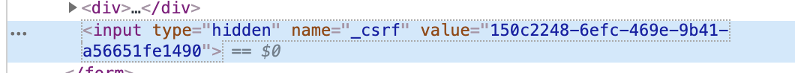
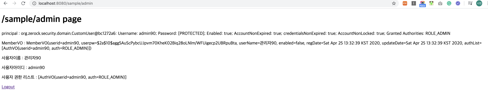
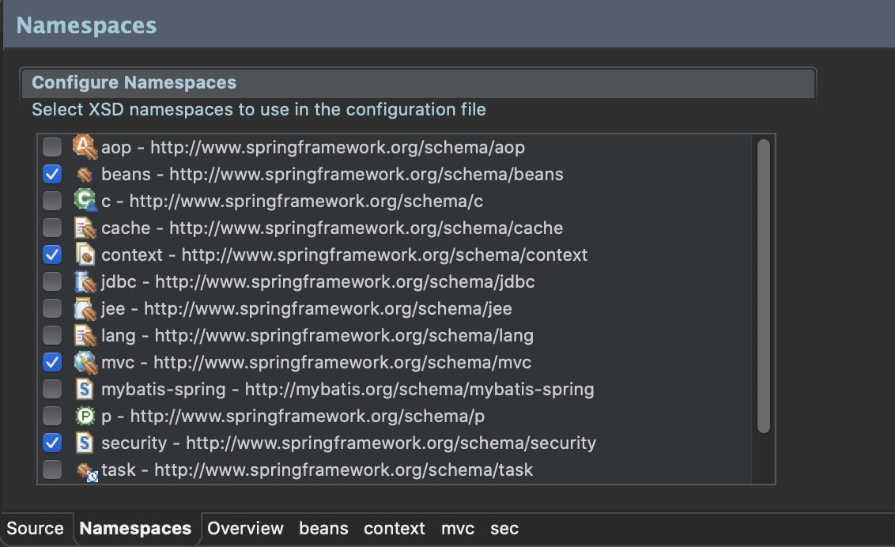

# 7장. Part07_Spring Web Security를 이용한 로그인 처리
> ## ch30. Spring Web Security 소개
- 스프링 시큐리티의 기본 동작 방식
  - 서블릿의 여러가지 필터와 인터셉터를 이용하여 처리
    |필터|인터셉터|
    |---|---|
    |서블릿에서 말하는 단순한 필터를 의미|스프링에서 필터와 유사한 역할|
    |스프링과 무관하게 서블릿 자원|스프링의 빈으로 관리되면서 스프링의 컨텍스트 내에 속함|
    |Dispatcher servlet의 앞단에서 정보를 처리|Dispatcher servlet에서 Handler(Controller)로 가기 전에 정보를 처리|
    |J2EE 표준 스펙에 정의 되어 있는 기능|Spring Framework에서 자체적으로 제공하는 기능|
    |인코딩이나 보안 관련 처리와 같은 web app의 전역적으로 처리해야 하는 로직은 필터로 구현|클라이언트에서 들어오는 디테일한 처리(인증, 권한 등)에 대해서는 주로 인터셉터에서 처리|
    -------
  - 필터와 인터셉터의 차이를 그림으로 표현

    

  - 출처
    - https://goddaehee.tistory.com/154
    - https://www.leafcats.com/39
------------
- Spring Web Security의 설정
  - pom.xml
  ```xml
  <!-- Security -->
  <!-- https://mvnrepository.com/artifact/org.springframework.security/spring-security-core -->
  <dependency>
      <groupId>org.springframework.security</groupId>
      <artifactId>spring-security-web</artifactId>
      <version>5.0.6.RELEASE</version>
  </dependency>
  
  <dependency>
      <groupId>org.springframework.security</groupId>
      <artifactId>spring-security-config</artifactId>
      <version>5.0.6.RELEASE</version>
  </dependency>
  
  <dependency>
      <groupId>org.springframework.security</groupId>
      <artifactId>spring-security-core</artifactId>
      <version>5.0.6.RELEASE</version>
  </dependency>
  
  <dependency>
      <groupId>org.springframework.security</groupId>
      <artifactId>spring-security-taglibs</artifactId>
      <version>5.0.6.RELEASE</version>
  </dependency>
  ```
-------------
- 인증(Authentication)과 권한(Authorization)
  - AuthenticationManager(인증 매니저)
    - 스프링 시큐리티에서 가장 중요한 역할을 하는 존재
    - ProviderManager는 인증에 대한 처리를 AuthenticationProvider라는 타입의 객체를 이용해서 처리를 위임함
      <pre>
      [AuthenticationManager]
                ↑
         [ProviderManager] ←→ [AuthenticationProvider]
      </pre>
    - AuthenticationProvider(인증 제공자)는 실제 인증 작업을 진행
    - 이때 인증된 정보에는 권한에 대한 정보를 같이 전달하게 되는데 이 처리는 UserDetailsService 인터페이스에서 사용자의 정보와 사용자가 가진 권한의 정보를 처리해서 반환해줌
      <pre>
      [AuthenticationManager]
                ↑
         [ProviderManager] ←→ [AuthenticationProvider] ⇠⇢ [UserDetailsService]
      </pre>
    - 개발자가 스프링 시큐리티를 커스터마이징 하는 방식은 크게 AuthenticationProvider를 직접 구현하는 방식과 실제 처리를 담당하는 UserDetailsService를 구현하는 방식으로 나누어짐
    - 대부분의 겨우 UserDetailsService를 구현하는 형태를 사용하는 것 만으로도 충분하지만, 새로운 프로토콜이나 인증 구현 방식을 직접 구현하는 경우에는 AuthenticationProvider 인터페이스를 직접 구현해서 사용함
---------------
> ## ch31. 로그인과 로그아웃 처리
- security-context.xml
```xml
<?xml version="1.0" encoding="UTF-8"?>
<beans xmlns="http://www.springframework.org/schema/beans"
	xmlns:xsi="http://www.w3.org/2001/XMLSchema-instance"
	xmlns:security="http://www.springframework.org/schema/security"
	xsi:schemaLocation="http://www.springframework.org/schema/security http://www.springframework.org/schema/security/spring-security.xsd
		http://www.springframework.org/schema/beans http://www.springframework.org/schema/beans/spring-beans.xsd">

	<security:http>
    <!-- 모든 사용자 접근 가능 -->
		<security:intercept-url pattern="/sample/all" access="permitAll" />

    <!-- ROLE_MEMBER 유저만 접근 가능 -->
		<security:intercept-url pattern="/sample/member" access="hasRole('ROLE_MEMBER')" />

    <!-- ROLE_ADMIN 유저만 접근 가능 -->
    <security:intercept-url pattern="/sample/admin" access="hasRole('ROLE_ADMIN')" />

		<security:form-login/>

    <!-- 권한이 없을 경우 accessError 페이지로 이동 -->
    <security:access-denied-handler error-page="/accessError" />

	</security:http>
	
	<security:authentication-manager>
		<security:authentication-provider>
			<security:user-service>	
				<!-- 스프링 시큐리티 5버젼부터는 반드시 PasswordEncoder라는 존재를 이용하도록 변경됨. 인코딩 처리 없이 사용하고 싶다면 패스워드 앞에 {noop}를 붙여줘야 -->
				<security:user name="member" password="{noop}member" authorities="ROLE_MEMBER" />
        <security:user name="admin" password="{noop}admin" authorities="ROLE_ADMIN" />
			</security:user-service>
		</security:authentication-provider>
	</security:authentication-manager>

</beans>
```
- all.jsp
```jsp
<%@ page language="java" contentType="text/html; charset=UTF-8"
    pageEncoding="UTF-8"%>
<!DOCTYPE html>
<html>
<head>
<meta charset="UTF-8">
<title>Insert title here</title>
</head>
<body>
	<h1>/sample/all page</h1>
</body>
</html>
```
- member.jsp
```jsp
<%@ page language="java" contentType="text/html; charset=UTF-8"
    pageEncoding="UTF-8"%>
<!DOCTYPE html>
<html>
<head>
<meta charset="UTF-8">
<title>Insert title here</title>
</head>
<body>
	<h1>/sample/member page</h1>
</body>
</html>
```
- admin.jsp
```jsp
<%@ page language="java" contentType="text/html; charset=UTF-8"
    pageEncoding="UTF-8"%>
<!DOCTYPE html>
<html>
<head>
<meta charset="UTF-8">
<title>Insert title here</title>
</head>
<body>
	<h1>/sample/admin page</h1>
</body>
</html>
```
- accessError.jsp
  - <security:access-denied-handler error-page="/accessError" /> 통해 접근하는 경우 uri는 변화가 없음
```jsp
<%@ page language="java" contentType="text/html; charset=UTF-8"
    pageEncoding="UTF-8"%>
<%@ taglib uri="http://java.sun.com/jsp/jstl/core" prefix="c" %>
<%@ taglib uri="http://www.springframework.org/security/tags" prefix="sec" %>
<%@ page import="java.util.*" %>
<!DOCTYPE html PUBLIC "-//W3C//DTD HTML 4.01 Transitional//EN" "http://www.w3.org/TR/html4/loose.dtd">
<html>
<head>
<meta http-equiv="Content-Type" content="text/html; UTF-8">
<title>Insert title here</title>
</head>
<body>
	<h1>Access Denied Page</h1>
	<h2><c:out value="${SPRING_SECURITY_403_EXCEPTION.getMessage()}"/></h2>
	<h2><c:out value="${msg}"/></h2>
</body>
</html>
```
-----------
- AccessDeniedHandler 인터페이스를 구현하는 경우
  - 접근 제한이 된 경우에 다양한 처리를 하고 싶다면 직접 AccessDeniedHandler 인터페이스를 구현하는 편이 좋음
  - 예를 들어 접근 제한이 되었을 때 쿠키나 세션에 특정한 작업을 하거나 HttpServletResponse에 특정한 헤더 정보를 추가하는 등의 행위를 할 경우에는 직접 구현하는 방식이 더 권장됨
- AccessDeniedHandler.java
```java
package org.zerock.security;

import java.io.IOException;

import javax.servlet.ServletException;
import javax.servlet.http.HttpServletRequest;
import javax.servlet.http.HttpServletResponse;

import org.springframework.security.access.AccessDeniedException;
import org.springframework.security.web.access.AccessDeniedHandler;

import lombok.extern.log4j.Log4j;

@Log4j
public class CustomAccessDeniedHandler implements AccessDeniedHandler {
	@Override
	public void handle(HttpServletRequest request, HttpServletResponse response, AccessDeniedException accessException) throws IOException, ServletException{
		log.error("Access Denied Handler");
		
		log.error("Redirect....");
		
		response.sendRedirect("/accessError");
	}
}
```
- security-context.xml
  - 접근제어 시 uri가 /accessError로 변경됨
```xml
<bean id="customAccessDenied" class="org.zerock.security.CustomAccessDeniedHandler"></bean>

	<security:http>
		<security:intercept-url pattern="/sample/all" access="permitAll" />
		<security:intercept-url pattern="/sample/member" access="hasRole('ROLE_MEMBER')" />
		<security:intercept-url pattern="/sample/admin" access="hasRole('ROLE_ADMIN')" />
		<security:form-login/>
		
		<!-- <security:access-denied-handler error-page="/accessError" /> -->
		<security:access-denied-handler ref="customAccessDenied" />
	</security:http>
```
-----
- 커스텀 로그인 페이지
  - security-context.xml
  ```xml
  <security:intercept-url pattern="/sample/all" access="permitAll"/>
  <!-- <security:form-login/> -->
  <security:form-login login-page="/customLogin"/>
  ```
  - CommonController.java
  ```java
  @GetMapping("/customLogin")
	public void loginInput(String error, String logout, Model model) {
		log.info("error : " + error);
		log.info("logout : " + logout);
		
		if(error != null) {
			model.addAttribute("error", "Login Error Check Your Account");
		}
		
		if(logout != null) {
			model.addAttribute("logout", "LogOut!!");
		}
	}
  ```
  - customLogin.jsp
  ```jsp
  <%@ page language="java" contentType="text/html; charset=UTF-8"
	pageEncoding="UTF-8"%>
  <%@ taglib uri="http://java.sun.com/jsp/jstl/core" prefix="c"%>

  <!DOCTYPE html PUBLIC "-//W3C//DTD HTML 4.01 Transitional//EN" "http://www.w3.org/TR/html4/loose.dtd">
  <html>
  <head>
  <meta http-equiv="Content-Type" content="text/html; charset=UTF-8">
  <title>Insert title here</title>
  </head>
  <body>

    <h1>Custom Login Page</h1>
    <h2>
      <c:out value="${error}" />
    </h2>
    <h2>
      <c:out value="${logout}" />
    </h2>

    <form method='post' action="/login">

      <div>
        <input type='text' name='username' value='admin'>
      </div>
      <div>
        <input type='password' name='password' value='admin'>
      </div>

      <div>
        <input type='submit'>
      </div>
      <input type="hidden" name="${_csrf.parameterName}" value="${_csrf.token}" />
    </form>

  </body>
  </html>
  ```
  - _csrf 토큰
    - 개발자도구를 통해 확인해 보면 값이 생성된다
  ```jsp
  <input type="hidden" name="${_csrf.parameterName}" value="${_csrf.token}" />
  ```
  
-------
- CSRF(Cross-site request forgery) 공격과 토큰
  - 스프링 시큐리티에서 POST 방식을 이용하는 경우 기본적으로 CSRF 토큰이라는 것을 이용
  - 별도의 설정이 없다면 POST 방식에는 CSRF 토큰이 사용되는데 '사이트간 위조 방지'를 목적으로 특정한 값의 토큰을 사용하는 방식
-----------
- 로그인 성공과 AuthenticationSuccessHandler
  - 로그인 성공시 계정에 따라 이동할 페이지 설정
    - CustomLoginSuccessHandler.java
    ```java
    package org.zerock.security;

    import java.io.IOException;
    import java.util.ArrayList;
    import java.util.List;

    import javax.servlet.ServletException;
    import javax.servlet.http.HttpServletRequest;
    import javax.servlet.http.HttpServletResponse;

    import org.springframework.security.core.Authentication;
    import org.springframework.security.web.authentication.AuthenticationSuccessHandler;

    import lombok.extern.log4j.Log4j;

    @Log4j
    public class CustomLoginSuccessHandler implements AuthenticationSuccessHandler {
      @Override
      public void onAuthenticationSuccess(HttpServletRequest request, HttpServletResponse response, Authentication auth) throws IOException, ServletException{
        log.warn("Login Success");
        
        List<String> roleNames = new ArrayList<>();
        
        auth.getAuthorities().forEach(authority -> {
          roleNames.add(authority.getAuthority());
        });
        
        log.warn("ROLE NAMES : " + roleNames);
        
        if(roleNames.contains("ROLE_ADMIN")) {
          response.sendRedirect("/sample/admin");
          return;
        }
        
        if(roleNames.contains("ROLE_MEMBER")) {
          response.sendRedirect("/sample/member");
        }
        
        response.sendRedirect("/");
      }
    }
    ```
    - security-context.xml
    ```xml
    <bean id="customLoginSuccess" class="org.zerock.security.CustomLoginSuccessHandler"></bean>

	<security:http>
		<security:intercept-url pattern="/sample/all" access="permitAll" />
		<security:intercept-url pattern="/sample/member" access="hasRole('ROLE_MEMBER')" />
		<security:intercept-url pattern="/sample/admin" access="hasRole('ROLE_ADMIN')" />
		
		
		<security:intercept-url pattern="/sample/all" access="permitAll"/>
		<!-- <security:form-login/> -->
		<!-- <security:form-login login-page="/customLogin"/> -->
		<security:form-login login-page="/customLogin" authentication-success-handler-ref="customLoginSuccess"/>
		
		<!-- <security:access-denied-handler error-page="/accessError" /> -->
		<security:access-denied-handler ref="customAccessDenied" />
		
		<security:logout logout-url="/customLogout" invalidate-session="true" />
		
	</security:http>
    ```
------
- 로그아웃의 처리와 LogoutSuccessHandler
  - security-context.xml
  ```xml
  <security:logout logout-url="/customLogout" invalidate-session="true" />
  ```
  -CommonController.java
  ```java
  @GetMapping("/customLogout")
	public void logoutGet() {
		log.info("custom logout");
	}
  ```
  - customLogout.jsp
  ```jsp
  <%@ page language="java" contentType="text/html; charset=UTF-8"
    pageEncoding="UTF-8"%>
  <!DOCTYPE html>
  <html>
  <head>
  <meta charset="UTF-8">
  <title>Insert title here</title>
  </head>
  <body>
    <h1>Logout Page</h1>
    <form action="/customLogout" method="post">
      <input type="hidden" name="${_csrf.parameterName}" value="${_csrf.token}" />
      <button>로그아웃</button>
    </form>
  </body>
  </html>
  ```
  - admin.jsp
  ```jsp
  <%@ page language="java" contentType="text/html; charset=UTF-8"
    pageEncoding="UTF-8"%>
  <!DOCTYPE html>
  <html>
  <head>
  <meta charset="UTF-8">
  <title>Insert title here</title>
  </head>
  <body>
    <h1>/sample/admin page</h1>
    <a href="/customLogout">Logout</a>
  </body>
  </html>
  ```
-------
> ## ch32. JDBC를 이용하는 간편 인증/권한 처리
- 유저, 권한 샘플 테이블 생성
```sql
create table users(
      username varchar2(50) not null primary key,
      password varchar2(50) not null,
      enabled char(1) default '1');

      
 create table authorities (
      username varchar2(50) not null,
      authority varchar2(50) not null,
      constraint fk_authorities_users foreign key(username) references users(username));
      
 create unique index ix_auth_username on authorities (username,authority);


insert into users (username, password) values ('user00','pw00');
insert into users (username, password) values ('member00','pw00');
insert into users (username, password) values ('admin00','pw00');

insert into authorities (username, authority) values ('user00','ROLE_USER');
insert into authorities (username, authority) values ('member00','ROLE_MANAGER'); 
insert into authorities (username, authority) values ('admin00','ROLE_MANAGER'); 
insert into authorities (username, authority) values ('admin00','ROLE_ADMIN');
commit;


select * from users;

select * from authorities order by authority;
```
- security-context.xml
```xml
<security:authentication-manager>
  <security:authentication-provider>
    <!-- <security:user-service>	 -->
      <!-- 스프링 시큐리티 5버젼부터는 반드시 PasswordEncoder라는 존재를 이용하도록 변경됨. 인코딩 처리 없이 사용하고 싶다면 패스워드 앞에 {noop}를 붙여줘야 -->
    <!-- 	<security:user name="member" password="{noop}member" authorities="ROLE_MEMBER" />
      <security:user name="admin" password="{noop}admin" authorities="ROLE_ADMIN" />
    </security:user-service> -->

    <!-- 실제 JDBC를 이용 -->
    <security:jdbc-user-service data-source-ref="dataSource" />	
    
  </security:authentication-provider>
</security:authentication-manager>
```
 ## ※ 로그인 시도할 경우 PasswordEncoder를 지정하지 않았기 때문에 에러 발생 (스프링 시큐리티 5부터는 기본적으로 PasswordEncoder를 지정해야함!)
- 암호화 없이 사용하는 방법이 있지만 쓸일이 거의 없을 것 같으므로 생략.
  - 만약 생기면 책 참고 p.647
------------
- PasswordEncoder 문제해결
  - 인증/권한을 위한 테이블 설계
  ```sql
  create table tbl_member(
      userid varchar2(50) not null primary key,
      userpw varchar2(100) not null,
      username varchar2(100) not null,
      regdate date default sysdate, 
      updatedate date default sysdate,
      enabled char(1) default '1');


  create table tbl_member_auth (
      userid varchar2(50) not null,
      auth varchar2(50) not null,
      constraint fk_member_auth foreign key(userid) references tbl_member(userid)
  );
  ```
  - BCryptPasswordEncoder 클래스를 이용한 패스워드 보호
    - security-context.xml
    ```xml
    <bean id="bcryptPasswordEncoder" class="org.springframework.security.crypto.bcrypt.BCryptPasswordEncoder"></bean>

    <security:authentication-manager>
      <security:authentication-provider>
        <!-- <security:user-service>	 -->
          <!-- 스프링 시큐리티 5버젼부터는 반드시 PasswordEncoder라는 존재를 이용하도록 변경됨. 인코딩 처리 없이 사용하고 싶다면 패스워드 앞에 {noop}를 붙여줘야 -->
        <!-- 	<security:user name="member" password="{noop}member" authorities="ROLE_MEMBER" />
          <security:user name="admin" password="{noop}admin" authorities="ROLE_ADMIN" />
        </security:user-service> -->

        <!-- 실제 JDBC를 이용 -->
        <security:jdbc-user-service data-source-ref="dataSource" />	
        
        <!-- BCryptPasswordEncoder -->
        <security:password-encoder ref="bcryptPasswordEncoder" />
        
      </security:authentication-provider>
    </security:authentication-manager>
    ```
    - pom.xml
    ```xml
    <dependency>
        <groupId>org.springframework</groupId>
        <artifactId>spring-test</artifactId>
        <version>${org.springframework-version}</version>
    </dependency>
    ```

    - MemberTests.java
      - 임시 멤버/권한 추가
    ```java
    package org.zerock.security;

    import java.sql.Connection;
    import java.sql.PreparedStatement;

    import javax.sql.DataSource;

    import org.springframework.beans.factory.annotation.Autowired;

    import org.junit.Test;
    import org.junit.runner.RunWith;
    import org.springframework.security.crypto.password.PasswordEncoder;
    import org.springframework.test.context.ContextConfiguration;
    import org.springframework.test.context.junit4.SpringJUnit4ClassRunner;

    import lombok.Setter;
    import lombok.extern.log4j.Log4j;

    @RunWith(SpringJUnit4ClassRunner.class)
    @ContextConfiguration({"file:src/main/webapp/WEB-INF/spring/root-context.xml", "file:src/main/webapp/WEB-INF/spring/security-context.xml"})
    @Log4j
    public class MemberTests {
      @Setter(onMethod_ = @Autowired)
      private PasswordEncoder pwencoder;
      
      @Setter(onMethod_ = @Autowired)
      private DataSource ds;
      
      @Test
      public void testInsertMember() {
        String sql = "insert into tbl_member(userid, userpw, username) values(?,?,?)";
        
        for(int i=0; i<100; i++) {
          Connection con = null;
          PreparedStatement pstmt = null;
          
          try {
            con = ds.getConnection();
            pstmt = con.prepareStatement(sql);
            
            pstmt.setString(2, pwencoder.encode("pw" + i));
            
            if(i<80) {
              pstmt.setString(1, "user" + i);
              pstmt.setString(3, "일반사용자" + i);
            }else if(i < 90) {
              pstmt.setString(1, "manager" + i);
              pstmt.setString(3, "운영자" + i);
            }else {
              pstmt.setString(1, "admin" + i);
              pstmt.setString(3, "관리자" + i);
            }
            
            pstmt.executeUpdate();
          }catch(Exception e) {
            e.printStackTrace();
          }finally {
            if(pstmt != null) {try {pstmt.close();}catch(Exception e) {}}
            if(con != null) {try {con.close();}catch(Exception e) {}}
          }
        }
      }

      @Test
      public void testInsertAuth() {
        String sql = "insert into tbl_member_auth(userid, auth) values(?,?)";
        
        for(int i=0; i<100; i++) {
          Connection con = null;
          PreparedStatement pstmt = null;
          
          try {
            con = ds.getConnection();
            pstmt = con.prepareStatement(sql);
            
            if(i<80) {
              pstmt.setString(1, "user" + i);
              pstmt.setString(2, "ROLE_USER");
            }else if(i < 90) {
              pstmt.setString(1, "manager" + i);
              pstmt.setString(2, "ROLE_MEMBER");
            }else {
              pstmt.setString(1, "admin" + i);
              pstmt.setString(2, "ROLE_ADMIN");
            }
            
            pstmt.executeUpdate();
          }catch(Exception e) {
            e.printStackTrace();
          }finally {
            if(pstmt != null) {try {pstmt.close();}catch(Exception e) {}}
            if(con != null) {try {con.close();}catch(Exception e) {}}
          }
        }
      }
    }
    ```
    - security-context.xml
      - SpringSecurity에서 지정된 테이블이 아닌 테이블 구조를 이용하는 경우
        - users-by-username-query : 유저
        - authorities-by-username-query : 권한
    ```xml
    <!-- 실제 JDBC를 이용 -->
    <!-- <security:jdbc-user-service data-source-ref="dataSource" />	 -->
    <security:jdbc-user-service data-source-ref="dataSource" 
    users-by-username-query="select userid, userpw, enabled from tbl_member where userid = ?"
    authorities-by-username-query="select userid, auth from tbl_member_auth where userid = ?"/>
    ```
 --------
> ## ch33. 커스텀 UserDetailsService 활용
- JDBC 방식으로 처리하는 방식은 제한적인 내용만을 이용한다는 단점이 존재함
- 스프링 시큐리티에서 username이라고 부르는 사용자의 정보만을 이용하기 때문에 실제 프로젝트에서 사용자의 이름이나 이메일 등의 자세한 정보를 이용할 경우에는 충분치 못함
- 이러한 문제를 해결하기 위해 UserDetailsService를 구현하는 방식을 이용하는 것이 좋음. 흔히 커스텀 UserDetailsService라고 부르며, 이를 이용하면 원하는 객체를 인증과 권한 체크에 활용할 수 있음
- 스프링 시큐리티의 UserDetailsService 인터페이스는 단 하나의 메서드(loadUserByUsername())만이 존재 
- 가장 일반적으로 사용되는 방법은 하위 클래스들 중에서 org.springframework.security.core.userdetails.User 클래스를 상속하는 형태
- MyBatis를 이용하는 MemberMapper와 서비스를 짝성하고 이를 시큐리티와 연결해서 사용하는 방식으로 예제를 진행
-----
- AuthVO.java
```java
package org.zerock.domain;

import lombok.Data;

@Data
public class AuthVO {
	private String userid;
	private String auth;
}
```
- MemberVO.java
```java
package org.zerock.domain;

import java.util.Date;
import java.util.List;

import lombok.Data;

@Data
public class MemberVO {
	private String userid;
	private String userpw;
	private String userName;
	private boolean enabled;
	
	private Date regDate;
	private Date updateDate;
	private List<AuthVO> authList;
}
```
- MemberMapper.java
```java
package org.zerock.mapper;

import org.zerock.domain.MemberVO;

public interface MemberMapper {
	public MemberVO read(String userid);
}
```
- MemberMapper.xml
```xml
<?xml version="1.0" encoding="UTF-8"?>
<!DOCTYPE mapper PUBLIC "-//mybatis.org/DTD Mapper 3.0//EN" "http://mybatis.org/dtd/mybatis-3-mapper.dtd">
<mapper namespace="org.zerock.mapper.MemberMapper">

	<resultMap type="org.zerock.domain.MemberVO" id="memberMap">
		<id property="userid" column="userid" />
		<result property="userid" column="userid" />
		<result property="userpw" column="userpw" />
		<result property="userName" column="userName" />
		<result property="regDate" column="regDate" />
		<result property="updateDate" column="updateDate" />
		<collection property="authList" resultMap="authMap" />
	</resultMap>
	
	<resultMap type="org.zerock.domain.AuthVO" id="authMap">
		<result property="userid" column="userid" />
		<result property="auth" column="auth" />
	</resultMap>
	
	<select id="read" resultMap="memberMap">
		select mem.userid, userpw, username, enabled, regdate, updatedate, auth
		from tbl_member mem LEFT OUTER JOIN tbl_member_auth auth on mem.userid = auth.userid
		where mem.userid = #{userid}
	</select>

</mapper>
```
- MemberMapperTests.java
```java
package org.zerock.mapper;

import org.springframework.beans.factory.annotation.Autowired;

import org.junit.Test;
import org.junit.runner.RunWith;
import org.springframework.test.context.ContextConfiguration;
import org.springframework.test.context.junit4.SpringRunner;
import org.zerock.domain.MemberVO;
import org.zerock.mapper.MemberMapper;

import lombok.Setter;
import lombok.extern.log4j.Log4j;

@RunWith(SpringRunner.class)
@ContextConfiguration({"file:src/main/webapp/WEB-INF/spring/root-context.xml"})
@Log4j
public class MemberMapperTests {
	@Setter(onMethod_ = @Autowired)
	private MemberMapper mapper;
	
	@Test
	public void testRead() {
		MemberVO vo = mapper.read("admin90");
		
		log.info(vo);
		
		vo.getAuthList().forEach(authVO -> log.info(authVO));
	}
}
```
-----
- CustomUserDetailsService 구성
  - CustomUserDetailsService.java
  ```java
  package org.zerock.security;

  import org.springframework.security.core.userdetails.UserDetails;
  import org.springframework.security.core.userdetails.UserDetailsService;
  import org.springframework.security.core.userdetails.UsernameNotFoundException;
  import org.zerock.mapper.MemberMapper;
  import org.springframework.beans.factory.annotation.Autowired;

  import lombok.Setter;
  import lombok.extern.log4j.Log4j;

  @Log4j
  public class CustomUserDetailsService implements UserDetailsService{
    @Setter(onMethod_ = @Autowired)
    private MemberMapper memberMapper;
    
    @Override
    public UserDetails loadUserByUsername(String userName) throws UsernameNotFoundException{
      log.warn("Load User By UserName : " + userName);
      
      return null;
    }
  }
  ```
  - security-context.xml
  ```xml
  <bean id="customUserDetailsService" class="org.zerock.security.CustomUserDetailsService"></bean>

  <security:authentication-manager>
		<!-- <security:authentication-provider>
			<security:jdbc-user-service data-source-ref="dataSource" 
			users-by-username-query="select userid, userpw, enabled from tbl_member where userid = ?"
			authorities-by-username-query="select userid, auth from tbl_member_auth where userid = ?"/>
			
			BCryptPasswordEncoder
			<security:password-encoder ref="bcryptPasswordEncoder" />
			
		</security:authentication-provider> -->
		
		<security:authentication-provider user-service-ref="customUserDetailsService">
		
			<!-- BCryptPasswordEncoder -->
			<security:password-encoder ref="bcryptPasswordEncoder" />
			
		</security:authentication-provider>
		
	</security:authentication-manager>
  ```
  -----
- MemberVO를 UsersDetails 타입으로 변환
  - 스프링 시큐리티의 UserDetailsService는 loadUserByUsername() 라는 하나의 추상 메서드만이 존재 
  - 리턴 타입은 org.springframework.security.core.userdetails.UserDetails
  - org.springframework.security.core.userdetails.User 클래스를 상속받은 CustomUser 클래스 생성
  - MemberVO를 직접 수정하는 방법도 있지만 확장하는 방식을 사용
  ```
  [UserDatails]
        ⇡
     [User]
        ↑
  ⌜⎺⎺⎺⎺⎺⎺⎺⎺⎺⎺⎺⎺⎺⎺⎺⎺⎺⎺⎺⎺⎺⎺⎺⎺⎺⎺⎺⎺⎺⎺⎺⎺⎺⎺⎺⎺⌝
                            ⌈[AuthVO]
    CustomUser ← [MemberVO]-|[AuthVO]
                            ⌊[AuthVO]
  ⌞⎽⎽⎽⎽⎽⎽⎽⎽⎽⎽⎽⎽⎽⎽⎽⎽⎽⎽⎽⎽⎽⎽⎽⎽⎽⎽⎽⎽⎽⎽⎽⎽⎽⎽⎽⎽⌟
  ```
  - MemberMapper.java
  ```java
  package org.zerock.mapper;

  import org.zerock.domain.MemberVO;

  public interface MemberMapper {
    public MemberVO read(String userid);
  }
  ```
  - MemberMapper.xml
  ```xml
  <?xml version="1.0" encoding="UTF-8"?>
  <!DOCTYPE mapper PUBLIC "-//mybatis.org/DTD Mapper 3.0//EN" "http://mybatis.org/dtd/mybatis-3-mapper.dtd">
  <mapper namespace="org.zerock.mapper.MemberMapper">

    <resultMap type="org.zerock.domain.MemberVO" id="memberMap">
      <id property="userid" column="userid" />
      <result property="userid" column="userid" />
      <result property="userpw" column="userpw" />
      <result property="userName" column="userName" />
      <result property="regDate" column="regDate" />
      <result property="updateDate" column="updateDate" />
      <collection property="authList" resultMap="authMap" />
    </resultMap>
    
    <resultMap type="org.zerock.domain.AuthVO" id="authMap">
      <result property="userid" column="userid" />
      <result property="auth" column="auth" />
    </resultMap>
    
    <select id="read" resultMap="memberMap">
      select mem.userid, userpw, username, enabled, regdate, updatedate, auth
      from tbl_member mem LEFT OUTER JOIN tbl_member_auth auth on mem.userid = auth.userid
      where mem.userid = #{userid}
    </select>

  </mapper>
  ```
  - CustomUserDetailsService.java
  ```java
  package org.zerock.security;

  import org.springframework.security.core.userdetails.UserDetails;
  import org.springframework.security.core.userdetails.UserDetailsService;
  import org.springframework.security.core.userdetails.UsernameNotFoundException;
  import org.zerock.domain.MemberVO;
  import org.zerock.mapper.MemberMapper;
  import org.zerock.security.domain.CustomUser;
  import org.springframework.beans.factory.annotation.Autowired;

  import lombok.Setter;
  import lombok.extern.log4j.Log4j;

  @Log4j
  public class CustomUserDetailsService implements UserDetailsService{
    @Setter(onMethod_ = @Autowired)
    private MemberMapper memberMapper;
    
    @Override
    public UserDetails loadUserByUsername(String userName) throws UsernameNotFoundException{
      log.warn("Load User By UserName : " + userName);
      
      MemberVO vo = memberMapper.read(userName);
      
      log.warn("queried by member mapper: " + vo);
      
      return vo == null ? null : new CustomUser(vo);
    }
  }
  ```
  - CustomUser.java
  ```java
  package org.zerock.security.domain;

  import java.util.Collection;
  import java.util.stream.Collectors;

  import org.springframework.security.core.GrantedAuthority;
  import org.springframework.security.core.authority.SimpleGrantedAuthority;
  import org.springframework.security.core.userdetails.User;
  import org.zerock.domain.MemberVO;

  import lombok.Getter;

  @Getter
  public class CustomUser extends User {
    private static final long serialVersionUID = 1L;
    
    private MemberVO member;
    
    public CustomUser(String username, String password, Collection<? extends GrantedAuthority> authorities) {
      super(username, password, authorities);
    }
    
    public CustomUser(MemberVO vo) {
      super(vo.getUserid(), vo.getUserpw(), vo.getAuthList().stream().map(auth -> new SimpleGrantedAuthority(auth.getAuth())).collect(Collectors.toList()));
      
      this.member = vo;
    }
  }
  ```
---------
> ## ch34. 스프링 시큐리티를 JSP에서 사용하기
- JSP에서 로그인한 사용자 정보 보여주기
  - admin.jsp
  ```jsp
  <%@ page language="java" contentType="text/html; charset=UTF-8"
    pageEncoding="UTF-8"%>
  <%@ taglib uri="http://java.sun.com/jsp/jstl/core" prefix="c" %>
  <%@ taglib uri="http://www.springframework.org/security/tags" prefix="sec" %>
  <!DOCTYPE html PUBLIC "-//W3C//DTD HTML 4.01 Transitional//EN" "http://www.w3.org/TR/html4/loose.dtd">
  <html>
  <head>
  <meta http-equiv="Content-Type" content="text/html; charset=UTF-8">
  <title>Insert title here</title>
  </head>
  <body>
    <h1>/sample/admin page</h1>
    
    <p>principal : <sec:authentication property="principal"/></p>
    <p>MemberVO : <sec:authentication property="principal.member"/></p>
    <p>사용자이름 : <sec:authentication property="principal.member.userName"/></p>
    <p>사용자아이디 : <sec:authentication property="principal.username"/></p>
    <p>사용자 권한 리스트 : <sec:authentication property="principal.member.authList"/></p>
    
    <a href="/customLogout">Logout</a>
  </body>
  </html>
  ```
  
------
- 표현식을 이용하는 동적 화면 구성
  - JSP 또는 security-context.xml에서 사용 가능
    
    |표현식|설명|
    |---|---|
    |hasRole([role])<br>hasAuthority([authority])|해당 권한이 있으면 true|
    |hasAnyRole([role,role2])<br>hasAnyAuthority([authority])|여러 권한들 중에서 하나라도 해당되는 권한이 있으면 true|
    |principal|현재 사용자 정보를 의미|
    |permitAll|모든 사용자에게 허용|
    |denyAll|모든 사용자에게 거부|
    |isAnonymous()|익명의 사용자의 경우(로그인을 하지 않은 경우도 해당)|
    |isAuthenticated()|인증된 사용자면 true|
    |isFullyAuthenticated()|Remember-me로 인증된 것이 아닌 인증된 사용자인 경우 true|
  - all.jsp
  ```jsp
  <%@ page language="java" contentType="text/html; charset=UTF-8"
      pageEncoding="UTF-8"%>
  <%@ taglib uri="http://java.sun.com/jsp/jstl/core" prefix="c" %>
  <%@ taglib uri="http://www.springframework.org/security/tags" prefix="sec" %>
  <!DOCTYPE html PUBLIC "-//W3C//DTD HTML 4.01 Transitional//EN" "http://www.w3.org/TR/html4/loose.dtd">
  <html>
  <head>
  <meta http-equiv="Content-Type" content="text/html; charset=UTF-8">
  <title>Insert title here</title>
  </head>
  <body>
    <h1>/sample/all page</h1>
    
    <sec:authorize access="isAnoymous()">
      <a href="/customLogin">로그인</a>
    </sec:authorize>
    
    <sec:authorize access="isAuthenticated()">
      <a href="/customLogout">로그아웃</a>
    </sec:authorize>
  </body>
  </html>
  ```
----------
> ## ch35. 자동 로그인(remember-me)
- 자동 로그인 기능을 처리하는 방식 중에서 가장 많이 사용되는 방식은 로그인 되었던 정보를 데이터베이스에 저장해 두었다가 사용자가 재방문 시 세션에 정보가 없으면 데이터베이스를 조회하는 방식
- 데이터베이스에 정보가 공유되기 때문에 좀 더 안정적인 운영이 가능함
----
- 스프링 시큐리티의 공식 문서에 나오는 로그인 정보를 유지하는 테이블
```sql
create table persistent_logins(
  username varchar2(64) not null,
  series varchar2(64) primary key,
  token varchar2(64) not null,
  last_used timestamp not null
);
```
- security-context.xml
```xml
<security:http>
		
  <security:remember-me data-source-ref="dataSource" token-validity-seconds="604800" />
  
</security:http>
```
- customLogin.jsp
```jsp
<%@ page language="java" contentType="text/html; charset=UTF-8"
	pageEncoding="UTF-8"%>
<%@ taglib uri="http://java.sun.com/jsp/jstl/core" prefix="c"%>

<!DOCTYPE html PUBLIC "-//W3C//DTD HTML 4.01 Transitional//EN" "http://www.w3.org/TR/html4/loose.dtd">
<html>
<head>
<meta http-equiv="Content-Type" content="text/html; charset=UTF-8">
<title>Insert title here</title>
</head>
<body>

	<h1>Custom Login Page</h1>
	<h2>
		<c:out value="${error}" />
	</h2>
	<h2>
		<c:out value="${logout}" />
	</h2>

	<form method='post' action="/login">

		<div>
			<input type='text' name='username' value='admin'>
		</div>
		<div>
			<input type='password' name='password' value='admin'>
		</div>
		<div>
			<input type="checkbox" name="remember-me"> Remember Me
		</div>

		<div>
			<input type='submit'>
		</div>
		<input type="hidden" name="${_csrf.parameterName}" value="${_csrf.token}" />
	</form>

</body>
</html>
```
----
- 로그아웃 시 쿠키 삭제
  - security-context.xml
  ```xml
  <security:http>

      <!-- JSESSION_ID는 Tomcat에서 발행하는 쿠키의 이름 -->
      <security:logout logout-url="/customLogout" invalidate-session="true" delete-cookies="remember-me, JSESSION_ID"/>
      
      <security:remember-me data-source-ref="dataSource" token-validity-seconds="604800" />
      
  </security:http>
  ```
-------
> ## ch37.어노테이션을 이용하는 스프링 시큐리티 설정
- 주로 사용되는 어노테이션
  - @Secured
    - 스프링 시큐리티 초기부터 사용되었고, () 안에 'ROLE_ADMIN'과 같은 문자열 혹은 문자열 배열을 이용
  - @PreAuthorize, @PostAuthorize
    - 3버전부터 지원되며, () 안에 표현식을 사용할 수 있으므로 최근에는 더 많이 사용됨
------
- SampleContorller.java
```java
@PreAuthorize("hasAnyRole('ROLE_ADMIN', 'ROLE_MEMBER')")
@GetMapping("/annoMember")
public void doMember2() {
  log.info("logined annotation member");
}

@Secured({"ROLE_ADMIN"})
@GetMapping("/annoAdmin")
public void doAdmin2() {
  log.info("admin annotation only");
}
```
- servlet-context.xml

  

- spring-security.xsd 버전을 4.2버전으로 낮추거나 버전 정보를 지워야 에러가 없이 작동됨
```xml
<?xml version="1.0" encoding="UTF-8"?>
<beans:beans xmlns="http://www.springframework.org/schema/mvc"
	xmlns:xsi="http://www.w3.org/2001/XMLSchema-instance"
	xmlns:beans="http://www.springframework.org/schema/beans"
	xmlns:context="http://www.springframework.org/schema/context"
	xmlns:security="http://www.springframework.org/schema/security"
	xsi:schemaLocation="http://www.springframework.org/schema/security http://www.springframework.org/schema/security/spring-security.xsd
		http://www.springframework.org/schema/mvc https://www.springframework.org/schema/mvc/spring-mvc.xsd
		http://www.springframework.org/schema/beans https://www.springframework.org/schema/beans/spring-beans.xsd
		http://www.springframework.org/schema/context https://www.springframework.org/schema/context/spring-context.xsd">

	<!-- DispatcherServlet Context: defines this servlet's request-processing infrastructure -->
	
	<!-- Enables the Spring MVC @Controller programming model -->
	<annotation-driven />

	<!-- Handles HTTP GET requests for /resources/** by efficiently serving up static resources in the ${webappRoot}/resources directory -->
	<resources mapping="/resources/**" location="/resources/" />

	<!-- Resolves views selected for rendering by @Controllers to .jsp resources in the /WEB-INF/views directory -->
	<beans:bean class="org.springframework.web.servlet.view.InternalResourceViewResolver">
		<beans:property name="prefix" value="/WEB-INF/views/" />
		<beans:property name="suffix" value=".jsp" />
	</beans:bean>
	
	<context:component-scan base-package="org.zerock.controller" />
	
	<security:global-method-security pre-post-annotations="enabled" secured-annotations="enabled"/>
	
	<beans:bean id="multipartResolver" class="org.springframework.web.multipart.support.StandardServletMultipartResolver"></beans:bean>
	
</beans:beans>
```