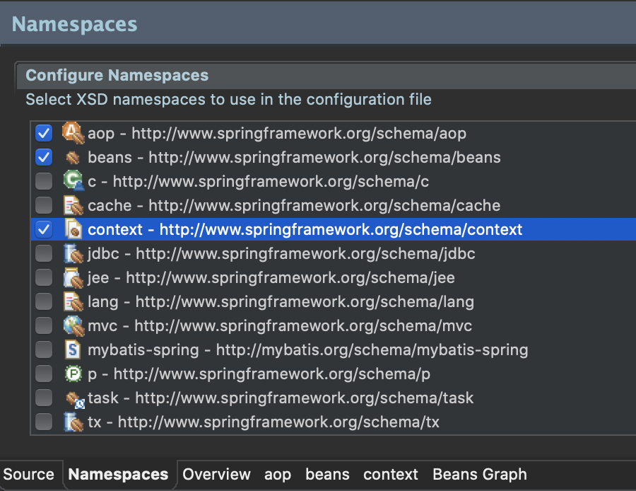

# AOP 설정

> pom.xml 설정
- Spring Legacy Project_셋팅 문서 참조
------
> root-context.xml (XML 설정 시)



```xml
<?xml version="1.0" encoding="UTF-8"?>
<beans xmlns="http://www.springframework.org/schema/beans"
    xmlns:xsi="http://www.w3.org/2001/XMLSchema-instance"
    xmlns:aop="http://www.springframework.org/schema/aop"
    xmlns:context="http://www.springframework.org/schema/context"
    xsi:schemaLocation="http://www.springframework.org/schema/beans https://www.springframework.org/schema/beans/spring-beans.xsd
        http://www.springframework.org/schema/context http://www.springframework.org/schema/context/spring-context-4.3.xsd
        http://www.springframework.org/schema/aop http://www.springframework.org/schema/aop/spring-aop-4.3.xsd">
    
    <!-- Root Context: defines shared resources visible to all other web components -->
    <context:annotation-config></context:annotation-config>
    
    <context:component-scan base-package="org.zerock.service"></context:component-scan>
    <context:component-scan base-package="org.zerock.aop"></context:component-scan>
    
    <aop:aspectj-autoproxy></aop:aspectj-autoproxy>
        
</beans>
```
---------
> RootConfig.java (JAVA 설정 시)
```java
package org.zerock.config;

import org.springframework.context.annotation.Configuration;
import org.springframework.context.annotation.ComponentScan;

import javax.sql.DataSource;

import org.springframework.context.annotation.Bean;
import org.springframework.context.annotation.ComponentScan;
import org.springframework.context.annotation.Configuration;

import com.zaxxer.hikari.HikariConfig;
import com.zaxxer.hikari.HikariDataSource;

@Configuration
@ComponentScan(basePackages= {"org.zerock.service"})
@ComponentScan(basePackages= {"org.zerock.aop"})
@EnableAspectJAutoProxy

@MapperScan(basePackages= {"org.zerock.mapper"})
public class RootConfig {
	
}
```
---------
> SampleService.java
```java
package org.zerock.service;

public interface SampleService {
	public Integer doAdd(String str1, String str2) throws Exception;
}
```
> SampleServiceImpl.java
```java
package org.zerock.service;

import org.springframework.stereotype.Service;

@Service
public class SampleServiceImpl implements SampleService{

	@Override
	public Integer doAdd(String str1, String str2) throws Exception {
		return Integer.parseInt(str1) + Integer.parseInt(str2);
	}
	
}
```
-----
> LogAdvice.java
```java
package org.zerock.aop;

import java.util.Arrays;

import org.aspectj.lang.ProceedingJoinPoint;
import org.aspectj.lang.annotation.AfterThrowing;
import org.aspectj.lang.annotation.Around;
import org.aspectj.lang.annotation.Aspect;
import org.aspectj.lang.annotation.Before;
import org.springframework.stereotype.Component;

import lombok.extern.log4j.Log4j;

@Aspect
@Log4j
@Component
public class LogAdvice {
	@Before("execution(* org.zerock.service.SampleService*.*(..))")
	public void logBefore() {
		log.info("========================");
	}
}
```
- args를 이용한 파라미터 추적
    - 간단한 파라미터를 찾아서 기록할 때에는 유용하지만 다른 여러종류의 메서드에 적용할 수 없음
    - @Around와 ProceedingJoinPoint를 사용하여 해결 가능
```java
@Before("execution(* org.zerock.service.SampleService*.doAdd(String, String)) && args(str1, str2)")
public void logBeforeWithParam(String str1, String str2) {
    log.info("str1 : " + str1);
    log.info("str2 : " + str2);
}
```
- 예외상황이 발생했을 경우
```java
@AfterThrowing(pointcut = "execution(* org.zerock.service.SampleService*.*(..))", throwing="exception")
public void logException(Exception exception) {
    log.info("Exception....!!!!");
    log.info("exception : " + exception);
}
```
- 조금 더 구체적으로 AOP 사용
    - @Around와 ProceedingJoinPoint를 결합하여 파라미터나 예외 등 모두 처리
    - @Around가 적용되는 메서드의 경우에는 리턴타입으로 void를 사용할 수 없음
```java
@Around("execution(* org.zerock.service.SampleService*.*(..))")
public Object logTime(ProceedingJoinPoint pjp) {
    long start = System.currentTimeMillis();
    
    log.info("Target : " + pjp.getTarget());
    log.info("Param : " + Arrays.deepToString(pjp.getArgs()));
    
    //invoke method
    Object result = null;
    
    try {
        result = pjp.proceed();
    }catch(Throwable e) {
        e.printStackTrace();
    }
    
    long end = System.currentTimeMillis();
    
    log.info("TIME : " + (end - start));
    
    return result;
}
```
> SampleServiceTests.java
- AOP 테스트
```java
package org.zerock.Service;

import org.junit.Test;
import org.junit.runner.RunWith;
import org.springframework.beans.factory.annotation.Autowired;
import org.springframework.test.context.ContextConfiguration;
import org.springframework.test.context.junit4.SpringJUnit4ClassRunner;
import org.zerock.service.SampleService;

import lombok.Setter;
import lombok.extern.log4j.Log4j;

@RunWith(SpringJUnit4ClassRunner.class)
@Log4j
@ContextConfiguration({"file:src/main/webapp/WEB-INF/spring/root-context.xml"})
// JAVA 설정의 경우
// @ContextConfiguration(classes={RootConfig.class})
public class SampleServiceTests {
	@Setter(onMethod_=@Autowired)
	private SampleService service;
	
	@Test
	public void testClass() {
		log.info(service);
		log.info(service.getClass().getName());
	}
	/*
	 	INFO : org.zerock.Service.SampleServiceTests - org.zerock.service.SampleServiceImpl@f80945f
		INFO : org.zerock.Service.SampleServiceTests - com.sun.proxy.$Proxy22
		// <aop:aspectj-autoproxy></aop:aspectj-autoproxy>가 정상작동 되었다면 Proxy 클래스의 인터페이스가 되는 것을 확인할 수 있음
	 */
	
	@Test
	public void testAdd() throws Exception{
		log.info(service.doAdd("123", "456"));
	}
	/*
		INFO : org.zerock.aop.LogAdvice - Param : [123, 456]
		INFO : org.zerock.aop.LogAdvice - ========================
		INFO : org.zerock.aop.LogAdvice - str1 : 123
		INFO : org.zerock.aop.LogAdvice - str2 : 456
		INFO : org.zerock.aop.LogAdvice - TIME : 2
		
		// LogAdvice에서 설정해둔 로그가 같이 출력 
	 */
	
	@Test
	public void testAddError() throws Exception{
		log.info(service.doAdd("123", "ABC"));
	}
	/*
	 	INFO : org.zerock.aop.LogAdvice - ========================
		INFO : org.zerock.aop.LogAdvice - str1 : 123
		INFO : org.zerock.aop.LogAdvice - str2 : ABC
		INFO : org.zerock.aop.LogAdvice - Exception....!!!!
		INFO : org.zerock.aop.LogAdvice - exception : java.lang.NumberFormatException: For input string: "ABC"
	 */
	
}
```