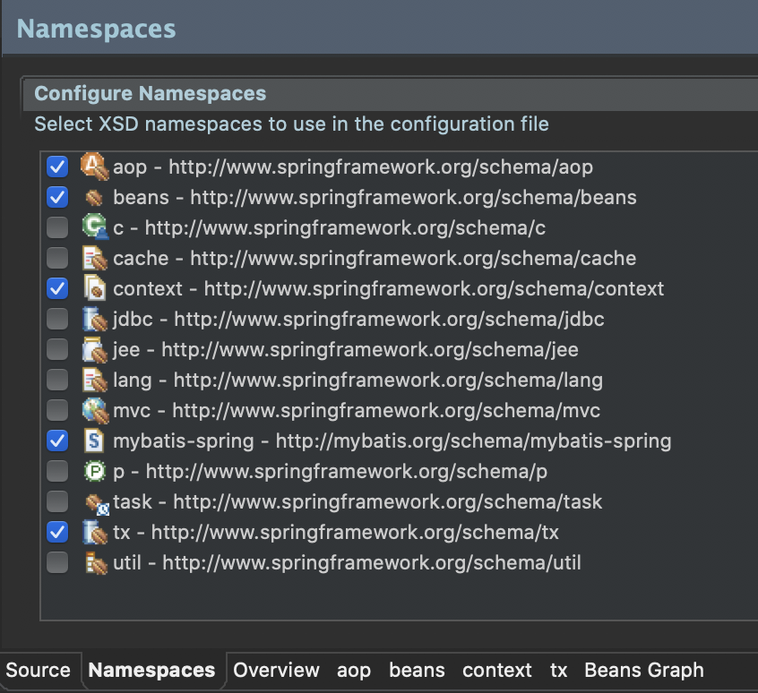

> # TRANSACTION 설정(AOP 포함)

> pom.xml 설정
- Spring Legacy Project_셋팅 문서 참조
------
> root-context.xml (XML 설정 시)



```xml
<?xml version="1.0" encoding="UTF-8"?>
<beans xmlns="http://www.springframework.org/schema/beans"
	xmlns:xsi="http://www.w3.org/2001/XMLSchema-instance"
	xmlns:aop="http://www.springframework.org/schema/aop"
	xmlns:context="http://www.springframework.org/schema/context"
	xmlns:tx="http://www.springframework.org/schema/tx"
	xmlns:mybatis-spring="http://mybatis.org/schema/mybatis-spring"
	xsi:schemaLocation="http://mybatis.org/schema/mybatis-spring http://mybatis.org/schema/mybatis-spring-1.2.xsd
		http://www.springframework.org/schema/beans https://www.springframework.org/schema/beans/spring-beans.xsd
		http://www.springframework.org/schema/context http://www.springframework.org/schema/context/spring-context-4.3.xsd
		http://www.springframework.org/schema/aop http://www.springframework.org/schema/aop/spring-aop-4.3.xsd
		http://www.springframework.org/schema/tx http://www.springframework.org/schema/tx/spring-tx-4.3.xsd">
	
	<!-- Root Context: defines shared resources visible to all other web components -->
	<context:annotation-config></context:annotation-config>
	
	<bean id="hikariConfig" class="com.zaxxer.hikari.HikariConfig">
		<property name="driverClassName" value="net.sf.log4jdbc.sql.jdbcapi.DriverSpy"></property>
		<property name="jdbcUrl" value="jdbc:log4jdbc:oracle:thin:@localhost:1521:xe"></property>
		<property name="username" value="book_ex"></property>
		<property name="password" value="book_ex"></property>
	</bean> 
	

	<!-- HikariCP configuration -->
	<bean id="dataSource" class="com.zaxxer.hikari.HikariDataSource" destroy-method="close">
		<constructor-arg ref="hikariConfig" />
	</bean>
	
	<bean id="sqlSessionFactory" class="org.mybatis.spring.SqlSessionFactoryBean">
		<property name="dataSource" ref="dataSource"></property>
	</bean>

	
    <!-- Transaction -->
	<bean id="transactionManager" class="org.springframework.jdbc.datasource.DataSourceTransactionManager">
		<property name="dataSource" ref="dataSource"></property>
	</bean>
	
	<tx:annotation-driven />

	
	<mybatis-spring:scan base-package="org.zerock.mapper" />
	
	<context:component-scan base-package="org.zerock.service"></context:component-scan>
	<context:component-scan base-package="org.zerock.aop"></context:component-scan>
	
	<aop:aspectj-autoproxy></aop:aspectj-autoproxy>
		
</beans>
```
---------
> RootConfig.java (JAVA 설정 시)
```java
package org.zerock.config;

import org.springframework.context.annotation.Configuration;
import org.springframework.context.annotation.ComponentScan;

import javax.sql.DataSource;

import org.springframework.context.annotation.Bean;
import org.springframework.context.annotation.ComponentScan;
import org.springframework.context.annotation.Configuration;

import com.zaxxer.hikari.HikariConfig;
import com.zaxxer.hikari.HikariDataSource;

@Configuration
@ComponentScan(basePackages= {"org.zerock.service"})
@ComponentScan(basePackages= {"org.zerock.aop"})
@EnableAspectJAutoProxy

@MapperScan(basePackages= {"org.zerock.mapper"})
public class RootConfig {
	@Bean
    public DataSource dataSource() {
    HikariConfig hikariConfig = new HikariConfig();

    hikariConfig.setDriverClassName("oracle.jdbc.driver.OracleDriver");
    hikariConfig.setJdbcUrl("jdbc:oracle:thin:@tongracle.cnsqtfo00xiq.ap-northeast-2.rds.amazonaws.com:1521:orcl");

    hikariConfig.setUsername("book_ex");
    hikariConfig.setPassword("book_ex");

    HikariDataSource dataSource = new HikariDataSource(hikariConfig);

    return dataSource;
    }

    @Bean
    public sqlSessionFactory sqlSessionFactory() throws Exception{
        SqlSessionFactoryBean sqlSessionFactory = new SqlSessionFactoryBean();
        sqlSessionFactory.setDataSource(dataSource());
        return (SqlSessionFactory) sqlSessionFactory.getObject();
    }

    @Bean
    public DataSourceTransactionManager txManager(){
        return new DataSourceTransactionManager(dataSource)());
    }
}
```
------
> Sample1Mapper.java
```java
package org.zerock.mapper;

import org.apache.ibatis.annotations.Insert;

public interface Sample1Mapper {
	@Insert("insert into tbl_sample1 (col1) values (#{data})")
	public int insertCol1(String data);
}
```
> Sample2Mapper.java
```java
package org.zerock.mapper;

import org.apache.ibatis.annotations.Insert;

public interface Sample2Mapper {
	@Insert("insert into tbl_sample2 (col2) values (#{data})")
	public int insertCol2(String data);
}
```
> SampleTxService.java
```java
package org.zerock.service;

public interface SampleTxService {
	public void addData(String value);
}
```
> SampleTxServiceImpl.java
```java
package org.zerock.service;

import org.springframework.stereotype.Service;
import org.springframework.transaction.annotation.Transactional;
import org.zerock.mapper.Sample1Mapper;
import org.zerock.mapper.Sample2Mapper;
import org.zerock.service.SampleTxService;

import lombok.AllArgsConstructor;
import lombok.extern.log4j.Log4j;

@Service
@Log4j
@AllArgsConstructor
public class SampleTxServiceImpl implements SampleTxService {
	private Sample1Mapper mapper1;
	
	private Sample2Mapper mapper2;
	
	@Transactional
	@Override
	public void addData(String value) {
		log.info("mapper1............");
		mapper1.insertCol1(value);
		
		log.info("mapper2............");
		mapper2.insertCol2(value);
		
		log.info("end....................");
	}
}
```
> SampleTxServiceTests.java
```java
package org.zerock.Service;

import org.junit.Test;
import org.junit.runner.RunWith;
import org.springframework.beans.factory.annotation.Autowired;
import org.springframework.test.context.ContextConfiguration;
import org.springframework.test.context.junit4.SpringJUnit4ClassRunner;
import org.zerock.service.SampleService;
import org.zerock.service.SampleTxService;

import lombok.Setter;
import lombok.extern.log4j.Log4j;

@RunWith(SpringJUnit4ClassRunner.class)
@Log4j
@ContextConfiguration({"file:src/main/webapp/WEB-INF/spring/root-context.xml"})
// JAVA 설정의 경우
// @ContextConfiguration(classes={RootConfig.class})
public class SampleTxServiceTests {
	@Setter(onMethod_=@Autowired)
	private SampleTxService service;
	
	@Test
	public void testLong() {
		String str = "Starry\r\n" +
				"Starry night\r\n" + 
				"Paint your palette blue and grey\r\n" +
				"Look out on a summer's day";
		log.info(str.getBytes().length);
		
		service.addData(str);
	}
}
```