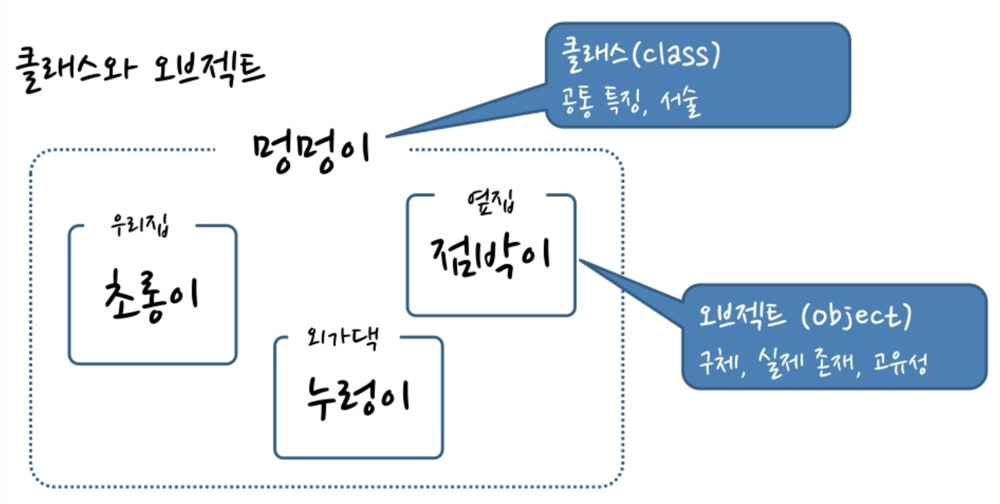

# 객체지향
- OOA(Object Oriented Analysis) : 객체 분석
- OOD(Object Oriented Design) : 객체 설계
- OOP(Object Oriented Programming) : 객체 프로그래밍
------
- 객체지향 키워드
    - 클래스(Class)
    - 오브젝트(Object)
    - 캡슐화(Encapsulation)
    - 상속성(Inheritance)
    - 다형성(Polymorphism)
------
> 1. 클래스(Class)
- 클래스(class) = 추상화(abstract)
- 클래스는 표현 대상의 특징에 대한 서술을 의미 (공통적인 특징을 서술)
- 추상은 사용자가 구체적인 내용을 생각하지 않고도 사용하는 기능
    - 프로시져 추상화 : 함수
    - 데이터 추상화 : 구조체, 배열, 포인터
- attribute = data = member variables = state = field
- 클래스(class) = 개념(concept) = 타입(type)

> 2. 오브젝트(Object)
- 오브젝트(Object) = 실체(instance)
- 오브젝트는 클래스의 실체(instance)
- 즉, 오브젝트는 instance of class. 클래스가 실체로 만들어진 것
- behavior = operation = member function = method
- 객체(object) = 실체(instance) = 변수(variable)

> 클래스와 오브젝트의 쉬운 예
- 클래스는 강아지(표현 대상)의 공통적인 특징
- 오브젝트는 실제 개별의 강아지(실체)

    
    

> 3. 캡슐화
- 데이터 + 데이터 다루는 방법을 묶은 것
- 묶음에 이름을 부여한 것이 바로 추상화(abstraction), 즉 클래스
```java
public class Dog {
	String x;
	String y;

    public void move() {}
    public void bark() {}
    public void run() {}
}
```

> 4. 상속성
- 하나의 클래스가 가지고 있는 특징들을 그대로 다른 클래스가 물려 받는 것

    

> 5. 다형성
- 상속성의 계층에 따라서 각 클래스에 동일한 이름의 메소드를 사용할 수 있는 것
- 즉, 같은 명령을 각기 다른 오브젝트에 줄 수 있음

    

> 출처
- https://www.slideshare.net/plusjune/ss-46109239