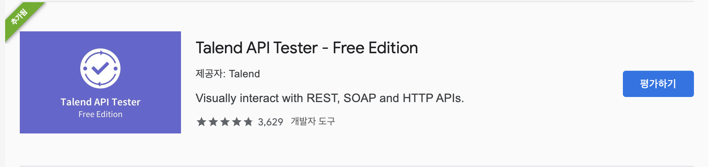
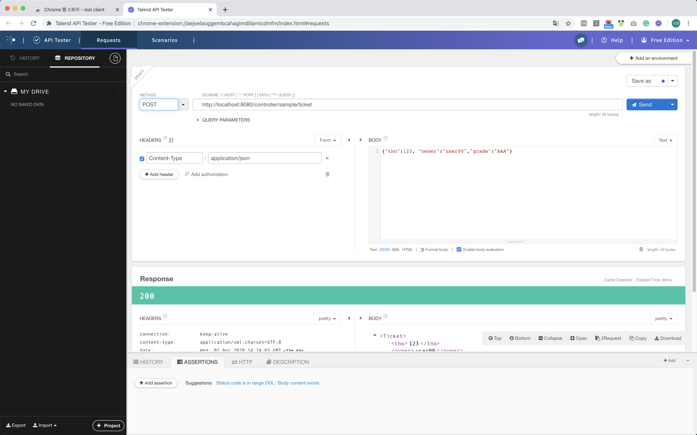

> ## Spring 에서 Was를 실행 하지 않고 Web URL을 테스트 하는 방법
 - 웹을 개발할 때 매번 URL을 테스트하기 위해 Tomcat과 같은 WAS를 실행하는 불편한 단계를 생략하기 위해서 스프링의 테스트 기능을 활용한다.
- GET 방식이 아니고, POST 등의 방식으로 지정되어있으며, JSON 형태의 데이터를 처리하는 것을 브라우저에서 개발하려면 많은 시간과 노력이 들어감
- 때문에 Junit과 spring-test를 활용하는 것을 권장
- 자세한 내용은 주석으로 기재
```java
/*
- TicketVO.java
package org.zerock.domain;

import lombok.Data;

@Data
public class Ticket {
	private int tno;
	private String owner;
	private String grade;
}

- SampleController.java
```java
@PostMapping("/ticket")
public Ticket convert(@RequestBody Ticket ticket) {
	log.info("convert....ticket" + ticket);
	
	return ticket;
}
*/

package org.zerock.controller;

import static org.springframework.test.web.servlet.request.MockMvcRequestBuilders.post;
import static org.springframework.test.web.servlet.result.MockMvcResultMatchers.status;

import org.junit.Before;
import org.junit.Test;
import org.junit.runner.RunWith;
import org.springframework.beans.factory.annotation.Autowired;
import org.springframework.http.MediaType;
import org.springframework.test.context.ContextConfiguration;
import org.springframework.test.context.junit4.SpringJUnit4ClassRunner;
import org.springframework.test.context.web.WebAppConfiguration;
import org.springframework.test.web.servlet.MockMvc;
import org.springframework.test.web.servlet.setup.MockMvcBuilders;
import org.springframework.web.context.WebApplicationContext;
import org.zerock.domain.Ticket;

import com.google.gson.Gson;

import lombok.Setter;
import lombok.extern.log4j.Log4j;

@RunWith(SpringJUnit4ClassRunner.class)
//Test for Controller
@WebAppConfiguration
@ContextConfiguration({"file:src/main/webapp/WEB-INF/spring/appServlet/servlet-context.xml",
	"file:src/main/webapp/WEB-INF/spring/root-context.xml"}) // XML Version
//@ContextConfiguration(classes = {RootConfig.class, ServletConfig.class}) // Java Version
@Log4j
public class SampleControllerTests {
	@Setter(onMethod_ = @Autowired)
	private WebApplicationContext ctx;
	
	private MockMvc mockMvc;
	
	@Before
	public void setup() {
		this.mockMvc = MockMvcBuilders.webAppContextSetup(ctx).build();
	}
	
	@Test
	public void testConvert() throws Exception{
		// TestConvert()는 SampleContropller에 작성해 둔 convert() 메서드를 테스트하기 위해서 작성
		// SmpleConteroller의 convert()는 JSON으로 전달되는 데이터를 받아서 Ticket 타입으로 변환함
		// 이를 위해 해당 데이터가 JSON이라는 것을 명시 해야함
		Ticket ticket = new Ticket();
		ticket.setTno(123);
		ticket.setOwner("Admin");
		ticket.setGrade("AAA");
		
		String jsonStr = new Gson().toJson(ticket);
		
		log.info(jsonStr);
		
		// mockMvc는 contentType()을 이용해서 전달하는 데이터가 무엇인지를 알려줄 수 있음
		// 코드 내의 Gson 라이브러리는 Java의 객체를 JSON 문자열로 변환하기 위해서 사용
		mockMvc.perform(post("/sample/ticket")
				.contentType(MediaType.APPLICATION_JSON)
				.content(jsonStr))
				.andExpect(status().is(200));
	}
}
```
-------
# 기타 도구
- Junit 이외에도 Tomcat을 구동한다면 다른 여러가지 도구들이 존재함
> curl
- Mac, Linux 용
- https://curl.haxx.se
> chrome 브라우저 앱스토어
- 크롬 앱스토어(chrome://apps/)에서 REST client 검색
- 가장 사용자가 많은 확장프로그램으로 테스트 했음<br>
<br><br>
- 간단하게 테스트가 가능함
