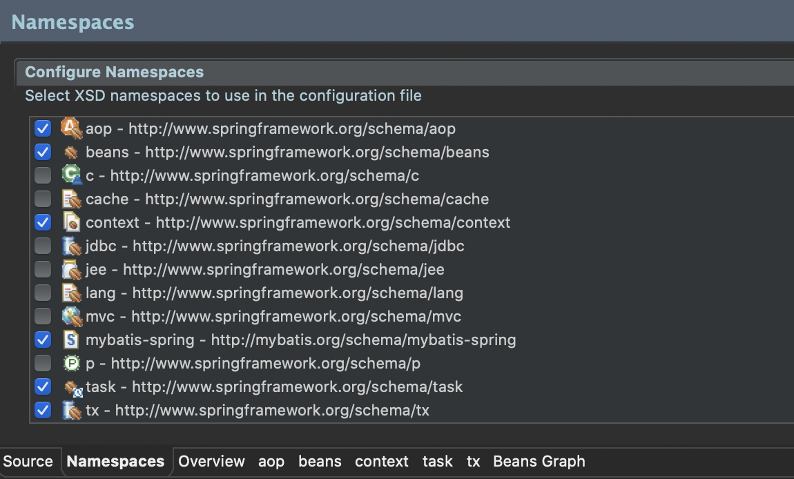

# Quartz 라이브러리 설정
> pom.xml
```xml
<!-- https://mvnrepository.com/artifact/org.quartz-scheduler/quartz -->
<dependency>
    <groupId>org.quartz-scheduler</groupId>
    <artifactId>quartz</artifactId>
    <version>2.3.0</version>
</dependency>

<dependency>
    <groupId>org.quartz-scheduler</groupId>
    <artifactId>quartz-jobs</artifactId>
    <version>2.3.0</version>
</dependency>
```
> root-context.xml (xml 설정)
- task 체크



```xml
<context:component-scan base-package="org.zerock.task"></context:component-scan>
<task:annotation-driven />
```
> RootConfig.java (java 설정)
```java
@ComponentScan(basePackages="org.zerock.task")

@EnableScheduling
```
> FileCheckTask.java
```java
package org.zerock.task;

import org.springframework.scheduling.annotation.Scheduled;
import org.springframework.stereotype.Component;

import lombok.extern.log4j.Log4j;

@Log4j
@Component
public class FileCheckTask {
    @Scheduled(cron="0 * * * * *")
    public void checkFiles() throws Exception{
        log.warn("File Check Task run.............");
        
        log.warn("========================================");
    }
}
```