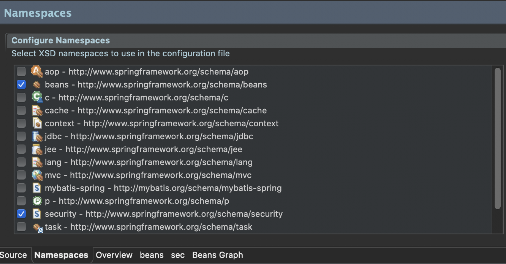

# Spring Legacy Project_셋팅(xml version)
> pom.xml
- 스프링 버전과 JAVA 버전 변경
```xml
<properties>
    <java-version>1.8</java-version>
    <org.springframework-version>5.0.7.RELEASE</org.springframework-version>
    <org.aspectj-version>1.9.0</org.aspectj-version>
    <org.slf4j-version>1.7.25</org.slf4j-version>
</properties>
```
- 스프링 관련 라이브러리 추가
```xml
<dependency>
    <groupId>org.springframework</groupId>
    <artifactId>spring-test</artifactId>
    <version>${org.springframework-version}</version>
</dependency>
<dependency>
    <groupId>org.springframework</groupId>
    <artifactId>spring-jdbc</artifactId>
    <version>${org.springframework-version}</version>
</dependency>
<dependency>
    <groupId>org.springframework</groupId>
    <artifactId>spring-tx</artifactId>
    <version>${org.springframework-version}</version>
</dependency>
```
- DataSource 라이브러리 중 HikariCP 추가 (가볍고 간편한 라이브러리)
```xml
<dependency>
    <groupId>com.zaxxer</groupId>
    <artifactId>HikariCP</artifactId>
    <version>2.7.8</version>
</dependency>
```
- MyBatis 라이브러리 추가
```xml
<!-- mybatis 라이브러리 추가 -->
<!-- https://mvnrepository.com/artifact/org.mybatis/mybatis -->
<dependency>
    <groupId>org.mybatis</groupId>
    <artifactId>mybatis</artifactId>
    <version>3.4.6</version>
</dependency>
<!-- https://mvnrepository.com/artifact/org.mybatis/mybatis-spring -->
<dependency>
    <groupId>org.mybatis</groupId>
    <artifactId>mybatis-spring</artifactId>
    <version>1.3.2</version>
</dependency>
<dependency>
    <groupId>org.springframework</groupId>
    <artifactId>spring-tx</artifactId>
    <version>${org.springframework-version}</version>
</dependency>
<dependency>
    <groupId>org.springframework</groupId>
    <artifactId>spring-jdbc</artifactId>
    <version>${org.springframework-version}</version>
</dependency>
```
- MyBatis 라이브러리 추가
```xml
<!-- log4jdbc 설정 -->
<!-- https://mvnrepository.com/artifact/org.bgee.log4jdbc-log4j2/log4jdbc-log4j2-jdbc4 -->
<dependency>
    <groupId>org.bgee.log4jdbc-log4j2</groupId>
    <artifactId>log4jdbc-log4j2-jdbc4</artifactId>
    <version>1.16</version>
</dependency>
```
- lombok 라이브러리 추가
```xml
<dependency>
    <groupId>org.projectlombok</groupId>
    <artifactId>lombok</artifactId>
    <version>1.18.0</version>
    <scope>provided</scope>
</dependency>
<dependency>
    <groupId>log4j</groupId>
    <artifactId>log4j</artifactId>
    <version>1.2.17</version>	<!-- lombok 활용을 위해 버젼 1.2.17 사용 -->
    <!-- <exclusions>
        <exclusion>
            <groupId>javax.mail</groupId>
            <artifactId>mail</artifactId>
        </exclusion>
        <exclusion>
            <groupId>javax.jms</groupId>
            <artifactId>jms</artifactId>
        </exclusion>
        <exclusion>
            <groupId>com.sun.jdmk</groupId>
            <artifactId>jmxtools</artifactId>
        </exclusion>
        <exclusion>
            <groupId>com.sun.jmx</groupId>
            <artifactId>jmxri</artifactId>
        </exclusion>
    </exclusions>
    <scope>runtime</scope> -->
</dependency>
```
- jackson-databind / jackson-dataformat-xml
```xml
<!-- 객체를 JSON/XML로 변환할 때 사용 -->
<dependency>
    <groupId>com.fasterxml.jackson.core</groupId>
    <artifactId>jackson-databind</artifactId>
    <version>2.9.6</version>
</dependency>
<dependency>
    <groupId>com.fasterxml.jackson.dataformat</groupId>
    <artifactId>jackson-dataformat-xml</artifactId>
    <version>2.9.6</version>
</dependency>

<!-- JAVA 인스턴스를 JSON 타입의 문자열로 변환(테스트 용도) -->
<dependency>
    <groupId>com.google.code.gson</groupId>
    <artifactId>gson</artifactId>
    <version>2.8.2</version>
</dependency>
```
- junit 버전 변경
```xml
<dependency>
    <groupId>junit</groupId>
    <artifactId>junit</artifactId>
    <version>4.12</version>
    <scope>test</scope>
</dependency>  
```
- Servlet3.1(3.0)을 사용하기 위해 버전 변경
```xml
<dependency>
    <groupId>javax.servlet</groupId>
    <artifactId>javax.servlet-api</artifactId><!-- servlet-api로 표기되어있을 수 있음. 변경해줌 -->
    <version>3.1.0</version>
    <scope>provided</scope>
</dependency>
```
- AOP 사용을 위해 AspectJ Weaver 라이브러리 추가
```xml
<!-- AspectJ -->
<dependency>
    <groupId>org.aspectj</groupId>
    <artifactId>aspectjrt</artifactId>
    <version>${org.aspectj-version}</version>
</dependency>	
<dependency>
    <groupId>org.aspectj</groupId>
    <artifactId>aspectjweaver</artifactId>
    <version>${org.aspectj-version}</version>
</dependency>	
```
- Spring Security 설정
```xml
<!-- Security -->
<!-- https://mvnrepository.com/artifact/org.springframework.security/spring-security-core -->
<dependency>
    <groupId>org.springframework.security</groupId>
    <artifactId>spring-security-web</artifactId>
    <version>5.0.6.RELEASE</version>
</dependency>

<dependency>
    <groupId>org.springframework.security</groupId>
    <artifactId>spring-security-config</artifactId>
    <version>5.0.6.RELEASE</version>
</dependency>

<dependency>
    <groupId>org.springframework.security</groupId>
    <artifactId>spring-security-core</artifactId>
    <version>5.0.6.RELEASE</version>
</dependency>

<dependency>
    <groupId>org.springframework.security</groupId>
    <artifactId>spring-security-taglibs</artifactId>
    <version>5.0.6.RELEASE</version>
</dependency>
```
- Servlet3.1(3.0)을 사용하고, JDK1.8의 기능을 활용하기 위해 버전 변경
```xml
 <plugin>
    <groupId>org.apache.maven.plugins</groupId>
    <artifactId>maven-compiler-plugin</artifactId>
    <version>2.5.1</version>
    <configuration>
        <source>1.8</source>
        <target>1.8</target>
        <compilerArgument>-Xlint:all</compilerArgument>
        <showWarnings>true</showWarnings>
        <showDeprecation>true</showDeprecation>
    </configuration>
</plugin>
```
> Maven Update
- 해당 프로젝트 마우스 우클릭 > Maven > Update Project
> Oracle JDBC Driver(ojdbc8.jar)
- ojdbc8.jar 파일 Build Path에 추가
- ojdbc8.jar 파일 Deployment Assembly에 추가

> root-context.xml


```xml
<?xml version="1.0" encoding="UTF-8"?>
<beans xmlns="http://www.springframework.org/schema/beans"
	xmlns:xsi="http://www.w3.org/2001/XMLSchema-instance"
	xmlns:aop="http://www.springframework.org/schema/aop"
	xmlns:context="http://www.springframework.org/schema/context"
	xmlns:tx="http://www.springframework.org/schema/tx"
	xmlns:mybatis-spring="http://mybatis.org/schema/mybatis-spring"
	xsi:schemaLocation="http://mybatis.org/schema/mybatis-spring http://mybatis.org/schema/mybatis-spring-1.2.xsd
		http://www.springframework.org/schema/beans https://www.springframework.org/schema/beans/spring-beans.xsd
		http://www.springframework.org/schema/context http://www.springframework.org/schema/context/spring-context-4.3.xsd
		http://www.springframework.org/schema/aop http://www.springframework.org/schema/aop/spring-aop-4.3.xsd
		http://www.springframework.org/schema/tx http://www.springframework.org/schema/tx/spring-tx-4.3.xsd">
	
	<!-- Root Context: defines shared resources visible to all other web components -->
	<context:annotation-config></context:annotation-config>
	
	<bean id="hikariConfig" class="com.zaxxer.hikari.HikariConfig">
		<property name="driverClassName" value="net.sf.log4jdbc.sql.jdbcapi.DriverSpy"></property>
		<property name="jdbcUrl" value="jdbc:log4jdbc:oracle:thin:@localhost:1521:xe"></property>
		<property name="username" value="book_ex"></property>
		<property name="password" value="book_ex"></property>
	</bean> 
	
	<!-- HikariCP configuration -->
	<bean id="dataSource" class="com.zaxxer.hikari.HikariDataSource" destroy-method="close">
		<constructor-arg ref="hikariConfig" />
	</bean>
	
	<bean id="sqlSessionFactory" class="org.mybatis.spring.SqlSessionFactoryBean">
		<property name="dataSource" ref="dataSource"></property>
	</bean>
	
	<bean id="transactionManager" class="org.springframework.jdbc.datasource.DataSourceTransactionManager">
		<property name="dataSource" ref="dataSource"></property>
	</bean>
	
	<tx:annotation-driven />
	
	<mybatis-spring:scan base-package="org.zerock.mapper" />
	
	<context:component-scan base-package="org.zerock.service"></context:component-scan>
	<context:component-scan base-package="org.zerock.aop"></context:component-scan>
	
	<aop:aspectj-autoproxy></aop:aspectj-autoproxy>
		
</beans>
```
> log4jdbc.log4j2.properties
- src/main/resources/log4jdbc.log4j2.properties
```properties
log4jdbc.spylogdelegator.name=net.sf.log4jdbc.log.slf4j.Slf4jSpyLogDelegator
```
> root-context.xml
- log4jdbc 사용할 수 있도록 변경
- sql 결과가 보기좋게 표시됨
```xml
<bean id="hikariConfig" class="com.zaxxer.hikari.HikariConfig">
		<!-- <property name="driverClassName" value="oracle.jdbc.driver.OracleDriver"></property> -->
		<!-- <property name="jdbcUrl" value="jdbc:oracle:thin:@tongracle.cnsqtfo00xiq.ap-northeast-2.rds.amazonaws.com:1521:orcl"></property> -->
		<property name="driverClassName" value="net.sf.log4jdbc.sql.jdbcapi.DriverSpy"></property>
		<property name="jdbcUrl" value="jdbc:log4jdbc:oracle:thin:@tongracle.cnsqtfo00xiq.ap-northeast-2.rds.amazonaws.com:1521:orcl"></property>
		<property name="username" value="book_ex"></property>
		<property name="password" value="book_ex"></property>
	</bean> 
```
> DataSourceTests.java
- DataSource 테스트
- src/test/java/....../DataSourceTests.java
```java
package org.zerock.persistence;

import static org.junit.Assert.fail;

import java.sql.Connection;

import javax.sql.DataSource;

import org.junit.Test;
import org.junit.runner.RunWith;
import org.springframework.beans.factory.annotation.Autowired;
import org.springframework.test.context.ContextConfiguration;
import org.springframework.test.context.junit4.SpringJUnit4ClassRunner;

import lombok.Setter;
import lombok.extern.log4j.Log4j;

@RunWith(SpringJUnit4ClassRunner.class)
@ContextConfiguration("file:src/main/webapp/WEB-INF/spring/root-context.xml")
/*
 * JAVA 설정을 사용하는 경우
 * @ContextConfiguration(class = {RootConfig.class})
 */
@Log4j
public class DataSourceTests {
	@Setter(onMethod_= {@Autowired})
	private DataSource dataSource;
	
	@Test
	public void testConnection() {
		try(Connection con = dataSource.getConnection()){
			log.info(con);
		}catch(Exception e) {
			fail(e.getMessage());
		}
	}
}
```
> JDBCTests.java
- JDBC 테스트
- src/test/java/....../JDBCTests.java (DataSourceTests.java와 동일한 위치)
```java
package org.zerock.persistence;

import static org.junit.Assert.fail;

import java.sql.Connection;
import java.sql.DriverManager;

import org.junit.Test;

import lombok.extern.log4j.Log4j;

@Log4j
public class JDBCTests {
	static {
		try {
			Class.forName("oracle.jdbc.driver.OracleDriver");
		} catch(Exception e) {
			e.printStackTrace();
		}
	}

	@Test
	public void testConnection() {
		try(Connection con = DriverManager.getConnection("jdbc:oracle:thin:@tongracle.cnsqtfo00xiq.ap-northeast-2.rds.amazonaws.com:1521:orcl","book_ex","book_ex")) {
			log.info(con);
		}catch(Exception e) {
			fail(e.getMessage());
		}
	}
}
```
> web.xml
- UTF-8 필터 설정
- 데이터 전송 시 한글깨짐 방지
```xml
<filter>
    <filter-name>encoding</filter-name>
    <filter-class>org.springframework.web.filter.CharacterEncodingFilter</filter-class>
    <init-param>
        <param-name>encoding</param-name>
        <param-value>UTF-8</param-value>
    </init-param>
</filter>

<filter-mapping>
    <filter-name>encoding</filter-name>
    <servlet-name>appServlet</servlet-name>
</filter-mapping>
```

- Servlet3.1(3.0)을 사용하기 위해 버전 변경
```xml
<?xml version="1.0" encoding="UTF-8"?>
<web-app xmlns:xsi="http://www.w3.org/2001/XMLSchema-instance"
	xsi:schemaLocation="http://java.sun.com/xml/ns/javaee https://java.sun.com/xml/ns/javaee/web-app_3_1.xsd"
	id="WebApp_ID version=3.1">
```

- upload 설정
```xml
<servlet>
    <servlet-name>appServlet</servlet-name>
    <servlet-class>org.springframework.web.servlet.DispatcherServlet</servlet-class>
    <init-param>
        <param-name>contextConfigLocation</param-name>
        <param-value>/WEB-INF/spring/appServlet/servlet-context.xml</param-value>
    </init-param>
    <load-on-startup>1</load-on-startup>
    
    <multipart-config>
        <!-- 업로드파일을 저장할 공간 -->
        <location>/Users/tongbook/Desktop/study/upload/temp</location>

        <!--업로드되는 파일의 최대 크기-->
        <max-file-size>20971520</max-file-size>	<!-- 20MB -->

        <!--한번에 올릴 수 있는 최대 크기-->
        <max-request-size>41943040</max-request-size>	<!-- 40MB -->

        <!-- 특정 사이즈의 메모리 사용 -->
        <file-size-threshold>20971520</file-size-threshold>	<!-- 20MB -->
    </multipart-config>
</servlet>
```
> servlet-context.xml
- upload를 위한 bean 추가
```xml
<beans:bean id="multipartResolver" class="org.springframework.web.multipart.support.StandardServletMultipartResolver"></beans:bean>
```
> security-context.xml
- 스프링 시큐리티 설정을 위해 /WEB-INF/spring/security-context.xml 파일 생성

    

```xml
<?xml version="1.0" encoding="UTF-8"?>
<beans xmlns="http://www.springframework.org/schema/beans"
	xmlns:xsi="http://www.w3.org/2001/XMLSchema-instance"
	xmlns:security="http://www.springframework.org/schema/security"
	xsi:schemaLocation="http://www.springframework.org/schema/security http://www.springframework.org/schema/security/spring-security.xsd
		http://www.springframework.org/schema/beans http://www.springframework.org/schema/beans/spring-beans.xsd">

	<security:http>
		<security:form-login/>
	</security:http>
	
	<security:authentication-manager></security:authentication-manager>

</beans>
```
> web.xml
```xml
- 스프링 시큐리티 설정
<!-- 스프링 시큐리티가 스프링 MVC에서 사용되기 위해서는 필터를 이용해서 스프링 동작에 관여하도록 설정해야 -->
<!-- <context-param>
    <param-name>contextConfigLocation</param-name>
    <param-value>/WEB-INF/spring/root-context.xml</param-value>
</context-param> -->
<context-param>
    <param-name>contextConfigLocation</param-name>
    <param-value>
        /WEB-INF/spring/root-context.xml
        /WEB-INF/spring/security-context.xml
    </param-value>
</context-param>

<filter>
    <filter-name>springSecurityFilterChain</filter-name>
    <filter-class>org.springframework.web.filter.DelegatingFilterProxy</filter-class>
</filter>

<filter-mapping>
    <filter-name>springSecurityFilterChain</filter-name>
    <url-pattern>/*</url-pattern>
</filter-mapping>
```