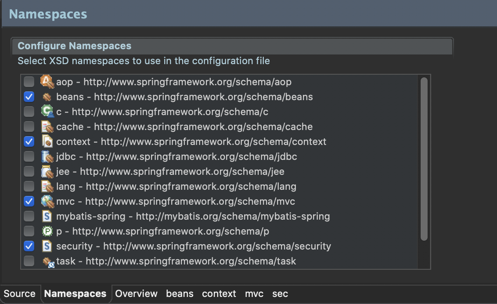

# SpringSecurity 설정
> pom.xml
```xml
 <dependency>
	<groupId>org.springframework</groupId>
	<artifactId>spring-test</artifactId>
	<version>${org.springframework-version}</version>
</dependency>

<!-- Security -->
<!-- https://mvnrepository.com/artifact/org.springframework.security/spring-security-core -->
<dependency>
    <groupId>org.springframework.security</groupId>
    <artifactId>spring-security-web</artifactId>
    <version>5.0.6.RELEASE</version>
</dependency>

<dependency>
    <groupId>org.springframework.security</groupId>
    <artifactId>spring-security-config</artifactId>
    <version>5.0.6.RELEASE</version>
</dependency>

<dependency>
    <groupId>org.springframework.security</groupId>
    <artifactId>spring-security-core</artifactId>
    <version>5.0.6.RELEASE</version>
</dependency>

<dependency>
    <groupId>org.springframework.security</groupId>
    <artifactId>spring-security-taglibs</artifactId>
    <version>5.0.6.RELEASE</version>
</dependency>
```
> web.xml
```xml
- 스프링 시큐리티 설정
<!-- 스프링 시큐리티가 스프링 MVC에서 사용되기 위해서는 필터를 이용해서 스프링 동작에 관여하도록 설정해야 -->
<!-- <context-param>
    <param-name>contextConfigLocation</param-name>
    <param-value>/WEB-INF/spring/root-context.xml</param-value>
</context-param> -->
<context-param>
    <param-name>contextConfigLocation</param-name>
    <param-value>
        /WEB-INF/spring/root-context.xml
        /WEB-INF/spring/security-context.xml
    </param-value>
</context-param>

<filter>
    <filter-name>springSecurityFilterChain</filter-name>
    <filter-class>org.springframework.web.filter.DelegatingFilterProxy</filter-class>
</filter>

<filter-mapping>
    <filter-name>springSecurityFilterChain</filter-name>
    <url-pattern>/*</url-pattern>
</filter-mapping>
```

> security-context.xml
- 스프링 시큐리티 설정을 위해 /WEB-INF/spring/security-context.xml 파일 생성

    

```xml
<?xml version="1.0" encoding="UTF-8"?>
<beans xmlns="http://www.springframework.org/schema/beans"
	xmlns:xsi="http://www.w3.org/2001/XMLSchema-instance"
	xmlns:security="http://www.springframework.org/schema/security"
	xsi:schemaLocation="http://www.springframework.org/schema/security http://www.springframework.org/schema/security/spring-security.xsd
		http://www.springframework.org/schema/beans http://www.springframework.org/schema/beans/spring-beans.xsd">
	
	<bean id="customAccessDenied" class="org.zerock.security.CustomAccessDeniedHandler"></bean>
	<bean id="customLoginSuccess" class="org.zerock.security.CustomLoginSuccessHandler"></bean>

	<security:http>
        <!-- 모든 사용자 접근 가능 -->
		<security:intercept-url pattern="/sample/all" access="permitAll" />

        <!-- ROLE_MEMBER 유저만 접근 가능 -->
            <security:intercept-url pattern="/sample/member" access="hasRole('ROLE_MEMBER')" />

        <!-- ROLE_ADMIN 유저만 접근 가능 -->
        <security:intercept-url pattern="/sample/admin" access="hasRole('ROLE_ADMIN')" />
		
        <!-- 로그인 완료 시 권한별로 이동할 페이지 설정 -->
		<!-- <security:form-login/> -->
		<!-- <security:form-login login-page="/customLogin"/> -->
		<security:form-login login-page="/customLogin" authentication-success-handler-ref="customLoginSuccess"/>
		
        <!-- 권한없는 페이지 접근 시 이동할 에러페이지 설정 -->
		<!-- <security:access-denied-handler error-page="/accessError" /> -->
		<security:access-denied-handler ref="customAccessDenied" />
		
        <!-- 로그아웃 시 이동할 페이지 설정 -->
		<security:logout logout-url="/customLogout" invalidate-session="true" />
		
	</security:http>
	
	<security:authentication-manager>
		<security:authentication-provider>
			<security:user-service>	
				<!-- 스프링 시큐리티 5버젼부터는 반드시 PasswordEncoder라는 존재를 이용하도록 변경됨. 인코딩 처리 없이 사용하고 싶다면 패스워드 앞에 {noop}를 붙여줘야 -->
				<security:user name="member" password="{noop}member" authorities="ROLE_MEMBER" />
				<security:user name="admin" password="{noop}admin" authorities="ROLE_ADMIN" />
			</security:user-service>
		</security:authentication-provider>
	</security:authentication-manager>
	
</beans>
```
> CustomAccessDeniedHandler.java
 - 접근 권한 없을 시 이동할 에러페이지 설정
```java
package org.zerock.security;

import java.io.IOException;

import javax.servlet.ServletException;
import javax.servlet.http.HttpServletRequest;
import javax.servlet.http.HttpServletResponse;

import org.springframework.security.access.AccessDeniedException;
import org.springframework.security.web.access.AccessDeniedHandler;

import lombok.extern.log4j.Log4j;

@Log4j
public class CustomAccessDeniedHandler implements AccessDeniedHandler {
	@Override
	public void handle(HttpServletRequest request, HttpServletResponse response, AccessDeniedException accessException) throws IOException, ServletException{
		log.error("Access Denied Handler");
		
		log.error("Redirect....");
		
		response.sendRedirect("/accessError");
	}
}
```
> CustomLoginSuccessHandler.java
- 로그인 성공 시 권한별로 이동할 페이지 설정
```java
package org.zerock.security;

import java.io.IOException;
import java.util.ArrayList;
import java.util.List;

import javax.servlet.ServletException;
import javax.servlet.http.HttpServletRequest;
import javax.servlet.http.HttpServletResponse;

import org.springframework.security.core.Authentication;
import org.springframework.security.web.authentication.AuthenticationSuccessHandler;

import lombok.extern.log4j.Log4j;

@Log4j
public class CustomLoginSuccessHandler implements AuthenticationSuccessHandler {
	@Override
	public void onAuthenticationSuccess(HttpServletRequest request, HttpServletResponse response, Authentication auth) throws IOException, ServletException{
		log.warn("Login Success");
		
		List<String> roleNames = new ArrayList<>();
		
		auth.getAuthorities().forEach(authority -> {
			roleNames.add(authority.getAuthority());
		});
		
		log.warn("ROLE NAMES : " + roleNames);
		
		if(roleNames.contains("ROLE_ADMIN")) {
			response.sendRedirect("/sample/admin");
			return;
		}
		
		if(roleNames.contains("ROLE_MEMBER")) {
			response.sendRedirect("/sample/member");
		}
		
		response.sendRedirect("/");
	}
}
```
> CommonController.java
- 로그인 관련 컨트롤러
```java
package org.zerock.controller;

import org.springframework.security.core.Authentication;
import org.springframework.stereotype.Controller;
import org.springframework.ui.Model;
import org.springframework.web.bind.annotation.GetMapping;

import lombok.extern.log4j.Log4j;

@Controller
@Log4j
public class CommonController {
	@GetMapping("/accessError")
	public void accessDenied(Authentication auth, Model model) {
		log.info("access Denied : " + auth);
		
		model.addAttribute("msg", "Access Denied");
	}
	
	@GetMapping("/customLogin")
	public void loginInput(String error, String logout, Model model) {
		log.info("error : " + error);
		log.info("logout : " + logout);
		
		if(error != null) {
			model.addAttribute("error", "Login Error Check Your Account");
		}
		
		if(logout != null) {
			model.addAttribute("logout", "LogOut!!");
		}
	}
	
	@GetMapping("/customLogout")
	public void logoutGet() {
		log.info("custom logout");
	}
}
```
> accessError.jsp
- 접근권한 없을 시 에러페이지
```jsp
<%@ page language="java" contentType="text/html; charset=UTF-8"
    pageEncoding="UTF-8"%>
<%@ taglib uri="http://java.sun.com/jsp/jstl/core" prefix="c" %>
<%@ taglib uri="http://www.springframework.org/security/tags" prefix="sec" %>
<%@ page import="java.util.*" %>
<!DOCTYPE html PUBLIC "-//W3C//DTD HTML 4.01 Transitional//EN" "http://www.w3.org/TR/html4/loose.dtd">
<html>
<head>
<meta http-equiv="Content-Type" content="text/html; UTF-8">
<title>Insert title here</title>
</head>
<body>
	<h1>Access Denied Page</h1>
	<h2><c:out value="${SPRING_SECURITY_403_EXCEPTION.getMessage()}"/></h2>
	<h2><c:out value="${msg}"/></h2>
</body>
</html>
```
> customLogin.jsp
- 로그인 페이지
```jsp
<%@ page language="java" contentType="text/html; charset=UTF-8"
	pageEncoding="UTF-8"%>
<%@ taglib uri="http://java.sun.com/jsp/jstl/core" prefix="c"%>

<!DOCTYPE html PUBLIC "-//W3C//DTD HTML 4.01 Transitional//EN" "http://www.w3.org/TR/html4/loose.dtd">
<html>
<head>
<meta http-equiv="Content-Type" content="text/html; charset=UTF-8">
<title>Insert title here</title>
</head>
<body>

	<h1>Custom Login Page</h1>
	<h2>
		<c:out value="${error}" />
	</h2>
	<h2>
		<c:out value="${logout}" />
	</h2>

	<form method='post' action="/login">

		<div>
			<input type='text' name='username' value='admin'>
		</div>
		<div>
			<input type='password' name='password' value='admin'>
		</div>

		<div>
			<input type='submit'>
		</div>
		<input type="hidden" name="${_csrf.parameterName}" value="${_csrf.token}" />
	</form>

</body>
</html>
```
> customLogout.jsp
- 로그아웃 페이지
```jsp
<%@ page language="java" contentType="text/html; charset=UTF-8"
    pageEncoding="UTF-8"%>
<!DOCTYPE html>
<html>
<head>
<meta charset="UTF-8">
<title>Insert title here</title>
</head>
<body>
	<h1>Logout Page</h1>
	<form action="/customLogout" method="post">
		<input type="hidden" name="${_csrf.parameterName}" value="${_csrf.token}" />
		<button>로그아웃</button>
	</form>
</body>
</html>
```
----------
# JDBC 사용과 패스워드 암호화
- 로그인 시도할 경우 PasswordEncoder를 지정하지 않으면 에러 발생 (스프링 시큐리티 5부터는 기본적으로 PasswordEncoder를 지정해야함!)
> security-context.xml
```xml
<?xml version="1.0" encoding="UTF-8"?>
<beans xmlns="http://www.springframework.org/schema/beans"
	xmlns:xsi="http://www.w3.org/2001/XMLSchema-instance"
	xmlns:security="http://www.springframework.org/schema/security"
	xsi:schemaLocation="http://www.springframework.org/schema/security http://www.springframework.org/schema/security/spring-security.xsd
		http://www.springframework.org/schema/beans http://www.springframework.org/schema/beans/spring-beans.xsd">
	
	<bean id="customAccessDenied" class="org.zerock.security.CustomAccessDeniedHandler"></bean>
	<bean id="customLoginSuccess" class="org.zerock.security.CustomLoginSuccessHandler"></bean>
	<bean id="bcryptPasswordEncoder" class="org.springframework.security.crypto.bcrypt.BCryptPasswordEncoder"></bean>

	<security:http>
        <!-- 모든 사용자 접근 가능 -->
		<security:intercept-url pattern="/sample/all" access="permitAll" />

        <!-- ROLE_MEMBER 유저만 접근 가능 -->
            <security:intercept-url pattern="/sample/member" access="hasRole('ROLE_MEMBER')" />

        <!-- ROLE_ADMIN 유저만 접근 가능 -->
        <security:intercept-url pattern="/sample/admin" access="hasRole('ROLE_ADMIN')" />
		
        <!-- 로그인 완료 시 권한별로 이동할 페이지 설정 -->
		<!-- <security:form-login/> -->
		<!-- <security:form-login login-page="/customLogin"/> -->
		<security:form-login login-page="/customLogin" authentication-success-handler-ref="customLoginSuccess"/>
		
        <!-- 권한없는 페이지 접근 시 이동할 에러페이지 설정 -->
		<!-- <security:access-denied-handler error-page="/accessError" /> -->
		<security:access-denied-handler ref="customAccessDenied" />
		
        <!-- 로그아웃 시 이동할 페이지 설정 -->
		<security:logout logout-url="/customLogout" invalidate-session="true" />
		
	</security:http>
	
	<security:authentication-manager>
		<security:authentication-provider>
		<!-- <security:user-service>	 -->
			<!-- 스프링 시큐리티 5버젼부터는 반드시 PasswordEncoder라는 존재를 이용하도록 변경됨. 인코딩 처리 없이 사용하고 싶다면 패스워드 앞에 {noop}를 붙여줘야 -->
		<!-- 	<security:user name="member" password="{noop}member" authorities="ROLE_MEMBER" />
			<security:user name="admin" password="{noop}admin" authorities="ROLE_ADMIN" />
		</security:user-service> -->

		<!-- 실제 JDBC를 이용 -->
		<security:jdbc-user-service data-source-ref="dataSource" />	
		
		<!-- BCryptPasswordEncoder -->
		<security:password-encoder ref="bcryptPasswordEncoder" />
		
		</security:authentication-provider>
	</security:authentication-manager>
	
</beans>
```
- SpringSecurity에서 지정된 테이블이 아닌 테이블 구조를 이용하는 경우
	- users-by-username-query : 유저
	- authorities-by-username-query : 권한
```xml
<!-- 실제 JDBC를 이용 -->
<!-- <security:jdbc-user-service data-source-ref="dataSource" />	 -->
<security:jdbc-user-service data-source-ref="dataSource" 
users-by-username-query="select userid, userpw, enabled from tbl_member where userid = ?"
authorities-by-username-query="select userid, auth from tbl_member_auth where userid = ?"/>
```
-------
# 커스텀 UserDetailsService 활용
- JDBC 방식으로 처리하는 방식은 제한적인 내용만을 이용한다는 단점이 존재함
- 스프링 시큐리티에서 username이라고 부르는 사용자의 정보만을 이용하기 때문에 실제 프로젝트에서 사용자의 이름이나 이메일 등의 자세한 정보를 이용할 경우에는 충분치 못함
- 이러한 문제를 해결하기 위해 UserDetailsService를 구현하는 방식을 이용하는 것이 좋음. 흔히 커스텀 UserDetailsService라고 부르며, 이를 이용하면 원하는 객체를 인증과 권한 체크에 활용할 수 있음
- 스프링 시큐리티의 UserDetailsService 인터페이스는 단 하나의 메서드(loadUserByUsername())만이 존재 
- 가장 일반적으로 사용되는 방법은 하위 클래스들 중에서 org.springframework.security.core.userdetails.User 클래스를 상속하는 형태
- MyBatis를 이용하는 MemberMapper와 서비스를 짝성하고 이를 시큐리티와 연결해서 사용하는 방식으로 예제를 진행

> AuthVO.java
```java
package org.zerock.domain;

import lombok.Data;

@Data
public class AuthVO {
	private String userid;
	private String auth;
}
```
> MemberVO.java
```java
package org.zerock.domain;

import java.util.Date;
import java.util.List;

import lombok.Data;

@Data
public class MemberVO {
	private String userid;
	private String userpw;
	private String userName;
	private boolean enabled;
	
	private Date regDate;
	private Date updateDate;
	private List<AuthVO> authList;
}
```
- MemberMapper.java
```java
package org.zerock.mapper;

import org.zerock.domain.MemberVO;

public interface MemberMapper {
	public MemberVO read(String userid);
}
```
> MemberMapper.xml
```xml
<?xml version="1.0" encoding="UTF-8"?>
<!DOCTYPE mapper PUBLIC "-//mybatis.org/DTD Mapper 3.0//EN" "http://mybatis.org/dtd/mybatis-3-mapper.dtd">
<mapper namespace="org.zerock.mapper.MemberMapper">

	<resultMap type="org.zerock.domain.MemberVO" id="memberMap">
		<id property="userid" column="userid" />
		<result property="userid" column="userid" />
		<result property="userpw" column="userpw" />
		<result property="userName" column="userName" />
		<result property="regDate" column="regDate" />
		<result property="updateDate" column="updateDate" />
		<collection property="authList" resultMap="authMap" />
	</resultMap>
	
	<resultMap type="org.zerock.domain.AuthVO" id="authMap">
		<result property="userid" column="userid" />
		<result property="auth" column="auth" />
	</resultMap>
	
	<select id="read" resultMap="memberMap">
		select mem.userid, userpw, username, enabled, regdate, updatedate, auth
		from tbl_member mem LEFT OUTER JOIN tbl_member_auth auth on mem.userid = auth.userid
		where mem.userid = #{userid}
	</select>

</mapper>
```
> MemberMapperTests.java
```java
package org.zerock.mapper;

import org.springframework.beans.factory.annotation.Autowired;

import org.junit.Test;
import org.junit.runner.RunWith;
import org.springframework.test.context.ContextConfiguration;
import org.springframework.test.context.junit4.SpringRunner;
import org.zerock.domain.MemberVO;
import org.zerock.mapper.MemberMapper;

import lombok.Setter;
import lombok.extern.log4j.Log4j;

@RunWith(SpringRunner.class)
@ContextConfiguration({"file:src/main/webapp/WEB-INF/spring/root-context.xml"})
@Log4j
public class MemberMapperTests {
	@Setter(onMethod_ = @Autowired)
	private MemberMapper mapper;
	
	@Test
	public void testRead() {
		MemberVO vo = mapper.read("admin90");
		
		log.info(vo);
		
		vo.getAuthList().forEach(authVO -> log.info(authVO));
	}
}
```
> CustomUserDetailsService.java
```java
package org.zerock.security;

import org.springframework.security.core.userdetails.UserDetails;
import org.springframework.security.core.userdetails.UserDetailsService;
import org.springframework.security.core.userdetails.UsernameNotFoundException;
import org.zerock.mapper.MemberMapper;
import org.springframework.beans.factory.annotation.Autowired;

import lombok.Setter;
import lombok.extern.log4j.Log4j;

@Log4j
public class CustomUserDetailsService implements UserDetailsService{
	@Setter(onMethod_ = @Autowired)
	private MemberMapper memberMapper;

	@Override
	public UserDetails loadUserByUsername(String userName) throws UsernameNotFoundException{
		log.warn("Load User By UserName : " + userName);
		
		return null;
	}
}
```
> security-context.xml
```xml
<bean id="customUserDetailsService" class="org.zerock.security.CustomUserDetailsService"></bean>

<security:authentication-manager>
	<!-- <security:authentication-provider>
		<security:jdbc-user-service data-source-ref="dataSource" 
		users-by-username-query="select userid, userpw, enabled from tbl_member where userid = ?"
		authorities-by-username-query="select userid, auth from tbl_member_auth where userid = ?"/>
		
		BCryptPasswordEncoder
		<security:password-encoder ref="bcryptPasswordEncoder" />
		
	</security:authentication-provider> -->
	
	<security:authentication-provider user-service-ref="customUserDetailsService">
	
		<!-- BCryptPasswordEncoder -->
		<security:password-encoder ref="bcryptPasswordEncoder" />
		
	</security:authentication-provider>
	
</security:authentication-manager>
```
> MemberVO를 UsersDetails 타입으로 변환
- 스프링 시큐리티의 UserDetailsService는 loadUserByUsername() 라는 하나의 추상 메서드만이 존재 
- 리턴 타입은 org.springframework.security.core.userdetails.UserDetails
- org.springframework.security.core.userdetails.User 클래스를 상속받은 CustomUser 클래스 생성
- MemberVO를 직접 수정하는 방법도 있지만 확장하는 방식을 사용
	```
	[UserDatails]
		⇡
		[User]
		↑
	⌜⎺⎺⎺⎺⎺⎺⎺⎺⎺⎺⎺⎺⎺⎺⎺⎺⎺⎺⎺⎺⎺⎺⎺⎺⎺⎺⎺⎺⎺⎺⎺⎺⎺⎺⎺⎺⌝
							⌈[AuthVO]
	CustomUser ← [MemberVO]-|[AuthVO]
							⌊[AuthVO]
	⌞⎽⎽⎽⎽⎽⎽⎽⎽⎽⎽⎽⎽⎽⎽⎽⎽⎽⎽⎽⎽⎽⎽⎽⎽⎽⎽⎽⎽⎽⎽⎽⎽⎽⎽⎽⎽⌟
	```
> MemberMapper.java
```java
package org.zerock.mapper;

import org.zerock.domain.MemberVO;

public interface MemberMapper {
	public MemberVO read(String userid);
}
```
> MemberMapper.xml
```xml
<?xml version="1.0" encoding="UTF-8"?>
<!DOCTYPE mapper PUBLIC "-//mybatis.org/DTD Mapper 3.0//EN" "http://mybatis.org/dtd/mybatis-3-mapper.dtd">
<mapper namespace="org.zerock.mapper.MemberMapper">

<resultMap type="org.zerock.domain.MemberVO" id="memberMap">
	<id property="userid" column="userid" />
	<result property="userid" column="userid" />
	<result property="userpw" column="userpw" />
	<result property="userName" column="userName" />
	<result property="regDate" column="regDate" />
	<result property="updateDate" column="updateDate" />
	<collection property="authList" resultMap="authMap" />
</resultMap>

<resultMap type="org.zerock.domain.AuthVO" id="authMap">
	<result property="userid" column="userid" />
	<result property="auth" column="auth" />
</resultMap>

<select id="read" resultMap="memberMap">
	select mem.userid, userpw, username, enabled, regdate, updatedate, auth
	from tbl_member mem LEFT OUTER JOIN tbl_member_auth auth on mem.userid = auth.userid
	where mem.userid = #{userid}
</select>

</mapper>
```
> CustomUserDetailsService.java
```java
package org.zerock.security;

import org.springframework.security.core.userdetails.UserDetails;
import org.springframework.security.core.userdetails.UserDetailsService;
import org.springframework.security.core.userdetails.UsernameNotFoundException;
import org.zerock.domain.MemberVO;
import org.zerock.mapper.MemberMapper;
import org.zerock.security.domain.CustomUser;
import org.springframework.beans.factory.annotation.Autowired;

import lombok.Setter;
import lombok.extern.log4j.Log4j;

@Log4j
public class CustomUserDetailsService implements UserDetailsService{
	@Setter(onMethod_ = @Autowired)
	private MemberMapper memberMapper;

	@Override
	public UserDetails loadUserByUsername(String userName) throws UsernameNotFoundException{
		log.warn("Load User By UserName : " + userName);
		
		MemberVO vo = memberMapper.read(userName);
		
		log.warn("queried by member mapper: " + vo);
		
		return vo == null ? null : new CustomUser(vo);
	}
}
```
> CustomUser.java
```java
package org.zerock.security.domain;

import java.util.Collection;
import java.util.stream.Collectors;

import org.springframework.security.core.GrantedAuthority;
import org.springframework.security.core.authority.SimpleGrantedAuthority;
import org.springframework.security.core.userdetails.User;
import org.zerock.domain.MemberVO;

import lombok.Getter;

@Getter
public class CustomUser extends User {
	private static final long serialVersionUID = 1L;

	private MemberVO member;

	public CustomUser(String username, String password, Collection<? extends GrantedAuthority> authorities) {
		super(username, password, authorities);
	}

	public CustomUser(MemberVO vo) {
		super(vo.getUserid(), vo.getUserpw(), vo.getAuthList().stream().map(auth -> new SimpleGrantedAuthority(auth.getAuth())).collect(Collectors.toList()));
		
		this.member = vo;
	}
}
```
-------
# 어노테이션을 이용하는 스프링 시큐리티 설정
> 주로 사용되는 어노테이션
- @Secured
	- 스프링 시큐리티 초기부터 사용되었고, () 안에 'ROLE_ADMIN'과 같은 문자열 혹은 문자열 배열을 이용
- @PreAuthorize, @PostAuthorize
	- 3버전부터 지원되며, () 안에 표현식을 사용할 수 있으므로 최근에는 더 많이 사용됨
------
> SampleContorller.java
```java
package org.zerock.controller;

import org.springframework.security.access.annotation.Secured;
import org.springframework.security.access.prepost.PreAuthorize;
import org.springframework.stereotype.Controller;
import org.springframework.web.bind.annotation.GetMapping;
import org.springframework.web.bind.annotation.RequestMapping;

import lombok.extern.log4j.Log4j;

@Log4j
@RequestMapping("/sample/*")
@Controller
	public class SampleController {
	@PreAuthorize("hasAnyRole('ROLE_ADMIN', 'ROLE_MEMBER')")
	@GetMapping("/annoMember")
	public void doMember2() {
	log.info("logined annotation member");
	}

	@Secured({"ROLE_ADMIN"})
	@GetMapping("/annoAdmin")
	public void doAdmin2() {
	log.info("admin annotation only");
	}
}
```
> servlet-context.xml



- spring-security.xsd 버전을 4.2버전으로 낮추거나 버전 정보를 지워야 에러가 없이 작동됨
```xml
<?xml version="1.0" encoding="UTF-8"?>
<beans:beans xmlns="http://www.springframework.org/schema/mvc"
	xmlns:xsi="http://www.w3.org/2001/XMLSchema-instance"
	xmlns:beans="http://www.springframework.org/schema/beans"
	xmlns:context="http://www.springframework.org/schema/context"
	xmlns:security="http://www.springframework.org/schema/security"
	xsi:schemaLocation="http://www.springframework.org/schema/security http://www.springframework.org/schema/security/spring-security.xsd
		http://www.springframework.org/schema/mvc https://www.springframework.org/schema/mvc/spring-mvc.xsd
		http://www.springframework.org/schema/beans https://www.springframework.org/schema/beans/spring-beans.xsd
		http://www.springframework.org/schema/context https://www.springframework.org/schema/context/spring-context.xsd">

	<!-- DispatcherServlet Context: defines this servlet's request-processing infrastructure -->
	
	<!-- Enables the Spring MVC @Controller programming model -->
	<annotation-driven />

	<!-- Handles HTTP GET requests for /resources/** by efficiently serving up static resources in the ${webappRoot}/resources directory -->
	<resources mapping="/resources/**" location="/resources/" />

	<!-- Resolves views selected for rendering by @Controllers to .jsp resources in the /WEB-INF/views directory -->
	<beans:bean class="org.springframework.web.servlet.view.InternalResourceViewResolver">
		<beans:property name="prefix" value="/WEB-INF/views/" />
		<beans:property name="suffix" value=".jsp" />
	</beans:bean>
	
	<context:component-scan base-package="org.zerock.controller" />
	
	<security:global-method-security pre-post-annotations="enabled" secured-annotations="enabled"/>
	
	<beans:bean id="multipartResolver" class="org.springframework.web.multipart.support.StandardServletMultipartResolver"></beans:bean>
	
</beans:beans>
```