# **Part 04** REST 방식과 Ajax를 이용하는 댓글 처리

## **Chapter 16** REST방식으로 전환

 - 흔히 URL(Uniform Resource Location)과 URL(Uniform Resource Identifier)를 같은 의미로 사용하는 경우가 많다. 엄밀하게는 URL은 URI의 하위 개념이기 때문에 혼용해도 무방하다.
 - URI 는 '자원의 식별자' 라는 의미로 사용된다.
 - URL은 '이곳에 가면 당신이 원하는 것을 찾을 수 있습니다.'와 같은 상징적인 의미가 좀더 강하다면 URI는 '당신이 원하는 곳의 주소는 여기입니다.'와 같이 좀더 현실적이고 구체적인 의미가 있다.
 - URI의 'I'는 마치 데이터베이스의 PK와 같은 의미로 사용된다.
 
 - REST는 'Representational State Transfer'의 약어로 하나의 URI는 하나의 고유한 리소스(Resource)를 대표하도록 설계된다는 개념에 전송방식을 결합해 원하는 작업을 지정한다.
    - 예로 '/board/123'은 게시물 중에서 123번이라는 고유한 의미를 가지도록 설계하고, 이에 대한 처리는 GET, POST 방식과 같이 추가적인 정보를 통해서 결정한다.
    - 따라서 REST 방식은 '**URI + GET/POST/PUT/DELETE/...**'로 구성된다.
 - REST 관련 어노테이션

 |어노테이션|기능|
 |-------|---|
 |@RestController|Controller가 REST방식을 처리하기 위한 것임을 명시한다|
 |@ResponseBody|일반적인 JSP와 같은 뷰로 전달되는게 아니라 데이터 자체를 전달하기 위한 용도|
 |@PathVariable|URL 경로에 있는 값을 파라미터로 추출하려고 할 때 사용|
 |@CrossOrigin| Ajax의 크로스 도메인 문제를 해결해주는 어노테이션|
 |@RequestBody|JSON 데이터를 원하는 타입으로 바인딩 처리|

 ### 16.1 @RestController
  - REST 방식에서 가장 먼저 기억해야 하는 점은 서버에서 전송하는 것이 순수한 데이터라는 점이다.
  - 스프링 4부터는 @Controller 외 @RestController라는 어노테이션을 추가해서 해당 Controller의 모든 메서드의 리턴타입을 기존과 다르게 처리한다는 것을 명시한다.
  - @RestController 이전에는 @Controller와 메서드 선언부에 @ResponseBody를 이용해서 동일한 결과를 만들 수 있다.
  - @RestController는 메서드의 리턴타입으로 사용자가 정의한 클래스 타입으르 사용할 수 있고, 이를 JSON이나 XML로 자동으로 처리할 수 있다.

  ```java
  @RestController
@RequestMapping("/sample")
@Log4j
public class SampleController {
	
	@GetMapping(value = "/getText", produces = "text/plain; charset=UTF-8")
	public String getText() {
		
		log.info("MIME TYPE: " + MediaType.TEXT_PLAIN_VALUE);
		
		return "안녕하세요";
	}

}
  ```
  - 기존의 @Controller는 문자열을 반환하는 경우에는 JSP 파일의 이름으로 처리하지만, @RestController의 경우에는 순수한 데이터가 된다.
  - @GetMapping에 사용된 **produces**속성은 해당 메서드가 생산하는 MIME 타입을 의미한다. 예제와 같이 문자열로 직접 지정할 수 있고, 메서드 내의 MediaType이라는 클래스를 이용할 수도 있다.
  - 별도의 페이지 생성 필요없이 순수한 텍스트 '안녕하세요'가 페이지에 나오는 것을 볼 수 있다.

  #### 16.1.1 객체의 반환
  - 객체를 반환하는 작업은 JSON이나 XML을 이용한다.

  ```java
  @Data
@AllArgsConstructor
@NoArgsConstructor
public class SampleVO {
	
	private Integer mno;
	private String firstName;
	private String lastName;

}
```
  
 - @AllArgsConstructor 모든속성을 사용하는 생성자 어노테이션
 - @NoArgsConstructor 비어있는 생성자를 만드는 어노테이션  
 - xml 파일</br>
	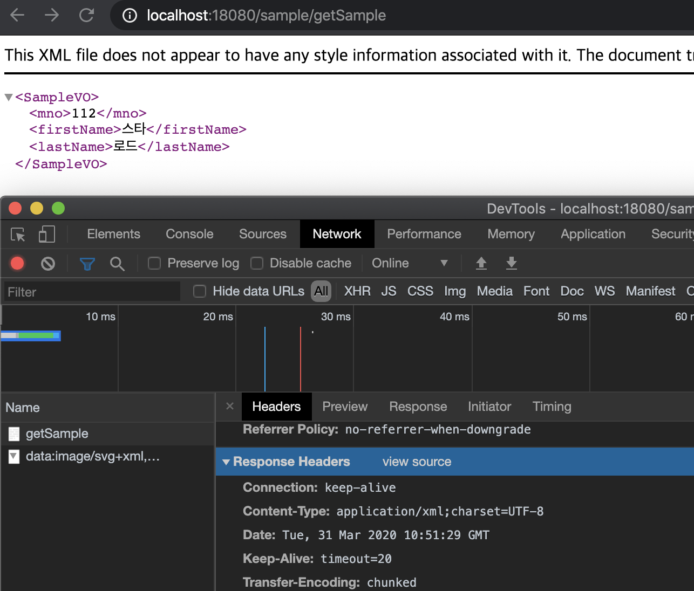</img></br>
 - json 파일</br>
	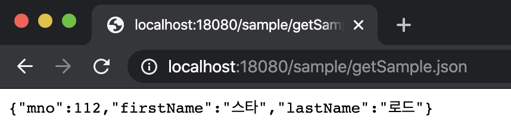</img>
</br>

 
#### 16.1.2 컬렉션 타입의 객체 반환

- List 반환

   ```java
   @GetMapping(value = "/getList")
	public List<SampleVO> getList(){
		return IntStream.range(1, 10).mapToObj(i -> new SampleVO(i, i+"First", i +" Last")).collect(Collectors.toList());
	}
   ```
- 내부적으로 1~10미만까지 루프를 처리하면서 SampleVO객체를 만들어서 List<SampleVO>로 만들어 낸다.
  - json </br>
	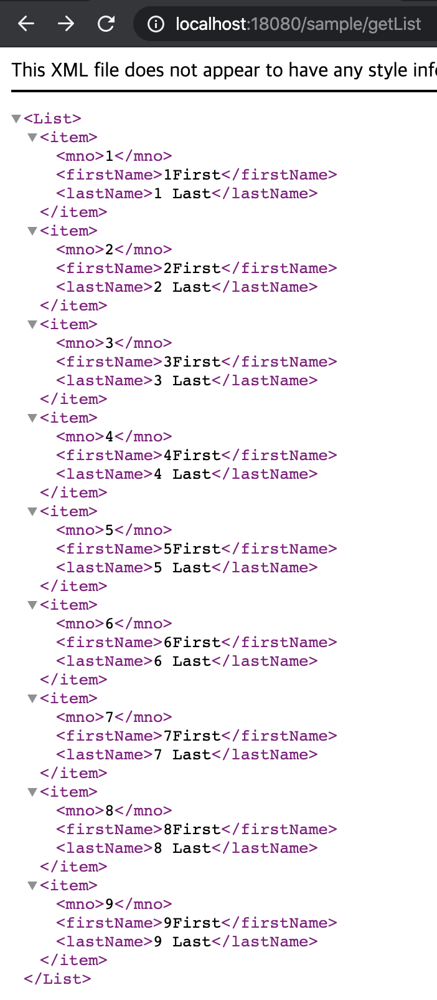</br>
  - xml  </br>
	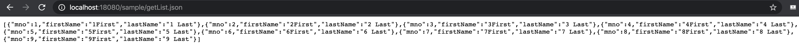</br>

- Map 반환
```java
@GetMapping(value = "/getMap")
	public Map<String, SampleVO> getMap(){
		Map<String, SampleVO> map = new HashMap<String, SampleVO>();
		map.put("First", new SampleVO(111, "그루트", "주니어"));
		
		return map;
	}
```
  - xml</br>
	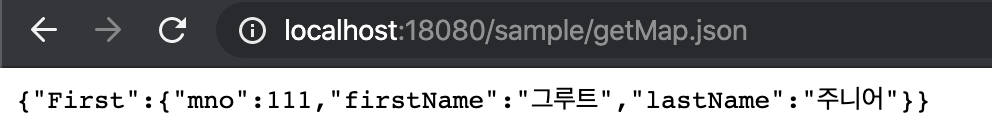</br>
  - json</br>
	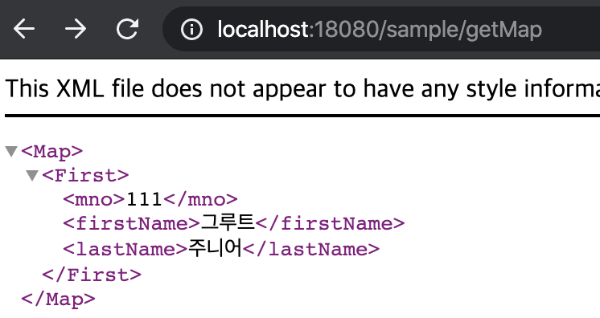

### 16.2 ResponseEntity 타입
 - REST 방식으로 호출하는 경우는 화면 자ㅣ체가 아니라 데이터 자체를 전송하는 방식으로 처리되기 때문에 데이터를 요청한 쪽에서는 정상적인 데이터인지 비정상적인 데이터인지를 구분할 수 있는 확실한 방법을 제공해야 한다.
 - 데이터와 함께 HTTP헤더의 상태 메시지 등을 같이 전달하는 용도로 사용한다.
 - HTTP의 상태 코드와 에러 메시지 등을 함께 데이터를 전달할 수있기 떄문에 받는 입장에서는 확실하게 결과를 알 수 있다.

 ```java
 @GetMapping(value = "/check", params = {"height", "weight"})
	public ResponseEntity<SampleVO> check(Double height, Double weight){
		
		SampleVO vo = new SampleVO(0, "" + height, "" + weight);
		
		ResponseEntity<SampleVO> result = null;
		
		if(height < 150) {
			result = ResponseEntity.status(HttpStatus.BAD_GATEWAY).body(vo);
		}else {
			result = ResponseEntity.status(HttpStatus.OK).body(vo);
		}
		
		return result;
	}
 ```
 - 'height' 와 'weight'를 파라미터로 전달받는다.
 - height < 150  일경우</br>
 	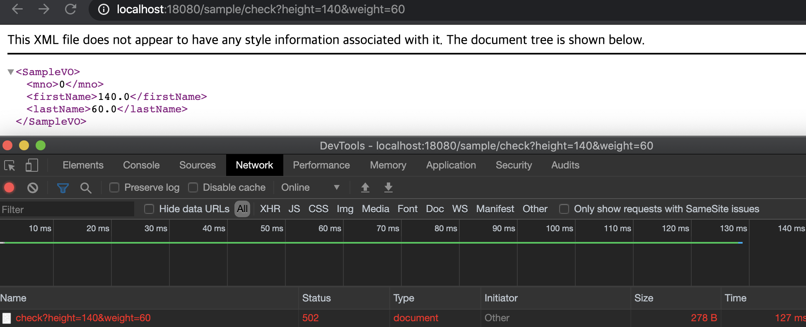</br>
 - height > 150  일경우 </br>
 	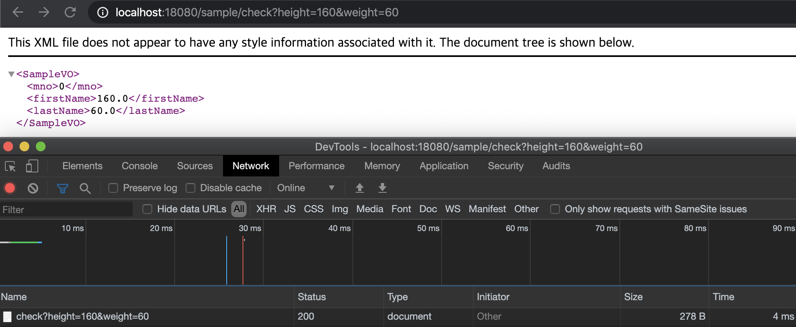</br>

 ### 16.3 @RestController에서 파라미터

  - @RestController는 기존의 @Controller에서 사용하던 일반적인 타입이나 사용자가 정의한 타입(클래스)를 사용한다. 몇가지 추가 어노테이션
    - @PathVariable 
      - 일반 컨트롤러에서도 사용이 가능하지만 REST 방식에서 자주사용
      - URL 경로의 일부를 파라미터로 사용할 때 이용
    - @RequestBody
      - JSON 데이터를 원하는 타입의 객체로 변환해야 하는 경우에 주로 사용
  
#### 16.3.1 @PathVariable

- REST 방식에서는 URL 내에 최대한 많은 정보를 담으려고 노력한다. 이전에는 '?'뒤에 추가되는 쿼리 스트링이라는 형태로 파라미터를 이용해서 전달되던 데이터들이 REST방식에서는 경로의 일부로 사용되는 경우가 많다.
- 스프링 MVC에서는 @PathVariable 어노테이션을 이용해서 URL 상에 경로의 일부를 파라미터로 사용할 수 있다.

```java
@GetMapping("/product/{cat}/{pid}")
	public String[] getPath(@PathVariable("cat") String cat, @PathVariable("pid") Integer pid) {
		return new String[] {"category: " + cat, "productid : " + pid};
	}
```

 - @PathVariable 을 적용하고 싶은 경우에는 '{}'를 이용해서 변수명을 지정한고, @PathVarialbe을 이용해서 지정된 이름의 변숫값을 얻을 수 있다.
 - 값을 얻을 떄에는 int, double형과 같은 기본 자료형은 사용할 수 없다.(Wapper형만 가능)
 - 예제
    - xml</br>
	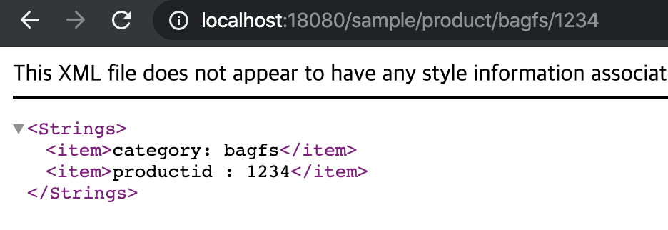
    - json</br>
	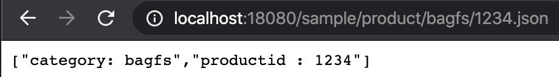
> - URL뒤에 .json을 붙이니 역시 JSON으로도 호출이 된다.

#### 16.3.2 @RequestBody
- 전달된 요청(request)의 내용(body)을 이용해서 해당 파라미터의 타입으로 변환을 요구한다.
- 내부적으로 HttpMessageConverter 타입의 객체들을 이용해서 다양한 포맷의 입력 데이터를 변환할 수있다.
- 대부분의 경우에서 JSON데이터를 서버에 보내서 원하는 타입의 객체로 변환하는 용도로 사용된다.
- 경우에 따라서 원하는 포맷의 데이터를 보내고, 이를 해석해서 원하는 타입으로 사용하기도 한다.

```java
@PostMapping("/ticket")
	public Ticket convert(@RequestBody Ticket ticket) {
		
		log.info("convert.......ticket" + ticket);
		
		return ticket;
	}
```

- 위의 예제들과 달리 (@GetMapping) @PostMapping이 적용된 것을 볼 수 있는데, 이것은 @RequestBody가 말 그대로 요청(request)한 내용(body)을 처리하기 떄문에 일반적인 파라미터 전달방식을 사용할 수 없기 때문이다.
 - **16.4** 테스트 방식을 통해 확인하기

### 16.4 REST 방식의 테스트
- @RestController를 쉽게 테스트할 수 있는 방법은 주로 REST방식의 데이터를 전송하는 툴을 이용하거나, JUnit과 spring-test를 이용해서 테스트하는 방식을 고려할 수 있다.

```java
@RunWith(SpringJUnit4ClassRunner.class)
@WebAppConfiguration
@ContextConfiguration({"file:src/main/webapp/WEB-INF/spring/root-context.xml","file:src/main/webapp/WEB-INF/spring/appServlet/servlet-context.xml"})
@Log4j
public class SampleControllerTests {
	
	@Setter(onMethod_ = {@Autowired})
	private WebApplicationContext ctx;
	
	private MockMvc mockMvc;
	
	@Before
	public void setup() {
		this.mockMvc = MockMvcBuilders.webAppContextSetup(ctx).build();
	}
	
	@Test
	public void testConvert() throws Exception {
		
		Ticket ticket = new Ticket();
		ticket.setTno(123);
		ticket.setOwner("Admin");
		ticket.setGrade("AAA");
		
		String jsonStr = new Gson().toJson(ticket);
		
		log.info(jsonStr);
		
		mockMvc.perform(post("/sample/ticket")
				.contentType(MediaType.APPLICATION_JSON)
				.content(jsonStr))
				.andExpect(status().is(200));
	}
}
```
- **16.3.2** 의 예제는 JSON으로 전달되는 데이터를 받아서 Ticket 타입으로 변환한다. 이를 위해서는 해당 데이터가 JSON이라는 것을 명시해 줄 필요가 잆다.
- MockMvc는 contentType()을 이용해서 전달하는 데이터가 무엇인지를 알려줄 수 있다.
- Gson 라이브러리는 Java의 객체를 JSON 문자열로 변환하기 위해 사용한다.
- 결과  
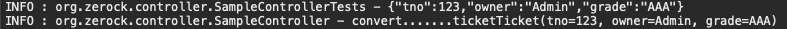</br>
- 전달되는 JSON 문자열이 Ticket 타입의 객체로 변환되는 것을 볼 수 있다.

> #### 16.4.1 기타도구
- JUnit을 이용하는 방식 이외에도 Tomcat을 구동한다면 REST 방식을 테스트할 수 있는 여러 가지 도구가 있다.
- Mac이나 리눅스 등을 이요한다면 간단히 curl같은 도구를 이용할 수도 있고, Java나 각종 언어로 개발된 라이브러리들을 이용할 수 있다.
- 최근에는 브라우저에서 직접 REST 방식을 테스트할 수 있는 도구들이 많아졋다. Chrome의 앱스토어에서 'REST client'로 검색해보면 관련 확장프로그램들을 볼 수 있다.
> - 예제에는 'Restlet Client'를 이용해서 테스트를 진행하라고 제시되어있지만 해당 서비스가 종료된 이윤지 찾을 수 없어 'Boomerang'이라는 확장프로그램으로 대체해서 진행하였다.  
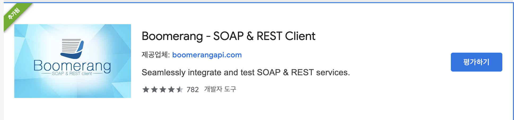
- xml(REST Test)
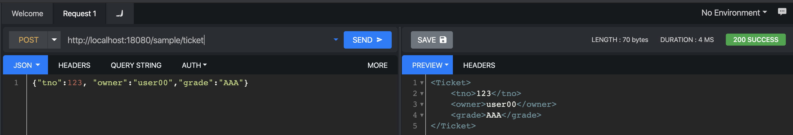
- json(REST Test)(.json으로 json파일로도 변환)
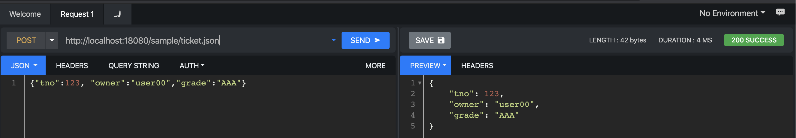

### 16.5 다양한 전송방식
 - HTTP의 전송 방식  

|작업|전송방식
|---|----
|Create|POST
|Read|GET
|Update|PUT
|Delete|DELETE

 - REST방식은 URL와 같이 결합하므로 회원(member)이라는 자원을 대상으로 전송방식을 결합하면 다음과 같아진다.

|작업|전송방식|URI
|---|----|-----
|등록|POST|/members/new
|조회|GET|/members/{id}
|수정|PUT|/member/{id} + body (json 데이터 등)
|삭제|DELETE|/member/{id}

## **Chapter 17** Ajax 댓글 처리

### 17.1 @Param어노테이션과 댓글 목록

- MyBatis에서 두 개 이상의 데이터를 파라미터로 전달하는 방법
	- 별도의 객체로 구성
	- Map을 이용
	- @Param을 이용해서 이름을 사용(가장 간단한 방식)
```java
public List<ReplyVO> getListWithPaging(@Param("cri") Criteria cri, @Param("bno") Long bno);
```

### 17.2 등록 작업과 테스트
 - REST 방식으로 처리할 때 주의해야 하는 점은 브라우저나 외부에서 서버를 호출 할 때 데이터의 포맷과 서버에서 보내주는 데이터의 타입을 명확히 설계해야 하는것이다.
 - 예로 댓글 등록의 경우 브라우저에서는 JSON 타입으로 된 댓글 데이터를 전송하고, 서버에서는 댓글의 처리 결과가 정상적으로 되었는지 문자열로 결과를 알려 주도록 한다.
```java
@PostMapping(value = "/new", consumes = "application/json", produces = {MediaType.TEXT_PLAIN_VALUE})
	public ResponseEntity<String> create(@RequestBody ReplyVO vo){
		
		log.info("ReplyVO : " + vo);
		
		int insertCount = service.register(vo);
		
		log.info("Reply Insert Count : " + insertCount);
		
		return insertCount == 1 ? new ResponseEntity<>("success", HttpStatus.OK) : new ResponseEntity<>(HttpStatus.INTERNAL_SERVER_ERROR);
		
	}
``` 
> - 요청타입 정의 = consumes  
>	- 위의 예제에서 consumes = MediaType.APPLICATION_JSON_VALUE 형식으로도 사용가능
> - 응답타입 정의 = producess
>	- 위의 예제에서 produces = ("text/plain")형식으로도 사용가능

> REST PUT 과 PATCH 차이점(추가 확인필요)
> - Put
>	- 자원의 전체를 교체하는 경우
> - Patch
>	- 요청된 자원만을 교체하는 경우

### 17.4 JavaScript

#### 17.4.1 JavaScript 모듈화

 - 유지보수가 하가ㅣ힘든 코드를 만드는경우를 방지하기위해 JavaScript를 하나의 모듈 처럼 구성하는 방식을 이용
 - JavaScript에서 가장 많이 사용하는 패턴 중 하나는 관련 있는 함수들을 하나의 모듈처럼 묶음으로 구성하는 것을 의미하는 모듈 패턴이다. JavaScript의 클로저를 이용하는 방식이 대표적인 방법

 ##### 17.4.1.1 모듈 구성하기
 ```javascript
 var replyService = (function(){
	
	function add(reply, callback){
		console.log("reply........");
	}
	return {add:add};
})();
 ```
  - 개발자 도구에서는 replyService 객체의 내부에는 add라는 메서드가 존재하는 형태로 보이게 된다.
  - 외부에서는 replyService.add(객체, 콜백)를 전달하는 형태로 호출할 수 있는데, Ajax호출은 감춰져 있기 때문에 코드를 좀 더 깔끔하게 작성할 수 있다.
  ```javascript
  $.ajax({
	type : 'post',
	url : '/replies/new',
	data : JSON.stringfy(reply),
	contentType : "application/json; charset=utf-8",
	success : function(result, status, xhr){
		if(callback){
			callback(result);
		}
	},
	error : function(xhr, status, er){
		if(error){
			error(er);
		}
	}
})
  ```

#### 17.5 시간에 대한 처리방식

 - 날짜 포맷의 경우 문화권마다 표기 순서 등이 다르기 때문에 화면에서 처리하는 방식을 권장한다.
 - 최근 웹페이지들은 해당일에 해당하는 데이터는 '시/분/초'를 보여주고, 전날에 등록된 데이터들은 '년/월/일' 등을 보여주는 경우가 많다.

 > #### 17.6 특정 댓글의 위임 처리

  - DOM에서 이벤트 리스너를 등록하는 것은 반드시 해당 DOM요소가 존재헤야만 가능하다.
  - 예제와 같이 동적으로 Ajax를 통해 태그들이 만들어지면 이후에 이벤트를 등록해야 하기 때문에 일반적인 방식이 아니라 '이벤트 위임(delegation)'의 형태로 작성해야 한다.
	- 이벤트 위임은 이벤트를 동적으로 생성되는 요소가 아닌 이미 존재하는 요소에 이벤트를 걸어주고, 후에 이벤트의 대상을 변경해 주는 방식이다.
	- jQuery는 on()을 이용해서 쉽게 처리할 수 있다.
 ```javascript
$(".chat").on("click", "li", function(e){

	var rno = $(this).data("rno");
	
	console.log(rno);
	
});
 ```
  - jQuery 에서 이벤트를 위임하는 방식
	- 이미 존재하는 DOM요소(위에서는 '.chat')에 이벤트 처리
	- 후에 동적으로 생기는 요소(위에서는 'li')들에 대해서 파라미터 형식으로 지정한다.

#### 17.6 데이터베이스의 인덱스 설계

 - 댓글의 경우 게시물의 번호가 중점이된다.
 - 일반 댓글의 PK로만 검색을 할경우 중간에 있는 다른 게시물을 건너뛰면서 특정 게시물의 댓글들을 모두 찾아야 하는 번거로움이 생긴다.
 - 효율을 높이기 위해 게시물 별 댓글을 모아주는 구조를 생성하는 인덱스를 만든다.
 ```sql
 create index idx_reply on tbl_reply (bno desc, rno asc);
 ```

#### 17.7 댓글 페이지의 화면 처리
 - 화면 처리 방식
	- 게시물을 조회하는 페이지에 들어오면 기본적으로 가장 오래된 댓글을 가져와서 1페이지에 보여준다.
	- 1페이지의 게시물을 가져올 때 해당 게시물의 댓글의 숫자를 파악해서 댓글의 페이지 번호를 출력한다.
	- 댓글이 추가되면 댓글의 숫자만을 가져와서 최종 페이지를 찾아서 이동한다.
	- 댓글의 수정과 삭제 후에는 다시 동일 페이지를 호출한다.