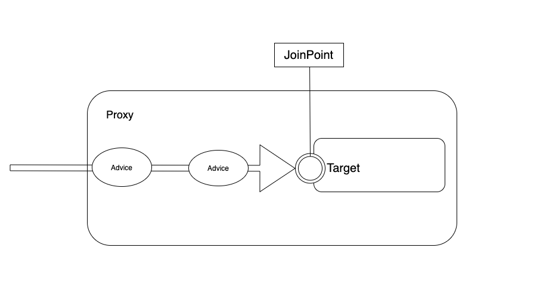
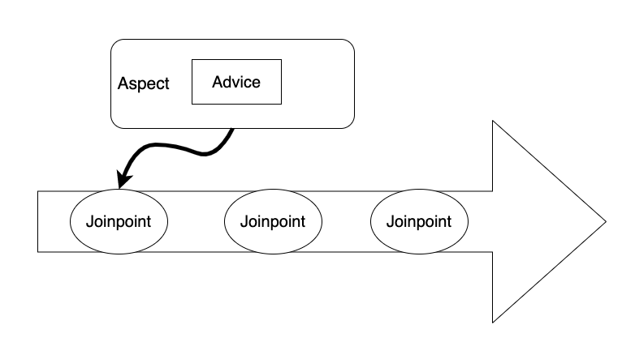

# **Part 05** AOP라는 패러다임

## **Chapter 18** AOP라는 패러다임

 - AOP는 흔히 '관점(관심사) 지향 프로그래밍'으로 변역 된다.
- AOP가 추구하는 것은 '관심사의 분리'이다
 - 예로 나눗셈을 구현한다면
    - 두개 의 숫자 = '핵심로직'
    - 0을 나누는 것이 아닌지 등을 체크 = '주변로직'

 - 즉, '관심사'는 가장 중요한 로직은 아니지만, 사전 조건이나 사후 조건 등으로 간주한다.

 - AOP는 과거에 개발자가 작성했던 '관심사 + 비즈니스 로직'을 분리해서 별도의 코드로 작성하도록 하고, 실행 할 때 이를 결합하는 방식으로 접근한다.
    - 개발자가 작성한 코드와 분리된 관심사를 구현한 코드를 컴파일 혹은 실행 시점에 결합

- 실제 실행은 결합된 상태의 코드가 실행되기 때문에 개발자들은 핵심 비즈니스 로직에만 근거해서 코드를 작성하고, 나머지는 어떤 관심사들과 결합할 것인지를 설정하는 것 만으로 모든 개발을 마칠 수 있다.

- 스프링이 AOP를 지원한다는 것이 스프링의 가장 중요한 특징중에 하나로 말게된 이유 역시 별도의 복잡한 설정이나 제약 없이 스프링 내에서 간편하게 AOP의 기능들을 구현할 수 있기 떄문이다.
    - 작성된 모든 메서드의 실행 시간이 얼마인지를 기록하는 기능을 기존 코드의 수정 없이 작성가능
    - 잘못된 파라미터가 들어와서 예외가 발생하는 상황을 기존 코드의 수정 없이도 제어

### 18.1 AOP 용어

 - AOP는 기존의 코드를 수정하지 않고, 원하는 기능들과 결합할 수 있는 패러다임이다.

 </br>
  
  - **Target**에 해당하는 것이 바로 개발자가 작성한 핵심 비즈니스 로직을 가지는 객체이다.
      - 순수한 비즈니스 로직을 의미하고, 어떠한 관심사들과도 관계를 맺지 않는다.
      - 순수한 코어라고 볼 수있다.
  - Target을 전체적으로 감싸고 있는것을 **Proxy**라고 한다.
      - 내부적으로 Target을 호출하지만, 중간에 필요한 관심사들을 거쳐서 Target을 호출하도록 자동 혹은 수동으로 작성된다.
      - Proxy의 존재는 직접 코드를 통해서 구현하는 경우도 있지만, 대부분의 경우 스프링 AOP 기능을 이용해서 자동으로 생성되는(auto-proxy)방식을 이용한다.
  - **JoinPoint**는 Target객체가 가진 메서드이다.
      - 외부에서의 호출은 Proxy객체를 통해 Target 객체의 JoinPoint를 호출하는 방식이라고 이해할 수 있다.

 </br>

  - Advice와 JoinPoint의 관계이다.
  - **JoinPoint**는 Target이 가진 여러 메서드라고 보면된다.(엄밀하게 스프링 AOP에서는 메서드만이 JoinPoint가 된다.)
  - Target에는 여러 메서드가 존재하기 때문에 어떤 메서드에 관심사를 결합할 것인지를 결정해야 하는데 이결정을 **'PointCut'** 이라고 한다.
  - **PointCut**은 관심사와 비즈니스 로직이 결합되는 지점을 결정하는 것이다.
    - 앞의 Proxy는 이 결합이 완성된 상태이므로 메서드를 호출하게 되면 자동으로 관심사가 결합된 상태로 동작하게 된다.
  - **관심사(concern)** 는 위의 그림에서 Aspect와 Advice라는 용어로 표현되어 있다.
  - **Aspect**는 조금 추상적인 개념을 의미한다.
    - 관심사 자체를 의미하는 추상명사
  - **Advice**는 Aspect를 구현한 코드이다.
  - **Advice**는 실제 걱정거리를 분리해 놓은 코드를 의미한다.
    - 동작위치에 따른 구분
    
    |구분|어노테이션|설명|
    |--|--|--|
    |Before Advice|@Before| Target의 JoinPoint를 호출하기 전에 실행되는 코드이다.</br> 코드의 실행 자체에는 관여할 수 없다.
    |After Returning Advice |@AfterReturning| 모든 실행이 정상적으로 이루어진 후 에 동작하는 코드|
    |After Throwing Advice |@AfterThrowing| 예외가 발생한 뒤에 동작하는 코드|
    |After Advice |@After| 정상적으로 실행되거나 예외가 발생했을 때 구분 없이 실행되는 코드|
    |Around Advice|@Around| 메서드의 실행 자체를 제어할 수 있는 가장 강력한 코드</br>직접 대상메서드를 호출하고 결과나 예외를 처리할 수 있다.
 - Advice는 과거의 스프링에서는 별도의 인터페이스로 구현되고, 이를 클래스로 구현하는 방식으로 제작되었으나. 스프링 3버전 이후에는 어노테이션만으로도 모든 설정이 가능하다.
 - Target에 어떤 Advice를 적용할 것인지는 XML을 이용한 설정을 이용할 수 있고, 어노테이션을 이용하는 방식을 이용할 수 있다.
 - PointCut은 Advice를 어떤 JoinPoint에 결합할 것인지를 결정하는 설정이다. AOP에서 Target은 결과적으로 PointCut에 의해서 자신에게는 없는 기능들을 가지게 된다.
 - PointCut은 다양한 형태로 선언해서 사용할 수 있는데 주로 사용되는 설정은 다음과 같다.

 |구분|설명|
 |--|---|
 |execution(@execution)| '**메서드**'를 기준으로 Pointcut을 설정한다|
 |within(@within)|특정한 '**타입(클래스)**'을 기준으로 Pointcut을 설정한다|
 |this|주어진 '**인터페이스를 구현한 객체**'를 대상으로 Pointcut을 설정한다|
 |arg(@args)|'**특정한 파라미터**'를 가지는 대상들만을 Pointcut으로 설정한다|
 |@annotation|'**특정한 어노테이션**'이 적용된 대상들만을 Pointcut으로 설정한다.|

 #### 18.1.1 용어 정리
 |구분|설명
|---|---
|Proxy|**대리인**, 함수 호출자는 주요업무가아닌 보조업무를 프록시에게 맡기고, 프록시 내부적으로 보조업무를 제어,처리
|Target| **핵심 비즈니스 로직 객체**, 부가기능을 부여할 대상
|Advice| **부가기능을 정의한 코드**, 타겟에 제공할 부가기능을 담고있는 모듈
|JoinPoint| **Advice를 적용 가능한 지점**, Spring에서 관리하는 Bean들의 모든 메서드
|pointcut| **관심사와 비즈니스 로직이 결합되는 지점을 결정하는 것**, JoinPoint의 부분집합으로도 표현
|Aspect| **Advice + pointcut**, Advice의 추상화, AOP의 기본 모듈

### 18.2 AOP 실습

```java
@Aspect
@Log4j
@Component
public class LogAdvice {
	
	@Before("execution(* org.zerock.service.SampleService*.*(..))")
	public void logBefore() {
		
		log.info("=====================================");
	}

}

```
 - 기존의 코드를 작성할 때 항상 쓰던 log.info()를 Advice로 간주
 - @Aspect는 해당 클래스 객체가 Aspect를 구현한 것임을 나타내기 위해 사용
 - @Component는 해당 클래스를 스프링 빈으로 인식하기 위해 사용
 - Advice와 관련된 어노테이션들은 내부적으로 Pointcut을 지정한다. 아니면 별도의 @Pointcut 으로 지정해서 사용 가능하다.
 - @Before("execution(* org.zerock.service.SampleService*.*(..))") 는 AspectJ의 표현식이다
 >   - 어떤 위치에 Advice를 적용할 것인지를 결정하는 Pointcut
 >   - execution의 경우 접근제한자와 특정 클래스의 메서드를 지정할 수 있다.  
 >   - 맨앞의 '*'는 접근제한자를 의미하고, 맨뒤의 '*'는 클래스의 이름과 메서드의 이름을 의미한다.
 >   -  execution([수식어] [리턴타입] [클래스이름] [이름](\[파라미터]\)<br/>

|구분|설명
|--|--
|수식어|생략가능, public,protected 등
|리턴타입|메서드의 리턴타입 지정
|클래스이름, 이름| 클래스의 이름 및 메서드 이름 지정
|파라미터 | 메서드 파라미터 지정
|'*'| 모든 값
|'..'| 0개 이상

    따라서, org.zerock.service.SampleService 포함된, 모든 0개이상의 파라미터를 가진 메서드들을 대상으로 실행한다.

### 18.3 AOP 설정

 - 스프링 2버전 이후에는 간단히 자동으로 Proxy 객체를 만들어주는 설정을 추가
 ```xml
<context:annotation-config></context:annotation-config>
	
<context:component-scan base-package="org.zerock.service"></context:component-scan>
<context:component-scan base-package="org.zerock.aop"></context:component-scan>

<aop:aspectj-autoproxy></aop:aspectj-autoproxy>
 ```

- root-context.xml의 namespace에 'aop'와 'context' 추가
- component-scan 등록
- \<aop:aspectj-autoproxy>를 이용해 위의 @Before가 동작한다.

 </br>
  > -   AOP 적용시 위의 동그라미친 아이콘이 표시된다. 해당 아이콘 클릭시 @Aspect 로 이동된다.

#### 18.3.1 Java 설정

- @ComponentScan 과 @EnableAspectJAutoProxy 이용
```java
@Configuration
@ComponentScan(basePackages = {"org.zerock.service"})
@ComponentScan(basePackages = "org.zerock.aop")
@EnableAspectJAutoProxy

@MapperScan(basePackages = {"org.zerock.mapper"})
```

### 18.4 AOP 테스트

 - 정상적인 상황일 시 SampleServiceImpl, LogAdvice는 같이 묶여서 자동으로 Proxy 객체가 생성된다.
 - 결과 값으로 com.sun.proxy.$Proxy를 볼 수 있는데 JDK의 다이나믹 프록시(dynamic Proxy)기법이 적용된 결과로 볼 수 있다.

 #### 18.4.1 args를 이용한 파라미터 추적

  - 간단한 로그 외에도 상황에 따라 해당 메서드에 전달되는 파라미터가 무엇인지, 예외가 발생했을 때 어떤 파라미터에 문제가 있는지 확인 할 수 있다.
  - Aspect의 @Before 등의 어노테이션 설정 시에 args를 이용하면 간단히 파라미터를 구할 수 있다.

  ```java
  @Before
  ("execution(* org.zerock.service.SampleService*.doAdd(String,String)) && args(str1, str2)")
	public void logBeforeWithParam(String str1, String str2) {
		
		log.info("str1 : " + str1);
		log.info("str2 : " + str2);
	}
  ```
  - doAdd메서드는 **파라미터 타입** 을 지정하고
  - && args 부분으로 **변수명**을 지정하는데 해당 정보를 이용해서 logBeforeWithParam 메서드의 파라미터를 설정하게 된다.
  - **&& args** 를 이용하는 설정은 간단히 파라미터를 찾아서 기록할 때 유용하지만 다른 여러 종류의 메서드에 적용하는 데는 간단하지 않다.

#### 18.4.2 @AfterThrowing
 - 코드를 실행하다 보면 파라미터의 값이 잘못되어 예외가 발생하는 경우가 많다.
 - AOP의 @AfterThrowing은 지정된 대상이 예외를 발생한 후 에 동작하면서 문제를 찾을 수 있도록 도와준다.
 ```java
 @AfterThrowing(pointcut = "execution(* org.zerock.service.SampleService*.*(..))", throwing="exception")
	public void logException(Exception exception) {
		log.info("Exceptioon......!!!!!");
		log.info("esception : " + exception);
	}
 ```

 - 실행 결과
 ```log
 INFO : org.zerock.aop.LogAdvice - str1 : 123
INFO : org.zerock.aop.LogAdvice - str2 : AB C
INFO : org.zerock.aop.LogAdvice - Exceptioon......!!!!!
INFO : org.zerock.aop.LogAdvice - esception : java.lang.NumberFormatException: For input string: "AB C"
 ```

 ### 18.5 @Around와 ProceedingJoinPoint
  - AOP 를 이용해 좀 더 구체적인 처리를 하고 싶다면 @Around와 ProceedingJoinPoint를 이용해야 한다.
   - @Around는 조금 다르게 작동하는데, 직접 대상 메서드를 실행할 수 있는 권한을 가지고 있고, 메서드의 실행 전과 실행 후에 처리가 가능하다.
   - ProceedingJoinPoint는 @Around와 같이 결합해서 파라미터나 예외 등을 처리할 수 있다.
```java
@Around("execution(* org.zerock.service.SampleService*.*(..))")
public Object logTime(ProceedingJoinPoint pjp) {
    
    long start = System.currentTimeMillis();
    
    log.info("Target: " + pjp.getTarget());;
    log.info("Param : " + Arrays.toString(pjp.getArgs()));
    
    //invoke method
    Object result = null;
    
    try {
        result = pjp.proceed();
    } catch (Throwable e) {
        // TODO: handle exception
        e.printStackTrace();
    }
    
    long end = System.currentTimeMillis();
    
    log.info("Time : " + (end - start));
    
    return result;
}
```  

- ProceedingJoinPoint는 AOP의 대상이 되는 Target이나 파라미터 등을 파악할 뿐만 아니라, 직접 실행을 결정할 수 있다.
- @Before 등과 달리 @Around가 적용되는 메서드의 경우에는 리턴 타입이 void가 아닌 타입으로 설정하고, 메서드의 실행 결과 역시 직접 반환하는 형태로 작성해야만 한다.
- 실행결과  

```log
INFO : org.zerock.aop.LogAdvice - Target: org.zerock.service.SampleServiceImpl@2c78324b
INFO : org.zerock.aop.LogAdvice - Param : [123, 456]
INFO : org.zerock.aop.LogAdvice - =====================================
INFO : org.zerock.aop.LogAdvice - str1 : 123
INFO : org.zerock.aop.LogAdvice - str2 : 456
INFO : org.zerock.aop.LogAdvice - Time : 2
INFO : org.zerock.service.SampleServiceTests - 579
```

- 결과를 보면 @Around가 먼저 동작하고, @Before 등이 실행된 후에 메서드가 실행되는 걸린 시간이 로그로 기록된다.

> #### 18.6 추가 내용
```java
@Pointcut("expression=within(com.ktko.test.*)")
private void publicTarget() {
    
}

@Around("publicTarget()")
    public Object measure(ProceedingJoinPoint joinPoint) throws Throwable {
    long start = System.nanoTime();
    try {
        Object result = joinPoint.proceed();
        return result;
    } finally {
        Signature sig = joinPoint.getSignature();

```

 - 위의 소스에서는 @Pointcut 으로 함수에 할당하여 Advice 어노테이션내 pointcut 매게변수에 할당한 함수를 사용하는 것을 볼 수 있다.
 - exception 의 종류가 일반적인 'Exception' 타입이아닌 'Throwable' 타입임을 확인한다.
 - ProceedingJoinPoint 인터페이스의 메서드

 |메서드|설명
 |--|--
 |Signature getSignature()|호출되는 메서드에 대한 정보
 |Object getTarget() | 대상 객체(Target)
 |Object[] getArgs() | 파라미터의 목록
 |proceed()| 의존 함수 실행
 |proceed(Object[])| 의존 함수 실행(매게변수는 의존 함수 파라미터와 같은 타입을 가져야한다)
 - ProceedingJoinPoint.getSignature() 로 정의된 Signature 인터페이스는 호출되는 메서드와 관련된 정보를 제공하며 다음과 같은 메서드를 정의한다.

 |메서드|설명
 |--|--
 |String getName | 메서드의 이름
 |String toLongString()| 메서드를 완전하게 표현한 문장(메서드의 리턴 타입, 파라미터 타입이 모두 표시)
 |String toShortString()|메서드의 축약 표현 문장(기본 구현은 메서드의 이름만을 구한다)


## **Chapter 19** 스프링에서 트랜잭션 관리
 - 비즈니스 계층에서 이루어지는 작업
 - 비즈니스에서는 쪼개질수 없는 하나의 단위 작업을 말한다.
 - 사전적 의미로는 '거래'라는 뜻을 가지지만, 현실적으로는 '한 번에 이루어지는 작업의 단위'로 간주한다.
 - 트랜잭션의 성격 ACID 원칙

|||
|--|--|
 |원자성(Atomicity)|하나의 트랜잭션은 모두 하나의 단위로 처리되어야한다. </br> 예로 하나의 트랜잭션이 A와 B로 구성된 경우, 처리결과는 동일해야한다. 하나의 작업만 성공할 경우 실행 전의 상태로 돌아가야한다.|
 |일관성(Consisency)| 트랜잭션이 성공했다면 DB의 모든 데이터는 일관성을 유지해야한다.</br>트랜잭션으로 처리된 데이터와 일반 데이터 사이에는 전혀 차이가 없어야 한다.|
 |격리(Isoltion)|트랜잭션으로 처리되는 중간에 외부에서의 간섭은 없어야 한다.|
 |영속성(Durability)|트랜잭션이 성공적으로 처리되면, 그 결과는 영속적으로 보관되어야 한다.|
 
### 19.1 데이터베이스 설계와 트랜잭션
 - 데이터 베이스의 저장 구조를 효율적으로 관리하기위해 '정규화'작업 진행
 - 정규화의 기본은 '중복된 데이터를 제거'해서 데이터의 저장효율을 올리는 것
 - 기본적으로 정규화 진행시 테이블은 늘어나고, 각 테이블의 데이터양은 줄어든다.
 - 정규화 진행시 원칙적으로 칼럼으로 처리되지 않는 데이터
    - 시간이 흐르면 변경되는 데이터를 칼럼으로 기록하지 않는다
        - 사용자의 생년월일은 칼럼에 기록하지면, 현재 나이는 유지하지 않는다.
    - 계산이 가능한 데이터를 칼럼으로 기록하지 않는다.
    - 누구에게나 정해진 값을 이용하는 경우 데이터베이스에서 취급하지 않는다.

### 19.2 트랜잭션 설정
 - Transaction Manager가 필요
 - root-context.xml 의 namespace 에서 tx 체크 후 아래 태그 등록
 ```xml
 <tx:annotation-driven/>
 ```
 - Java 설정에서는 아래의 txManager() 함수를 빈으로 등록
 ```java
 @Bean
 public DataSourceTransactionManager txManager(){
     return new DataSSourceTransactionManager(dataSource());
 }
 ```

#### 19.2.1 @Transactional
 - 트랜잭션의 처리가 되지않으면 두개의 실행문중 하나의 결과만 적용되는 현상을 볼 수있다.
 ```java
 	@Transactional
	@Override
	public void addData(String value) {
		// TODO Auto-generated method stub
		
		log.info("mapper1....................");
		
		mapper1.insertCol1(value);
		
		log.info("mapper2....................");
		mapper2.insertCol2(value);
		log.info("end....................");
	}
 ```

 - mapper1이 성공후 mapper2가 실패하면 mapper1이 롤백되며 원점으로 돌아간다.
 - mapper1,2가 모두 성공되어야만 해당 트랜잭션이 성공한다.
#### 19.2.1.1 @Transactional 설정 속성

- #### 전파 속성

|속성|설명|
|--|--|
|PROPAGATION_MADATORY|작업은 반드시 특정한 트랜잭션이 존재한 사앹에서만 가능|
|PROPAGATION_NESTED|기존에 트랜잭션이 있는 경우, 포함되어서 실행|
|PROPAGATION_NEVER|트랜잭션 상황하에 실행되면 예외 발생|
|PROPAGATION_NOT_SUPPORTED|트랜잭션이 있는 겨웅엔 트랜잭션이 끝날 때까지 보류된 후 실행
|PROPAGATION_REQUIRED|트랜잭션이 있으면 그 상황에서 실행, 없으면 새로운 트랜 잭션 실행(기본값)
|PROPAGATION_REQUIRED_NEW|대상은 자신만의 고유한 트랜잭션으로 실행
|PROPAGATION_SUPPORTS|트랜잭션을 필요로 하지 않으나, 트랜잭션 상황하에 있다면 포함되어 실행

- #### 격리 레벨

|레벨|설명
|--|--
|DEFAULT|DB 설정, 기본 격리 수준(기본 설정)
|SERIALIZABLE| 가장 높은 격리, 성능 저하의 우려가 있음
|READ_UNCOMMITED|커밋되지 않는 데이터에 대한 읽기를 허용
|READ_COMMITED| 커밋된 데이터에 대해 읽기 허용
|REPEATEABLE_READ|동일 필드에 대해 다중 접근 시 모두 동일한 결과 봐장

- Read-only 속성
    - true인 경우 insert, update, delete 실행 시 예외 발생, 기본 설정은 false

- Rollback-for-에외
    - 즉정 예외가 발생 시 강제로 Rollback

- No_rollback-for-예외
    - 특정 예외의 발생 시에는 Rollback 처리되지 않음

#### 19.2.2 @Transactional 적용 순서
 - 위와 같은 설정 외에도 '클래스'나 '인터페이스'에 선언하는 것 역시 가능하다.
 - 어노테이션의 우선순위는 다음과 같다
    - **1순위** : 메서드의 @Transactional
    - **2순위** : 클래스의 @Transactional
    - **3순위** : 인터페이스의 @Transactional
 - 위의 우선순위를 통해 인터페이스에는 가장 기준이 되는 @Transactional을 설정하고, 클래스나 메서드에 필요한 어노테이션을 처리하는 것이 좋다.

 ## **Chapter 20** 댓글과 댓글 수에 대한 처리