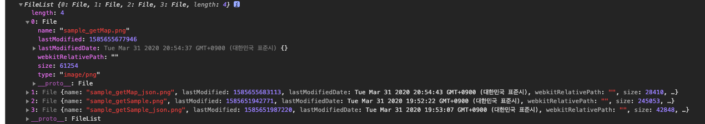

# **Part 06** 파일 업로드 처리

## **Chapter 21** 파일 업로드 방식

 - 첨부파일을 서버에 전송하는 두가지 방식
    - \<form> 태그를 이용하는 방식 : 브라우저의 제한이 없어야 하는 경우 사용
        - 일반적으로 페이지 이동과 동시에 첨부파일을 업로드
        - \<iframe>을 이용해서 화면의 이동 없이 첨부파일을 처리하는 방식
    - Ajax를 이용하는 방식 : 첨부파일을 별도로 처리하는 방식
        - \<input type = 'file'>을 이용하고 Ajax로 처리하는 방식
        - HTML5의 Drag And Drop 기능이나 jQuery 라이브러리를 이용해서 처리하는 방식

 - 서버에서 첨부파일을 처리하는 방식은 응답을 HTML코드로 할지 JSON 등으로 처리할지 정도의 구분만 하면 된다.
 - 사용 API
    - cos.jar : 2002년도 이후로 개발이 종료되었으므로, 사용 권장 하지 않음
    - commons-fileupload : 가장 일반적으로 많이 활용되고, Servlet 스펙 3.0 이전에도 사용가능
    - Servlet 3.0 이상 - 3.0 이상부터는 자체적으로 파일 업로드 처리가 API상에서 지원


### 21.1 web.xml 이용하는 첨부파일 설정

 - 3.0 이상의 Servlet 설정
 - web.xml 에 \<multpart-config> 추가
 ```xml
<multipart-config>
    <location>/Users/yun-wonhui/Desktop/upload</location>
    <max-file-size>20971520</max-file-size> <!--  1MB * 20  -->
    <max-request-size>41943040</max-request-size> <!-- 40MB -->
    <file-size-threshold>20971520</file-size-threshold> <!-- 20MB -->
</multipart-config>
 ```
- 특정 사이즈의 메모리사용(file-size-threshold)
- 업로드되는 파일을 저장할 공간(location)
- 파일의 최대 크기(max-file-size)
- 한번에 올릴 수 있는 최대 크기(max-request-size)

> - web.xml의 설정은 WAS(Tomcat) 자체의 설정일 뿐이고, 스프링에서 업로드 처리는 MultipartResolver라는 타입의 객체를 빈으로 등록해야만 가능하다. 
> - Web과 관련된 설정으로 servlet-context.xml을 이용해서 설정

### 21.2 \<form> 방식의 파일 업로드

 - 파일 업로드에서 가장 신경써야 할 부분은 enctype의 속성값을 'multipart/form-data'로 지정하는 것이다
- \<input type='file'>의 경우 최근 브라우저에서 'multiple'이라는 속성을 지원하는데 이를 이용하면 하나의 \<input> 태그로 여러 개의 파일을 한번에 업로드할 수 있다.
     - 브라우저의 버전에 따라 지원여부가 달라지므로 IE의 경우 10이상에서만 사용 가능하다.
- 예제 소스
```jsp
<form action="uploadFormAction" method="post" enctype="multipart/form-data">
    <input type="file" name="uploadFile" multiple>
    <button>Submit</button>
</form>
```

#### 21.2.1 MultipartFile 타입

 - web.xml 의 \<servlet> 내부에 \<multipart-config> 선언해야한다
 - Java 사용 예
 ```java
@PostMapping("/uploadFormAction")
public void uploadFormPost(MultipartFile[] uploadFile, Model model) {
    
    for(MultipartFile multipartFile : uploadFile) {
        
        log.info("-----------------------------");
        log.info("Upload File Name = " + multipartFile.getOriginalFilename());
        log.info("Upload File Size = " + multipartFile.getSize());
        
    }
}
 ```

  - 메서드 종류

  |메서드|설명
  |--|--
  |String getName()|파라미터의 이름 \<input> 태그의 이름
  |String getOriginalFileNmae()|업로드되는 파일의 이름
  |boolean isEmpty()|파일이 존재하지 않는 경우 true
  |long getSize()|업로드되는 파일의 크기
  |byte[] getBytes()|byte[]로 파일 데이터 변환
  |iuputStream getInputStream()|파일데이터와 연결된 inputStream을 반환
  |transferTo(File file)|파일의 저장

  - 파일 저장
    - 업로드 되는 파일을 저장하는 방법은 간단히 **transferTo()** 를 이용한다
```java
@PostMapping("/uploadFormAction")
	public void uploadFormPost(MultipartFile[] uploadFile, Model model) {
		
		String uploadFolder = "/Users/yun-wonhui/Desktop/upload";
		
		for(MultipartFile multipartFile : uploadFile) {
			
			log.info("-----------------------------");
			log.info("Upload File Name = " + multipartFile.getOriginalFilename());
			log.info("Upload File Size = " + multipartFile.getSize());
			
			
			File saveFile = new File(uploadFolder, multipartFile.getOriginalFilename());
			
			try {
				multipartFile.transferTo(saveFile);
			} catch (Exception e) {
				// TODO: handle exception
				log.error(e.getMessage());
			}
		}
	}
```

### 21.3 Ajax를 이용하는 파일 업로드

 - Ajax를 이용하는 첨부파일 처리는 FormData라는 객체를 이용하는데 IE의 경우 10 이후의 버전부터 지원되므로 브라우저의 제약이 있을 수 있다.

 ```javascript
<script type="text/javascript">
$(document).ready(function(){
    $('#uploadBtn').on('click', function(e){

        var formData = new FormData();
        
        var inputFile = $('input[name="uploadFile"]');
        
        var files = inputFile[0].files;
        
        console.log(files);
        
    })
})
</script>
 ```
  - 결과(File 4개 등록)

 </br>
  - JQuery를 이용하는 경우 파일업로드는 **FormData** 라는 객체를 이용한다(브라우저 제약있음)
  - FormData는 쉽게 말해 가상의 \<form> 태그로 생각하면 된다.

```javascript
  <script type="text/javascript">
  	$(document).ready(function(){
  		$('#uploadBtn').on('click', function(e){

  			var formData = new FormData();
  			
  			var inputFile = $('input[name="uploadFile"]');
  			
  			var files = inputFile[0].files;
  			
  			console.log(files);
  			
  			//add filedate to formdata
  			for(var i = 0; i < files.length; i++){
  				
  				formData.append("uploadFile",files[i]);

  			}
  			
  			$.ajax({
  				url:'/uploadAjaxAction',
  				processData : false,
  				contentType : false,
  				data : formData,
  				type : 'POST',
  				success : function(result){
  					alert("Uploaded");
  				}
  			});
  			
  		});
  	});
  </script>
```
 - 첨부파일 데이터는 formData에 추가한뒤 Ajax를 통해 formData 자체를 전송한다.
    - 이 때 processData, contentType은 반드시 'false'로 지정해야하만 전송이 된다.
        > - processData : 일반적으로 서버에 전달되는 데이터는 query string('url?i_title=제목')으로 전달된다. data 파라미터로 전달된 데이터를 jQuery 내부적으로 query string으로 만드는데, 파일 전송의 경우 이를 하지 않아야 하기에 false로 설정한다.
        > - contentType : 기본 값이 'application/x-www-form-urlencoded;charset=UTF-8'인데 파일의 경우 'multipart/form-data'로 전송이 되어야 하므로 false로 설정한다.

 출처 : https://repacat.tistory.com/38

- Ajax 파일 업로드
 ```java
 @PostMapping("/uploadAjaxAction")
public void puloadAjaxPost(MultipartFile[] uploadFile) {
    
    log.info("updata ajax post......");
    
    String uploadFolder = "/Users/yun-wonhui/Desktop/upload";
    
    for(MultipartFile multipartFile : uploadFile) {
        
        log.info("-----------------------------------");
        log.info("Upload File Name : " + multipartFile.getOriginalFilename());
        log.info("Upload File Size : " + multipartFile.getSize());
        
        String uploadFileName = multipartFile.getOriginalFilename();
        
        //IE has file path
        uploadFileName = uploadFileName.substring(uploadFileName.lastIndexOf("\\")+1);
        log.info("only file name: " + uploadFileName );
        
        File saveFile = new File(uploadFolder,uploadFileName);
        
        try {
            
            multipartFile.transferTo(saveFile);
            
        } catch (Exception e) {
            // TODO: handle exception
            log.error(e.getMessage());
        }
        
    }
    
}
 ```
 - IE의 경우에는 전체 파일의 경로가 전송되므로, 마지막 '\'를 기준으로 잘라낸 문자열이 실제 파일 이름이 된다.

 - 고려해야할 점
    - 동일한 이름으로 파일이 업로드 되었을 경우 기존 파일이 사라지는 문제
    - 이미지 파일의 경우에는 원본 파일의 용량이 큰 경우 섬네일 이미지를 생성해야 하는 문제
    - 이미지 파일과 일반 파일을 구분해서 다운로드 혹은 페이지에서 조회하도록 처리하는 문제
    - 첨부파일 공격에 대비하기 위한 업로드 파일의 확장자 제한

## **Chapter 22** 파일 업로드 상세 처리