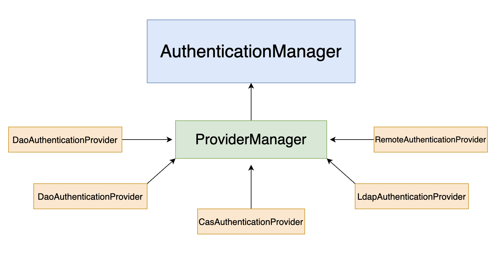
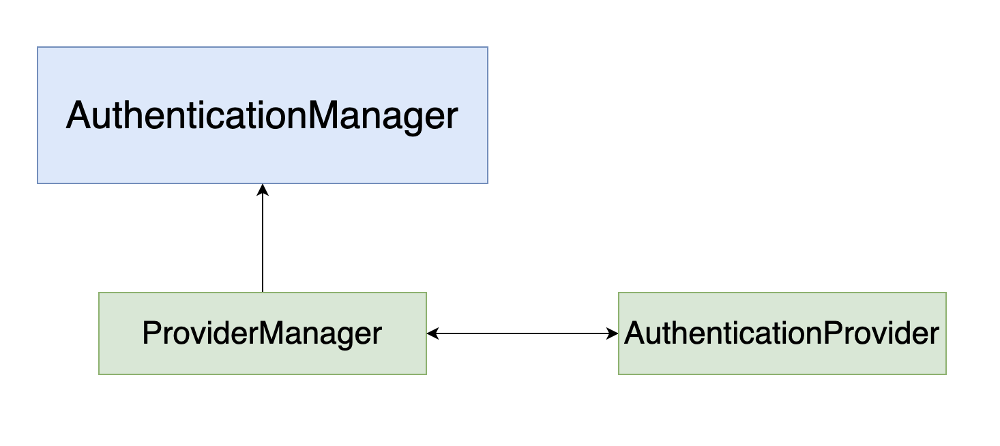
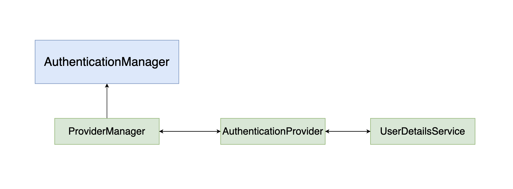
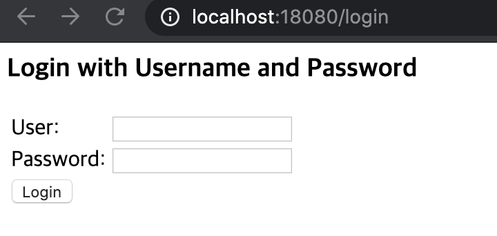

# **Part 07** Spring Web Security를 이용한 로그인 처리

## **Chapter 30** Spring Web Security소개

 - 스프링 시큐리티의 기본 동작 방식
    - 서블릿의 여러 종류의 필터와 인터셉터를 이용해 처리
        - 필터 : 서블릿에서 말하는 단순한 필터
        - 인터셉터(Interceptor) : 스프링에서 필터와 유사한 역할.
 
            |구분|공통점|차이점
            |---|----|----
            |필터| 특정한 서블릿이나 컨트롤러 접근에 관여|스프링과 무관한 서블릿 자원
            |인터셉터| |스프링의 빈으로 관리되며 스프링 컨텍스트에 속한다. </br>따라서 컨텍스트 내의 모든 자원 사용 가능

### 30.1 Spring Web Security 설정

 - spring-security-web, spring-security-config, spring-security-core를 같은버전으로 dependency 추가한다.
 - Spring Securtiy TagLib 사용을 위해 spring-security-taglibs또한 추가한다.

### 30.1. security-context.xml 생성
 - 스프링 시큐리티는 단독으로 설정할 수 있기에 별도로 작성하는게 좋다.(/WEB-INF/spring/security-context.xml)

 - web.xml 설정
 
 ```xml
<?xml version="1.0" encoding="UTF-8"?>
<web-app version="2.5" xmlns="http://java.sun.com/xml/ns/javaee"
	xmlns:xsi="http://www.w3.org/2001/XMLSchema-instance"
	xsi:schemaLocation="http://java.sun.com/xml/ns/javaee https://java.sun.com/xml/ns/javaee/web-app_2_5.xsd">

	<!-- The definition of the Root Spring Container shared by all Servlets and Filters -->
	<context-param>
		<param-name>contextConfigLocation</param-name>
		<param-value>/WEB-INF/spring/root-context.xml
		/WEB-INF/spring/security-context.xml
		</param-value>
	</context-param>
	
	<!-- Creates the Spring Container shared by all Servlets and Filters -->
	<listener>
		<listener-class>org.springframework.web.context.ContextLoaderListener</listener-class>
	</listener>

	<!-- Processes application requests -->
	<servlet>
		<servlet-name>appServlet</servlet-name>
		<servlet-class>org.springframework.web.servlet.DispatcherServlet</servlet-class>
		<init-param>
			<param-name>contextConfigLocation</param-name>
			<param-value>/WEB-INF/spring/appServlet/servlet-context.xml</param-value>
		</init-param>
		<load-on-startup>1</load-on-startup>
	</servlet>
		
	<servlet-mapping>
		<servlet-name>appServlet</servlet-name>
		<url-pattern>/</url-pattern>
	</servlet-mapping>
	
	<filter>
		<filter-name>springSecurityFilterChain</filter-name>
		<filter-class>org.springframework.web.filter.DelegatingFilterProxy</filter-class>
	</filter>
	
	<filter-mapping>
		<filter-name>springSecurityFilterChain</filter-name>
		<url-pattern>/*</url-pattern>
	</filter-mapping>
</web-app>
 ```

 - security-context.xml
```xml
<?xml version="1.0" encoding="UTF-8"?>
<beans xmlns="http://www.springframework.org/schema/beans"
	xmlns:xsi="http://www.w3.org/2001/XMLSchema-instance"
	xmlns:security="http://www.springframework.org/schema/security"
	xsi:schemaLocation="http://www.springframework.org/schema/security http://www.springframework.org/schema/security/spring-security.xsd
		http://www.springframework.org/schema/beans http://www.springframework.org/schema/beans/spring-beans.xsd">
		
		<security:http>
			<security:form-login/>
		</security:http>
		
		<security:authentication-manager>
		
		</security:authentication-manager>
</beans>
```
 - 스프링 시큐리티가 동작하기 위해서는 authentication-manager 라는 존재와 스프링 시큐리티의 시작지점이 필요하기 때문에 위와같이 최소한의 설정을 지정한 후에 실행해야한다.


### 30.2 인증(Authentication)과 권한 부여(Authorization - 인가)

 - 인증 : 본인을 증명 하여 자격을 얻는 것
 - 권한 부여 : 다른 사람에 의해 자격이 부여되는 것

#### 30.2.1 AuthenticationManager(인증 매니저)
 - AuthenticationManager(인증 매니저) : 다양한 방식의 인증을 처리할 수 있도록 하는 스프링 시큐리티에서 중요한 존재


 

 
 - ProviderManager : 인증에 대한 처리를 AuthenticationProvider라는 타입의 객체를 이용해 처리를 위임한다.


 
 - AuthenticationProvider(인증 제공자) 는 실제 인증 작업을 진행한다.
    - 인증된 정보에는 권한에 대한 정보를 같이 전달 하게 되는데 이 처리는 UserDetailsService라는 존재와 관련 있다.
    - UserDetailsService 인터페이스의 구현체는 실제로 사용자의 정보와 사용자가 가진 권한의 정보를 처리해서 반환하게 된다.



- 스프링 시큐리티를 커스터마이징 하는방식은 크게 AuthenticationManager를 직접 구현하는 방식과 실제 처리를 담당하는 UserDetailsService를 구현하는 방식으로 나뉜다.
- 대부분의 경우 UserDetailsService를 구현하는 형태를 사용하는 것으로 충분하지만, **새로운 프로토콜** 이나 **인증 구현방식** 을 직접 구현하는 경우 AuthenticationManager 인터페이스를 직접 구현해서 사용한다.

## **Chapter 31** 로그인과 로그아웃 처리

### 31.1 접근 제한 설정

 - 특정한 URI에 접근할 떄 인터셉터를 이용해서 접근을 제한하는 설정은 \<security:intercept-url>을 이용한다.
    - pattern이라는 속성과 access라는 속성을 지정해야만 한다.
    - access의 속성값으로 사용되는 문자열
        1. 표현식(권장)
        1. 권한명을 의미하는 문자열
    - \<security:http>는 기본설정이 표현식을 이용한 access속성이다.

 - 표현식을 사용하지 않는 경우에 권한 지정
```xml
<security:http>
		
    <security:intercept-url pattern="/sample/all" access="permitAll"/>
    
<!-- 			ROLE_MEMBER 라는 권한이 있는 사용자면 /sample/member URI에 접근 가능하다. -->
    <security:intercept-url pattern="/sample/member" access="hasRole('ROLE_MEMBER')"/>
    
    <security:form-login/>
</security:http>
```
 - 표현식처리는 이후 JSP에서 확인.

 - 위의 권한이 없는 URI로 접근하면 아래와 같은 login페이지로 이동한다. 별도의 로그인 페이지를 지정하지 않을경우 스프링 시큐리티에서 기본으로 제공하는 페이지로 이동한다.

 


### 31.2 단순 로그인 처리

 - 스프링 시큐리티에서 주의할점
    - 일반 시스템의 **userid** 는 스프링 시큐리티에서는 **username** 이다.
    - 일반 시스템의 **User** 는 **사용자 정보**를 뜻한다면 스프링 시큐리티에서는 **인증 정보, 권한을 가진 객체**이다
 - 인증과 권한에 대한 실제처리는 UserDetailsService를 이용해 처리한다.
 ```xml
 <security:authentication-manager>
    <security:authentication-provider>
        <security:user-service>
            <security:user name="member" password="member" authorities="ROLE_MEMBER"/>
        </security:user-service>
    </security:authentication-provider>
</security:authentication-manager>
 ```
  - member 라는 계정 정보를 가진 사용자가 로그인을 할 수 있도록 적용
  - 스프링 시큐리티 5버전 이상을 설정하였다면
    - 500Error 나며 PasswordEncoder라는 존재를 이용하도록 요구한다.
    - 임시 방편으로 포맷팅 처리를 지정해서 패스워드 인코드 방식을 지정할 수 있다.
        - https://spring.io/blog/2017/11/01/spring-security-5-0-0-rc1-released#password-storage-format
    - 패스워드의 인코딩 처리 없이 사용하고 싶다면 패스워드 앞에 '{noop}' 문자열을 추가한다.

### 31.2.1 로그아웃 확인
 - 개발자도구 -> Application -> Storage -> Cookies -> URL(ex.http://localhost:8080) -> JSESSIONID(톰캣에서 발행하는 쿠키이름[WAS마다 다르다]) 우클릭 삭제

### 31.2.2 다중 권한 설정 사용자

 - 다음과 같이 여러개의 권한을 갖는 사용자를 설정 할 수 있다.
```xml
<security:user name="admin" password="{noop}admin" authorities="ROLE_MEMBER, ROLE_ADMIN"/>
```

#### 31.2.3 접근 제한 메시지 처리

 - 스프링 시큐리티에서 접근제한에 대해서는 AccessDeniedHandler를 직접 구현하거나 특정한 URI를 지정할 수 있다.

 ```xml
 <security:http auto-config="true" use-expressions="true">
		
	...생략
			
    <security:access-denied-handler error-page="/accessError"/>
</security:http>
 ```
> - auto-config="true", use-expressions="true" 설정
>   - auto-config : 로그인 양식, 기본 인증 및 로그 아웃 URL 및 로그 아웃 서비스를 자동으로  등록하는 속성으로 태그로보면 다음과같이 처리된다.
>    ```html
>   <http>
>        <form-login/>
>        <http-basic/>
>        <logout/>
>    <http/>
>    ```
>    - use-expressions : 스프링 표현식(spEL) 사용여부
- \<security:access-denied-handler> sms AccessDeniedHandler 인터페이스의 구현체를 지정하거나, error-page를 지정할 수 있다. 위의 예제의 경우 '/accessError'라는 URI로 접근 제한 시 보이는 화면을 처리한다.

- JSP에서는 HttpServletRequest 안에 'SPRING_SECURITY_403_EXCEPTION'이라는 이름으로 AccessDeniedException 객체가 전달된다.

```jsp
<%@ page language="java" contentType="text/html; charset=UTF-8"
    pageEncoding="UTF-8"%>
    <%@ taglib prefix="c" uri="http://java.sun.com/jsp/jstl/core"%>
    <%@ taglib prefix="sec" uri="http://www.springframework.org/security/tags"%>
<%@ page import="java.util.*" %>
<!DOCTYPE html>
<html>
<head>
<meta charset="UTF-8">
<title>Insert title here</title>
</head>
<body>
<h1>Access Denied Page</h1>

<h2><c:out value="${SPRING_SECURITY_403_EXCEPTION.getMessage() }"/></h2>

<h2><c:out value="${msg}"/></h2>
</body>
</html>
```

 - 접근 제한이 된 경우 다양한 처리를 하고싶다면 직접 AccessDeniedHandler 인터페이슬 구현하는 게 좋다.
    - 예로 쿠키나 세션에 특정한 작업을하거네 HttpServletResponse에 특정한 헤더정보 추가등의 행위

```java
@Log4j
public class CustomAccessDenieHandler implements AccessDeniedHandler{

	@Override
	public void handle(HttpServletRequest request, HttpServletResponse response,
			AccessDeniedException accessDeniedException) throws IOException, ServletException {
		// TODO Auto-generated method stub
		
		log.error("Access Denied Handler");
		
		log.error("Redirect....");
		
		response.sendRedirect("/accessError");
		
	}

}
```
- 접근제한이 걸리는 경우 리다이렉트 하는 방식으로 동작하도록 지정
```xml
		<bean id="customAccessDenied" class="org.zerock.security.CustomAccessDenieHandler"></bean>
			
<!-- 			<security:access-denied-handler error-page="/accessError"/> -->
			<security:access-denied-handler ref="customAccessDenied"/>
```

- customAccessDenied를 빈으로 등록해 사용하는방식
    > - 위의 error-page와는 달리 url에서도 /accessError 나타나며 직접적으로 구현가능하기에 더욱 사용 용이

### 31.3 커스텀 로그인 페이지
 - 기본적인 로그인 페이지가아닌 커스텀된 로그인 화면페이지 URI 설정
 ```xml
 <!-- 			<security:form-login/> -->
    <security:form-login login-page="/customLogin"/>
 ```
  - customLogin.jsp를 로그인 페이지로 설정
  - 반드시 GET 방식으로 접근하는 URI를 지정해야 한다.

```jsp
<h1>Custom Login Page</h1>
<h2><c:out value="${error}"/></h2>
<h2><c:out value="${logout}"/></h2>

<form method="post" action="/login">

<div>
    <input type="text" name="username" value="admin">
</div>

<div>
    <input type="password" name="password" value="admin">
</div>

<div>
    <input type="submit">
</div>
<input type="hidden" name="${_csrf.parameterName }" value="${_csrf.token }"/>

</form>
```

### 31.4 CSRF(Cross-site request forgery) 공격과 토큰
  - 위의 예제와같이 스프링 시큐리티에서 POST 방식을 이용하는 경우 기본적으로 CSRF 토큰을 이용한다.
    - '사이트간 위조 방지'를 목적으로 특정한 값의 토큰을 사용
 - CSRF 공격 : '사이트간 요청 위조'
    - 서버에서 받아들이는 정보가 특별히 사전 조건을 검증하지 않는다는 단점을 이용하는 공격 방식
    - 단순한 게시물 조회수 증가 등의 조작부터 피해자의 계정을 이용한 다양한 공격이 가능
 - CSRF 방어 : 공격 자체가 사용자의 요청에 대한 출처를 검사하지 않아서 생기는 허점
    - referer 헤더 체크
    - REST방식에서 사용되는 PUT, DELETE와 같은 방식을 이용

#### 31.4.1 CSRF 토큰
 - 사용자가 임으로 변하는 특정한 토큰값을 서버에서 체크하는 방식
 1. 서버에서는 브라우저에 데이터를 전송할 떄 CSRF 토큰을 같이 전송
 1. 사용자가 POST 방식 등으로 특정한 작업을 할 떄 브라우저에서 전송된 CSRF 토큰의 값과 서버가 보관하고 있는 토큰의 값을 비교
 1. CSRF 토큰의 값이 다를 경우 작업을 처리하지 않는다.
 - 서버에서 생성하는 토큰은 일반적으로 난수를 생성해 공격자가 패턴을 찾을 수 없도록 한다.
 > - 공격자의 입장에서 CSRF 공격을 하기위해서는 변경되는 CSRF토큰의 값을 알아야 하기에 고정된 내용의 \<form> 태그나 \ 태그 등을 이용할 수 없게 된다.

#### 31.4.2 스프링 시큐리티의 CSRF 설정

 - 일반적으로 세선을 통해 보관, 브라우저에서 전송된 CSRF 토큰값을 검사 하는 방식이다.
 - 스프링 시큐리티에서는 CSRF 토큰생성을 비활성하거니 CSRF 토큰을 쿠키에서 이용해서 처리하는 등의 설정을 지원한다.
 ```xml
<security:http auto-config="true" use-expressions="true">
		
    ... 생략
    <security:csrf disabled="true"/>
</security:http>
 ```

 31.5 로그인 성공과 AuthenticationSuccessHandler

  - 로그인 처리후 로그인 성공이후 특정 동작을 제어하고싶을 경우 AuthenticationSuccessHandler 인터페이스 구현해서 설정한다.
  ```java

@Log4j
public class CustomLoginSuccessHandler implements AuthenticationSuccessHandler{@Override
	public void onAuthenticationSuccess(HttpServletRequest request, HttpServletResponse response,
			Authentication authentication) throws IOException, ServletException {
		// TODO Auto-generated method stub
	
		log.warn("Login Success");
		
		List<String> roleNames = new ArrayList<String>();
		
		authentication.getAuthorities().forEach(authority ->{
			roleNames.add(authority.getAuthority());
		});
		
		log.warn("ROLE NAMES: " + roleNames);
		
		if(roleNames.contains("ROLE_ADMIN")){
			response.sendRedirect("/sample/admin");
			return;
		}

		if(roleNames.contains("ROLE_MEMBER")){
			response.sendRedirect("/sample/member");
			return;
		}
		
		response.sendRedirect("/");
		
	}

}
  ```

### 31.6 로그아웃의 처리와 LogoutSuccessHandler
 - 로그인과 동일하게 특정 URI지정하고, 로그아웃 처리 후 직접 로직을 처리할 수 있느 핸들러를 등록 가능
 ```xml
 <security:logout logout-url="/customLogout" invalidate-session="true"/>
 ```