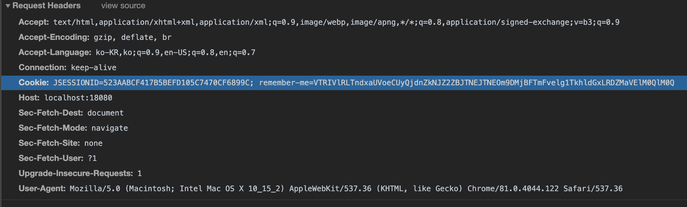
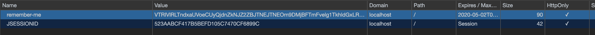

# **Part 07** Spring Web Security를 이용한 로그인 처리

## **Chapter 30** Spring Web Security소개

 - 스프링 시큐리티의 기본 동작 방식
    - 서블릿의 여러 종류의 필터와 인터셉터를 이용해 처리
        - 필터 : 서블릿에서 말하는 단순한 필터
        - 인터셉터(Interceptor) : 스프링에서 필터와 유사한 역할.
 
            |구분|공통점|차이점
            |---|----|----
            |필터| 특정한 서블릿이나 컨트롤러 접근에 관여|스프링과 무관한 서블릿 자원
            |인터셉터| |스프링의 빈으로 관리되며 스프링 컨텍스트에 속한다. </br>따라서 컨텍스트 내의 모든 자원 사용 가능

### 30.1 Spring Web Security 설정

 - spring-security-web, spring-security-config, spring-security-core를 같은버전으로 dependency 추가한다.
 - Spring Securtiy TagLib 사용을 위해 spring-security-taglibs또한 추가한다.

### 30.1. security-context.xml 생성
 - 스프링 시큐리티는 단독으로 설정할 수 있기에 별도로 작성하는게 좋다.(/WEB-INF/spring/security-context.xml)

 - web.xml 설정
 
 ```xml
<?xml version="1.0" encoding="UTF-8"?>
<web-app version="2.5" xmlns="http://java.sun.com/xml/ns/javaee"
	xmlns:xsi="http://www.w3.org/2001/XMLSchema-instance"
	xsi:schemaLocation="http://java.sun.com/xml/ns/javaee https://java.sun.com/xml/ns/javaee/web-app_2_5.xsd">

	<!-- The definition of the Root Spring Container shared by all Servlets and Filters -->
	<context-param>
		<param-name>contextConfigLocation</param-name>
		<param-value>/WEB-INF/spring/root-context.xml
		/WEB-INF/spring/security-context.xml
		</param-value>
	</context-param>
	
	<!-- Creates the Spring Container shared by all Servlets and Filters -->
	<listener>
		<listener-class>org.springframework.web.context.ContextLoaderListener</listener-class>
	</listener>

	<!-- Processes application requests -->
	<servlet>
		<servlet-name>appServlet</servlet-name>
		<servlet-class>org.springframework.web.servlet.DispatcherServlet</servlet-class>
		<init-param>
			<param-name>contextConfigLocation</param-name>
			<param-value>/WEB-INF/spring/appServlet/servlet-context.xml</param-value>
		</init-param>
		<load-on-startup>1</load-on-startup>
	</servlet>
		
	<servlet-mapping>
		<servlet-name>appServlet</servlet-name>
		<url-pattern>/</url-pattern>
	</servlet-mapping>
	
	<filter>
		<filter-name>springSecurityFilterChain</filter-name>
		<filter-class>org.springframework.web.filter.DelegatingFilterProxy</filter-class>
	</filter>
	
	<filter-mapping>
		<filter-name>springSecurityFilterChain</filter-name>
		<url-pattern>/*</url-pattern>
	</filter-mapping>
</web-app>
 ```

 - security-context.xml
```xml
<?xml version="1.0" encoding="UTF-8"?>
<beans xmlns="http://www.springframework.org/schema/beans"
	xmlns:xsi="http://www.w3.org/2001/XMLSchema-instance"
	xmlns:security="http://www.springframework.org/schema/security"
	xsi:schemaLocation="http://www.springframework.org/schema/security http://www.springframework.org/schema/security/spring-security.xsd
		http://www.springframework.org/schema/beans http://www.springframework.org/schema/beans/spring-beans.xsd">
		
		<security:http>
			<security:form-login/>
		</security:http>
		
		<security:authentication-manager>
		
		</security:authentication-manager>
</beans>
```
 - 스프링 시큐리티가 동작하기 위해서는 authentication-manager 라는 존재와 스프링 시큐리티의 시작지점이 필요하기 때문에 위와같이 최소한의 설정을 지정한 후에 실행해야한다.


### 30.2 인증(Authentication)과 권한 부여(Authorization - 인가)

 - 인증 : 본인을 증명 하여 자격을 얻는 것
 - 권한 부여 : 다른 사람에 의해 자격이 부여되는 것

#### 30.2.1 AuthenticationManager(인증 매니저)
 - AuthenticationManager(인증 매니저) : 다양한 방식의 인증을 처리할 수 있도록 하는 스프링 시큐리티에서 중요한 존재


 

 
 - ProviderManager : 인증에 대한 처리를 AuthenticationProvider라는 타입의 객체를 이용해 처리를 위임한다.


 
 - AuthenticationProvider(인증 제공자) 는 실제 인증 작업을 진행한다.
    - 인증된 정보에는 권한에 대한 정보를 같이 전달 하게 되는데 이 처리는 UserDetailsService라는 존재와 관련 있다.
    - UserDetailsService 인터페이스의 구현체는 실제로 사용자의 정보와 사용자가 가진 권한의 정보를 처리해서 반환하게 된다.


- 스프링 시큐리티를 커스터마이징 하는방식은 크게 AuthenticationManager를 직접 구현하는 방식과 실제 처리를 담당하는 UserDetailsService를 구현하는 방식으로 나뉜다.
- 대부분의 경우 UserDetailsService를 구현하는 형태를 사용하는 것으로 충분하지만, **새로운 프로토콜** 이나 **인증 구현방식** 을 직접 구현하는 경우 AuthenticationManager 인터페이스를 직접 구현해서 사용한다.

## **Chapter 31** 로그인과 로그아웃 처리

### 31.1 접근 제한 설정

 - 특정한 URI에 접근할 떄 인터셉터를 이용해서 접근을 제한하는 설정은 \<security:intercept-url>을 이용한다.
    - pattern이라는 속성과 access라는 속성을 지정해야만 한다.
    - access의 속성값으로 사용되는 문자열
        1. 표현식(권장)
        1. 권한명을 의미하는 문자열
    - \<security:http>는 기본설정이 표현식을 이용한 access속성이다.

 - 표현식을 사용하지 않는 경우에 권한 지정
```xml
<security:http>
		
    <security:intercept-url pattern="/sample/all" access="permitAll"/>
    
<!-- 			ROLE_MEMBER 라는 권한이 있는 사용자면 /sample/member URI에 접근 가능하다. -->
    <security:intercept-url pattern="/sample/member" access="hasRole('ROLE_MEMBER')"/>
    
    <security:form-login/>
</security:http>
```
 - 표현식처리는 이후 JSP에서 확인.

 - 위의 권한이 없는 URI로 접근하면 아래와 같은 login페이지로 이동한다. 별도의 로그인 페이지를 지정하지 않을경우 스프링 시큐리티에서 기본으로 제공하는 페이지로 이동한다.

 


### 31.2 단순 로그인 처리

 - 스프링 시큐리티에서 주의할점
    - 일반 시스템의 **userid** 는 스프링 시큐리티에서는 **username** 이다.
    - 일반 시스템의 **User** 는 **사용자 정보**를 뜻한다면 스프링 시큐리티에서는 **인증 정보, 권한을 가진 객체**이다
 - 인증과 권한에 대한 실제처리는 UserDetailsService를 이용해 처리한다.
 ```xml
 <security:authentication-manager>
    <security:authentication-provider>
        <security:user-service>
            <security:user name="member" password="member" authorities="ROLE_MEMBER"/>
        </security:user-service>
    </security:authentication-provider>
</security:authentication-manager>
 ```
  - member 라는 계정 정보를 가진 사용자가 로그인을 할 수 있도록 적용
  - 스프링 시큐리티 5버전 이상을 설정하였다면
    - 500Error 나며 PasswordEncoder라는 존재를 이용하도록 요구한다.
    - 임시 방편으로 포맷팅 처리를 지정해서 패스워드 인코드 방식을 지정할 수 있다.
        - https://spring.io/blog/2017/11/01/spring-security-5-0-0-rc1-released#password-storage-format
    - 패스워드의 인코딩 처리 없이 사용하고 싶다면 패스워드 앞에 '{noop}' 문자열을 추가한다.

### 31.2.1 로그아웃 확인
 - 개발자도구 -> Application -> Storage -> Cookies -> URL(ex.http://localhost:8080) -> JSESSIONID(톰캣에서 발행하는 쿠키이름[WAS마다 다르다]) 우클릭 삭제

### 31.2.2 다중 권한 설정 사용자

 - 다음과 같이 여러개의 권한을 갖는 사용자를 설정 할 수 있다.
```xml
<security:user name="admin" password="{noop}admin" authorities="ROLE_MEMBER, ROLE_ADMIN"/>
```

#### 31.2.3 접근 제한 메시지 처리

 - 스프링 시큐리티에서 접근제한에 대해서는 AccessDeniedHandler를 직접 구현하거나 특정한 URI를 지정할 수 있다.

 ```xml
 <security:http auto-config="true" use-expressions="true">
		
	...생략
			
    <security:access-denied-handler error-page="/accessError"/>
</security:http>
 ```
> - auto-config="true", use-expressions="true" 설정
>   - auto-config : 로그인 양식, 기본 인증 및 로그 아웃 URL 및 로그 아웃 서비스를 자동으로  등록하는 속성으로 태그로보면 다음과같이 처리된다.
>    ```html
>   <http>
>        <form-login/>
>        <http-basic/>
>        <logout/>
>    <http/>
>    ```
>    - use-expressions : 스프링 표현식(spEL) 사용여부
- \<security:access-denied-handler> sms AccessDeniedHandler 인터페이스의 구현체를 지정하거나, error-page를 지정할 수 있다. 위의 예제의 경우 '/accessError'라는 URI로 접근 제한 시 보이는 화면을 처리한다.

- JSP에서는 HttpServletRequest 안에 'SPRING_SECURITY_403_EXCEPTION'이라는 이름으로 AccessDeniedException 객체가 전달된다.

```jsp
<%@ page language="java" contentType="text/html; charset=UTF-8"
    pageEncoding="UTF-8"%>
    <%@ taglib prefix="c" uri="http://java.sun.com/jsp/jstl/core"%>
    <%@ taglib prefix="sec" uri="http://www.springframework.org/security/tags"%>
<%@ page import="java.util.*" %>
<!DOCTYPE html>
<html>
<head>
<meta charset="UTF-8">
<title>Insert title here</title>
</head>
<body>
<h1>Access Denied Page</h1>

<h2><c:out value="${SPRING_SECURITY_403_EXCEPTION.getMessage() }"/></h2>

<h2><c:out value="${msg}"/></h2>
</body>
</html>
```

 - 접근 제한이 된 경우 다양한 처리를 하고싶다면 직접 AccessDeniedHandler 인터페이슬 구현하는 게 좋다.
    - 예로 쿠키나 세션에 특정한 작업을하거네 HttpServletResponse에 특정한 헤더정보 추가등의 행위

```java
@Log4j
public class CustomAccessDenieHandler implements AccessDeniedHandler{

	@Override
	public void handle(HttpServletRequest request, HttpServletResponse response,
			AccessDeniedException accessDeniedException) throws IOException, ServletException {
		// TODO Auto-generated method stub
		
		log.error("Access Denied Handler");
		
		log.error("Redirect....");
		
		response.sendRedirect("/accessError");
		
	}

}
```
- 접근제한이 걸리는 경우 리다이렉트 하는 방식으로 동작하도록 지정
```xml
		<bean id="customAccessDenied" class="org.zerock.security.CustomAccessDenieHandler"></bean>
			
<!-- 			<security:access-denied-handler error-page="/accessError"/> -->
			<security:access-denied-handler ref="customAccessDenied"/>
```

- customAccessDenied를 빈으로 등록해 사용하는방식
    > - 위의 error-page와는 달리 url에서도 /accessError 나타나며 직접적으로 구현가능하기에 더욱 사용 용이

### 31.3 커스텀 로그인 페이지
 - 기본적인 로그인 페이지가아닌 커스텀된 로그인 화면페이지 URI 설정
 ```xml
 <!-- 			<security:form-login/> -->
    <security:form-login login-page="/customLogin"/>
 ```
  - customLogin.jsp를 로그인 페이지로 설정
  - 반드시 GET 방식으로 접근하는 URI를 지정해야 한다.

```jsp
<h1>Custom Login Page</h1>
<h2><c:out value="${error}"/></h2>
<h2><c:out value="${logout}"/></h2>

<form method="post" action="/login">

<div>
    <input type="text" name="username" value="admin">
</div>

<div>
    <input type="password" name="password" value="admin">
</div>

<div>
    <input type="submit">
</div>
<input type="hidden" name="${_csrf.parameterName }" value="${_csrf.token }"/>

</form>
```

### 31.4 CSRF(Cross-site request forgery) 공격과 토큰
  - 위의 예제와같이 스프링 시큐리티에서 POST 방식을 이용하는 경우 기본적으로 CSRF 토큰을 이용한다.
    - '사이트간 위조 방지'를 목적으로 특정한 값의 토큰을 사용
 - CSRF 공격 : '사이트간 요청 위조'
    - 서버에서 받아들이는 정보가 특별히 사전 조건을 검증하지 않는다는 단점을 이용하는 공격 방식
    - 단순한 게시물 조회수 증가 등의 조작부터 피해자의 계정을 이용한 다양한 공격이 가능
 - CSRF 방어 : 공격 자체가 사용자의 요청에 대한 출처를 검사하지 않아서 생기는 허점
    - referer 헤더 체크
    - REST방식에서 사용되는 PUT, DELETE와 같은 방식을 이용

#### 31.4.1 CSRF 토큰
 - 사용자가 임으로 변하는 특정한 토큰값을 서버에서 체크하는 방식
 1. 서버에서는 브라우저에 데이터를 전송할 떄 CSRF 토큰을 같이 전송
 1. 사용자가 POST 방식 등으로 특정한 작업을 할 떄 브라우저에서 전송된 CSRF 토큰의 값과 서버가 보관하고 있는 토큰의 값을 비교
 1. CSRF 토큰의 값이 다를 경우 작업을 처리하지 않는다.
 - 서버에서 생성하는 토큰은 일반적으로 난수를 생성해 공격자가 패턴을 찾을 수 없도록 한다.
 > - 공격자의 입장에서 CSRF 공격을 하기위해서는 변경되는 CSRF토큰의 값을 알아야 하기에 고정된 내용의 \<form> 태그나 \ 태그 등을 이용할 수 없게 된다.

#### 31.4.2 스프링 시큐리티의 CSRF 설정

 - 일반적으로 세선을 통해 보관, 브라우저에서 전송된 CSRF 토큰값을 검사 하는 방식이다.
 - 스프링 시큐리티에서는 CSRF 토큰생성을 비활성하거니 CSRF 토큰을 쿠키에서 이용해서 처리하는 등의 설정을 지원한다.
 ```xml
<security:http auto-config="true" use-expressions="true">
		
    ... 생략
    <security:csrf disabled="true"/>
</security:http>
 ```

 31.5 로그인 성공과 AuthenticationSuccessHandler

  - 로그인 처리후 로그인 성공이후 특정 동작을 제어하고싶을 경우 AuthenticationSuccessHandler 인터페이스 구현해서 설정한다.
  ```java

@Log4j
public class CustomLoginSuccessHandler implements AuthenticationSuccessHandler{@Override
	public void onAuthenticationSuccess(HttpServletRequest request, HttpServletResponse response,
			Authentication authentication) throws IOException, ServletException {
		// TODO Auto-generated method stub
	
		log.warn("Login Success");
		
		List<String> roleNames = new ArrayList<String>();
		
		authentication.getAuthorities().forEach(authority ->{
			roleNames.add(authority.getAuthority());
		});
		
		log.warn("ROLE NAMES: " + roleNames);
		
		if(roleNames.contains("ROLE_ADMIN")){
			response.sendRedirect("/sample/admin");
			return;
		}

		if(roleNames.contains("ROLE_MEMBER")){
			response.sendRedirect("/sample/member");
			return;
		}
		
		response.sendRedirect("/");
		
	}

}
  ```

### 31.6 로그아웃의 처리와 LogoutSuccessHandler
 - 로그인과 동일하게 특정 URI지정하고, 로그아웃 처리 후 직접 로직을 처리할 수 있느 핸들러를 등록 가능
 ```xml
 <security:logout logout-url="/customLogout" invalidate-session="true"/>
 ```
 - 로그인과 동일하게 실제작업은 '/custokmLogout'으로 처리하고 POST방식으로 이루어진다.
    - POST방식이기에 CSRF 토큰값을 같이 지정
 - POST 방식으로 처리되는 로그아웃은 스프링 시큐리티 내부에서 동작한다.
    - 로그아웃 시 추가작업을 원할경우 logoutSuccessHandler를 정의해서 처리


## **Chapter 32** JDBC를 이용하는 간편 인증/권한 처리

 - 인증과 권한에 대한 처리는 크게 보면 Authentication Manager를 통해서 이루어지는데 이떄 인증이나 권한 정보를 제공하는 존재(Provider)가 필요하고, 다시 이를 위해 UserDetailsService라는 인터페이스를 구현한 존재를 활용하게 된다.
 - 이전 예제 에서 security-contex.xml에 문자열로 고정한 방식은 InMemoryUserDetailsmanager를 이용한 것이다.

### 32.1 JDBC를 이용하기 위한 테이블 설정

 - JDBC를 이용해서 인증/권한을 체크하는 방식
	1. 지정된 형식으로 테이블을 생성해서 사용하는 방식
	1. 기존에 작성된 데이터베이스를 이용하는 방식
 - 스프링 시큐리티가 JDBC를 이용하는 경우 사용하는 클래스는 JdbcUserDetailsManager 클래스이다.
	-[Open Source URI](https://github.com/spring-projects/spring-security/blob/master/core/src/main/java/org/springframework/security/provisioning/JdbcUserDetailsManager.java)

#### 32.1.1 PasswrodEncoder 문제 해결

 - 데이터 베이스를 이용하는 경우 앞에서 사용한{noop} 을 사용할 수 없다.
 - 패스워드 인코딩을 처리하고 나면 사용자의 계정 등을 입력할 때 부터 인코딩 작업이 추가되어야 한다.
 ```java
 @Log4j
public class CustomNoOpPasswrodEncoder implements PasswordEncoder{@Override
	
	public String encode(CharSequence rawPassword) {
		// TODO Auto-generated method stub
	
		log.warn("before encode : " + rawPassword);
		
		return rawPassword.toString();
	}

	@Override
	public boolean matches(CharSequence rawPassword, String encodedPassword) {
		// TODO Auto-generated method stub
		
		log.warn("matches : " + rawPassword + " : " + encodedPassword);
		
		return rawPassword.toString().equals(encodedPassword);
	}

}

 ```
 - PasswordEncoder 인터페이스에는 encode()와 matches() 메서드가 존재하므로 위와 같이 처리

 ```xml
 <security:password-encoder ref="customPasswordEncoder"/>
 ```
  - security-context.xml에 위의 설정 추가

  ### 32.2 기존의 테이블을 이용하는 경우
  - \<security:jdbc-user-service data-source-ref="dataSource"/> 태그의 속성활용
	- users-by-username-query 속성과 authorities-by-user-name-query 속성에 적당한 쿼리문을 지정해주면 JDBC를 이용하는 설정 그대로 사용 가능하다.

  #### 32.2.1 BCryptPasswordEncoder 클래스를 이용한 패스워드 보호
   - 스프링 시큐리티에서 제공되는 BCyptPasswordEncoder클래스를 이용해 패스워드를 암호화 처리한다.
   - bcrypt는 태생 자체로 패스워드를 저장하는 용도로 설계된 해시 함수로 특정 문자열을 암호화하고, 체크하는 쪽에서는 암호화된 패스워드가 가능한 패스워드인지만 확인하고 다시 원문으로 되돌리지 못한다.
   ```xml
   <bean id="bcryptPasswordEncoder" class="org.springframework.security.crypto.bcrypt.BCryptPasswordEncoder"></bean>

   <security:password-encoder ref="bcryptPasswordEncoder"/>
   ```
   - bcrypt 방식을 이용하는 PasswordEncoder는 이미 스프링 시큐리티에서 제공하므로 빈으로 추가후 password-encoder를 지정한다.
   ```xml
   <security:jdbc-user-service data-source-ref="dataSource"
				authorities-by-username-query="select userid, auth from tbl_member_auth where userid= ?"
				users-by-username-query="select userid, userpw, enabled from tbl_member where userid = ?"/>
   ```
    
- 쿼리 지정하므로써 로그인 기능 처리

## **Chapter 33** 커스텀 UserDetailsService 활용

 - JDBC를 이용하는 방식에도 단점으로 사용자의 여러 정보들중 제한적인 내용만을 이용한다는 점이 있다.
	- 스프링 시큐리티에서 username이라고 부르는 사용자의 정보만을 이용하기 때문에 실제 프로젝트에서 사용자의 이름이나 이메일 등의 자세한 정보를 이용할 경우에는 충분하지 못한다는 단점이 있다.
 - 위의 문제를 해결하기위해 UserDetailsService를 구현하는 방식을 이용한다.
	- UserDetailsService는 loadUserByUsername() 이라는 메서드만 존재한다.
		- 반환 타입인 UserDetails 역시 인터페이스로 사용자의 정보와 권한 정보등을 담는 타입이다.
 - 가장 일반적인 방법으로는 하위 클래스 중 org.springframework.security.core.userdetails.User 클래스를 상속하는 형태이다.

### 33.1 Mapper Conllection 사용
```xml
<resultMap type="org.zerock.domain.MemberVO" id="memberMap">
		<id property="userid" column="userid"/>
		<result property="userid" column="userid"/>
		<result property="userpw" column="userpw"/>
		<result property="userName" column="username"/>
		<result property="regDate" column="regdate"/>
		<result property="updateDate" column="updatedate"/>
		<collection property="authList" resultMap="authMap">
		</collection>
	</resultMap>
	
	<resultMap type="org.zerock.domain.AuthVO" id="authMap">
		<result property="userid" column="userid"/>
		<result property="auth" column="auth"/>
	</resultMap>
	
	<select id="read" resultMap="memberMap">
		select
			mem.userid, userpw, username, enabled, regdate, updatedate, auth
		from
			tbl_member mem left join tbl_member_auth auth on mem.userid = auth.userid
		where 
			mem.userid = #{userid}
	</select>
```
 - resultMap, collection 사용 예
 - MyBatis 는 이처럼 하나의 결과에 부가적으로 여러개의 데이터를 처리하는 경우 1:N의 결과를 처리할수 있는 \<resultMap> 태그를 지원한다.

 ### 33.2 CustomUserDetailsService 구성

  - CustomUserDetailsService는 스프링 시큐리티의 UserDetailsService를 구현하고, MemberMapper 타입의 인스턴스를 주입받아서 실제 기능을 구현한다.

  ```java
  @Getter
public class CustomUser extends User{
	/**
	 * 
	 */
	private static final long serialVersionUID = 1L;
	
	private MemberVO member;

	public CustomUser(String username, String password, boolean enabled, boolean accountNonExpired,
			boolean credentialsNonExpired, boolean accountNonLocked,
			Collection<? extends GrantedAuthority> authorities) {
		super(username, password, enabled, accountNonExpired, credentialsNonExpired, accountNonLocked, authorities);
		// TODO Auto-generated constructor stub
	}
	
	public CustomUser(MemberVO vo) {
		
		super(vo.getUserid(), vo.getUserpw(), vo.getAuthList().stream().map(auth -> new SimpleGrantedAuthority(auth.getAuth())).collect(Collectors.toList()));
		
		this.member = vo;
		
	}
}
  ```

  - CustomUser는 User 클래스를 상속하기 때문에 부모 클래스의 생성자를 호출해야한 정상적인 객체를 생성할 수 있다.
  - 위의 예제는 MemberVO를 파라미터로 전달해 User 클래스에 맞게 생성자를 호출한다.
	- 위의 과정에서는 AuthVO 인스턴스는 GrantedAuthority 객체로 변환해야하므로 stream(), map()을 사용해 처리한다.
  - 변경 후 CustomUserDetailsService에서 CustomUser를 반환하도록 수정한다.

```java

@Log4j
public class CustomUserDetailsService implements UserDetailsService{
	
	@Setter(onMethod_ = @Autowired)
	private MemberMapper memberMapper;
	
	@Override
	public UserDetails loadUserByUsername(String username) throws UsernameNotFoundException {
		// TODO Auto-generated method stub
		
		log.warn("Load User By UserName : " + username);
		
		//userName means userid
		MemberVO vo = memberMapper.read(username);
		
		log.warn("queried by member mapper : " + vo);
		
		return vo == null ? null : new CustomUser(vo);
	}

}
```

## **Chapter 34** 스프링 시큐리티를 JSP에서 사용하기

### 34.1 JSP에서 로그인한 사용자 정보 보여주기

  - 스프링 시큐리티에 관련된 정보를 출력하거나 사용하려면 JSP 상단에 스프링 시큐리티 관련 태그 라이브러리의 사용을 선언하고, \<set:authentication> 태그와 principal이라는 이름의 속성을 사용한다.

  ```jsp
<%@ taglib uri="http://java.sun.com/jsp/jstl/core" prefix="c"%>
<%@ taglib uri="http://www.springframework.org/security/tags" prefix="sec"%>


<p>principal : <sec:authentication property="principal"/></p>
<p>MemberVO : <sec:authentication property="principal.member"/></p>
<p>사용자 이름 : <sec:authentication property="principal.member.userName"/></p>
<p>사용자 아이디 : <sec:authentication property="principal.member.userid"/></p>
<p>사용자 권한 리스트 : <sec:authentication property="principal.member.authList"/></p>
  ```
 - \<sec:authentication property="principal"/>가 의미하는 것은 UserDetailsService애서 반환된 객체이다. 즉 CustomUserDetailsService를 이용했다면 loadUserByUsername()에서 반환된 CustomUser 객체가 된다.
 - 이를 이용해 'principal'이 CustomUser를 의미하므로 'principal.member'는 CustomUser객체의 getMember()를 호출한다는 것을 알 수 있다.

 ### 34.2 표현식을 이용하는 동적 화면 구성

  - 경우에 따라 특정한 페이지에서 로그인한 사용자의 경우 특정한 내용을 보여주는 경우가 있다. 이 때 유용한 것이 스프링 시큐리티의 표현식(expression)이다. security-context.xml에서도 사용된다.

  - 표현식

  |표현식|설명
  |--|--
  |hasRole([role])<br>hasAuthority([authority])|해당 권한이 있으면 true
  |hasAnyRole([role,role2])<br>hasAnyAuthority([authority])|여러 권한들 중에서 하나라도 해당하는 권한이 있으면 true
  |principal|현재 사용자를 의미
  |permitAll|모든 사용자에게 허용
  |denyAll|모든 사용자에게 거부
  |isAnonymous()|익명의 사용자의 경우(로그인을 하지 않은 경우도 해당)
  |isAuthenticated()|인증된 사용자면 true
  |isFullyAuthenticated()|Remember-me로 인증된 것이 아닌 인증된 사용자의 경우 true

  ```jsp
  <sec:authorize access="isAnonymous()">
 	<a href="/customLogin">로그인</a>
</sec:authorize>

<sec:authorize access="isAuthenticated()">
 	<a href="/customLogout">로그아웃</a>
</sec:authorize>
  ```

  - 로그인한 사용자의 경우 로그아웃태그, 로그인안한 사용자의 경우 로그인 태그를 보여준다.

## **Chapter 35** 자동로그인(remember-me)

 - '자동 로그인', '로그인 기억하기' 이름으로 한번 로그인하면 일정 시간 동안 다시 로그인을 하지 않아도 되는 기능을 가지고 있다. 거의 대부분이 Cookie를 이용해서 구현된다.
 - 스프링 시큐리티의 경우 'remember-me'기능을 메모리상에서 처리하고나, 데이터베이스를 이용하는 형태로 약간의 설정만으로 구현이 가능하다.
	- security-context.xml에 \<security:remember-me>태그를 이용해 구현가능

 - \<security:remember-me> 속성
 
 |속성|설명|
 |--|--|
 |key|쿠키에 사용되는 값을 암호화하기 위한 키(key) 값
 |data-source-ref|DataSource를 지정하고 테이블을 이용해서 기존 로그인 정보를 기록(옵션)
 |remember-me-cookie|브라우저에 보관되는 쿠키의 이름을 지정. 기본값은 'remember-me'
 |remember-me-parameter|웹 화면에서 로그인할 때 'remember-me'는 대부분의 체크 박스를 이용한다. 이 떄 체크박스 태그name 속성을 의미
 |token-validity-seconds|쿠키의 유효시간 지정

 ### 35.1 데이터베이스를 이용하는 자동로그인

 - 자동로그인 기능을 처리하는 방식중 가장 많이 사용되는 방식
 - 로그인된 정보를 데이터베이스에 기록해 두었다가 사용자 재방문시 세션에 정보가 없으면 데이터베이스를 조회해서 사용하는 방식
 - 서버의 메모리상에서만 데이터를 저장하는 방식보다 좋은점으로 데이터베이스에 정보가 공유되기 때문에 좀더 안정적인 운영 가능
 - JDBC를 이용하는 경우 처럼 지정된 이름의 테이블을 생성하면 지정된 SQL이 실행되어 처리되는 방ㅇ식과, 직접 구현하는 방식이 존재
 - 생성된 테이블은 로그인을 유지하는데 필요한 정보를 보관하는 용도일 뿐이므로, 지정된 형식의 테이블 방식 사용

 ```sql
 create table persistent_logins(
username varchar(64) not null,
series varchar(64) primary key,
token varchar(64) not null,
last_used timestamp not null);
 ```	
 - 지정된 형식 Script

 ```xml
 <security:remember-me data-source-ref="dataSource" token-validity-seconds="604800"/>
 ```

 - security-context.xml 에 위의 태그만 추가하면 사용 가능하다.

 ```jsp
 <input type="checkbox" name="remember-me">Remember Me
 ```

  - 로그인화면에서 체크박스형태로 구현후 name은 'remember-me'로 설정한다.
 - HttpHeader 확인
</br>
 - Application 확인 
</br>

#### 35.1.1 로그아웃 시 쿠키 삭제

 - 자동 로그인 기능을 이용하는 경우 사용자가 로그아웃을 하면 기존과 달리 자동 로그인에 사용하는 쿠키도 삭제해 주도록 쿠키를 삭제하는 항목을 security-context.xml에 지정한다.
 ```xml
 <security:logout logout-url="/customLogout" invalidate-session="true" delete-cookies="remember-me,JSESSIONID"/>
 ```
  - 별도의 설정이 없을경우 자동로그인 사용한 쿠키의 이름은 'remember-me'이며 Tomcat을 사용했다면 WAS가 발행하는 쿠키의 이름은 'JSESSIONID'이다.

  ## **Chapter 36** Java설정을 이용하는 경우의 스프링 시큐리티 설정
   - web.xml 없이 WebConfig.Class 사용한 경우 다음의 방식중 하나를 이용해 기본적으로 필터를 추가하는 작업 진행
	1. getServletFilters()를 이용해 직접 스프링 시큐리티 관련 필터를 추가하는 방식
	1. AbstractSecurityWebApplicationInitializer라는 클래스를 상속하는 클래스를 추가하는 방식

- AbstractSecurityWebApplicationInitializer 클래스는 내부적으로 DelegatingFilterProxy를 스프링에 등록ㄱ하는데 이 작업은 별도의 구현 없이 클래스를 추가하는 것만으로도 설정이 완료된다.

```java
import org.springframework.security.web.context.AbstractSecurityWebApplicationInitializer;

public class SecurityIntializer extends AbstractSecurityWebApplicationInitializer{
}
```

 - security-context.xml을 대신하는 설정은 SecurityConfig.Class를 만들어 설정한다.
 ```java
 @Configuration
@EnableWebSecurity
@Log4j
public class SecurityConfig extends WebSecurityConfigurerAdapter{@Override
	
	protected void configure(HttpSecurity http) throws Exception {
		// TODO Auto-generated method stub
			http.authorizeRequests()
			.antMatchers("/sample/all").permitAll()
			.antMatchers("/sample/admin").access("hasRole('ROLE_ADMIN')")
			.antMatchers("/sample/member").access("hasRole('ROLE_MEMBER')");
	}	
}
 ```
 - @EnableWebSecurity는 스프링 MVC와 스프링 시큐리티를 결합하는 용도
 - configure()메서드를 오버라이드해서 security-context.xml에서 사용했던 \<security:http> 관련 설정들을 대신한다.

 ```java
 	@Override
	protected void configure(AuthenticationManagerBuilder auth) throws Exception {
		// TODO Auto-generated method stub
		log.info("configure..........");
		auth.inMemoryAuthentication().withUser("admin").password("{nootp}admin").roles("ADMIN");
		auth.inMemoryAuthentication().withUser("member").password("{nootp}member").roles("MEMBER");
	}
	
 ```
  - passwordEncode 임시 처리

  ### 36.1 로그인 성공 처리
```java
@Bean
public AuthenticationSuccessHandler loginSuccessHandler() {
	return new CustomLoginSuccessHandler();
}
```
 - @Bean tjfwjddmf xhdgo rkseksgl cjfl rksmdgkek.


  ## **Chapter 37** 어노테이션을 이용하는 스프링 시큐리티 설정
  ## **Chapter 38** 기존 프로젝트에 스프링 시큐리티 접목하기
   - 기존 프로젝트에 스프링 시큐리티를 접목하는 작업 순서
	1. 로그인과 회원 가입 페이지의 작성
	1. 기존 화면과 컨트롤러에 시큐리티 관련 내용 추가
	1. Ajax 부분의 변경